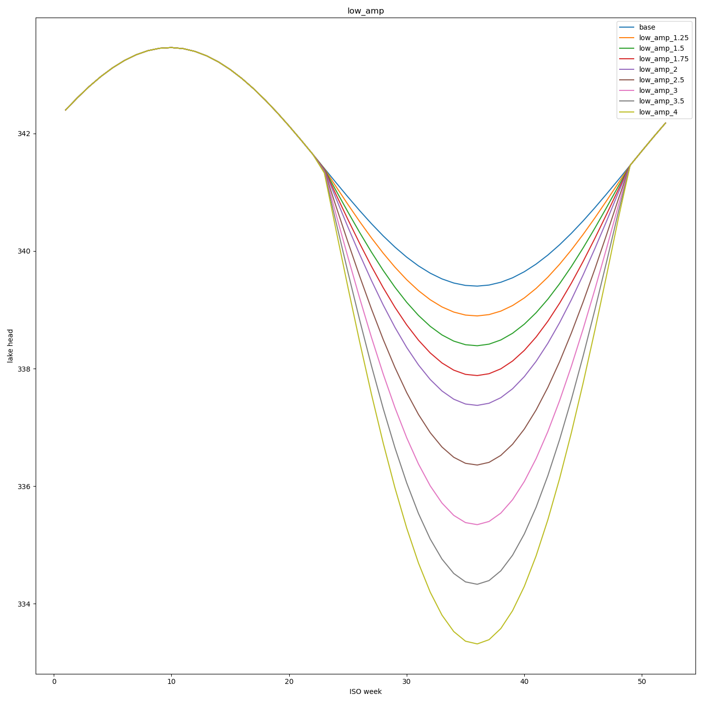
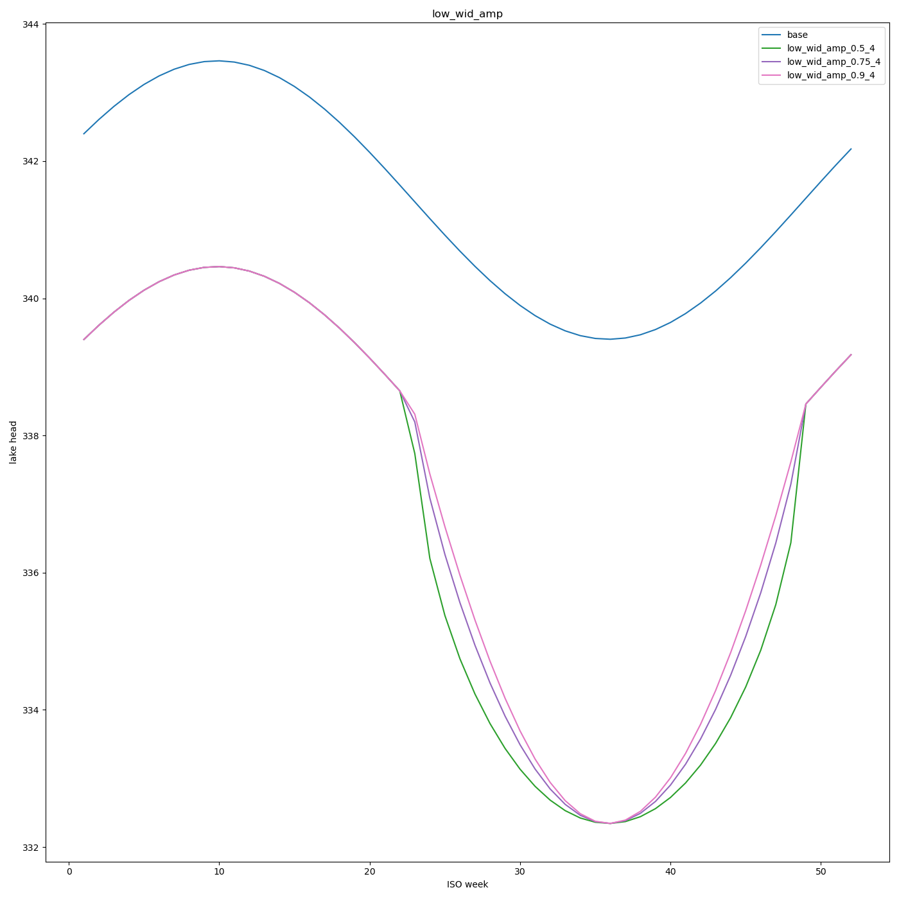
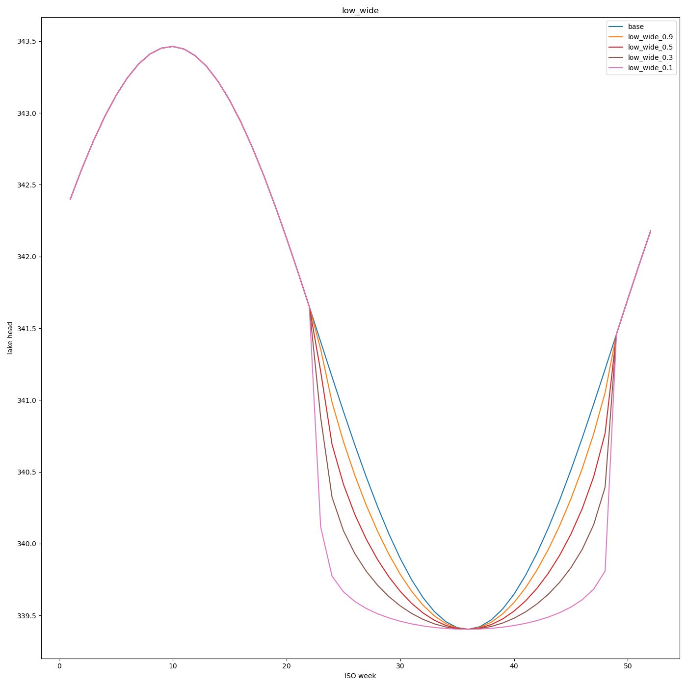
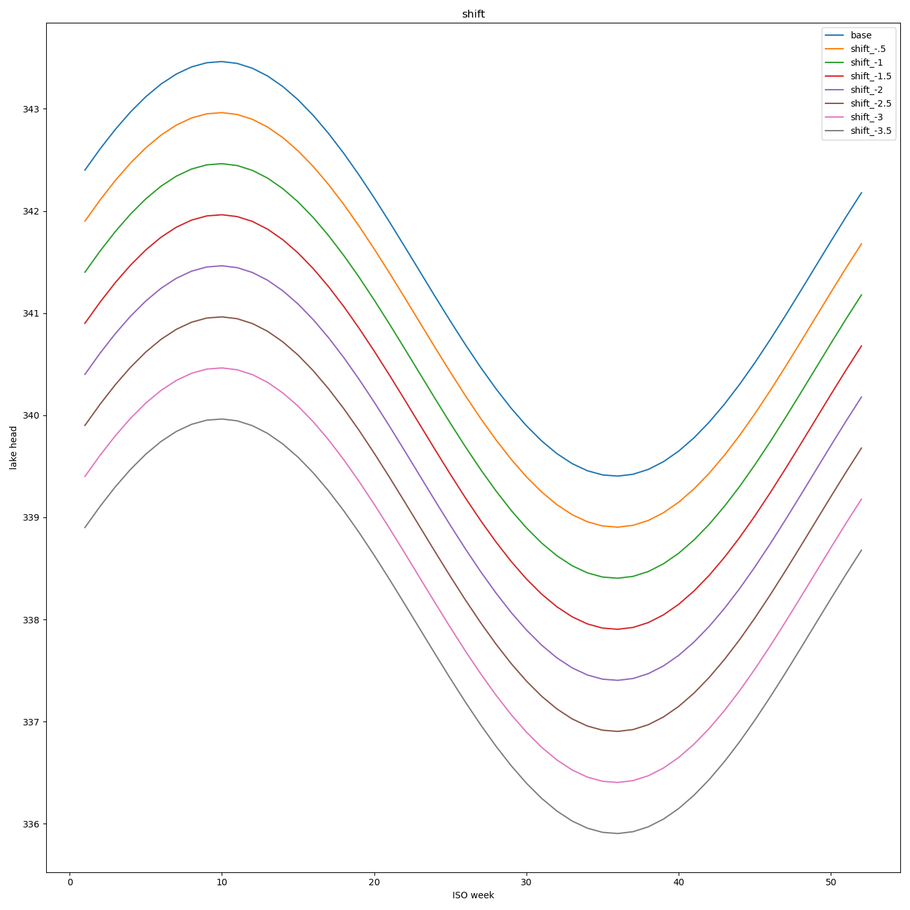
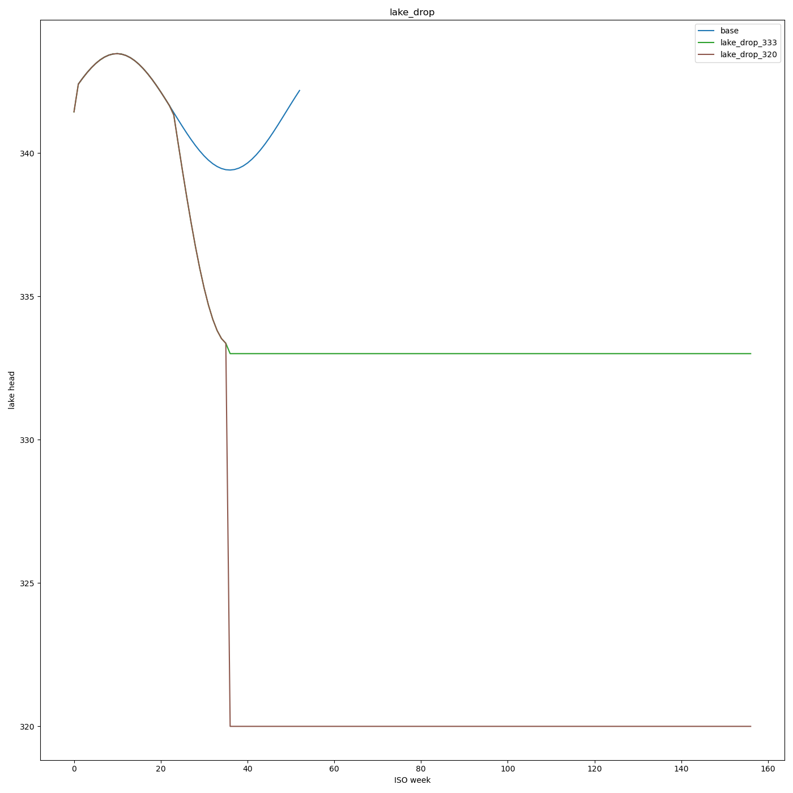
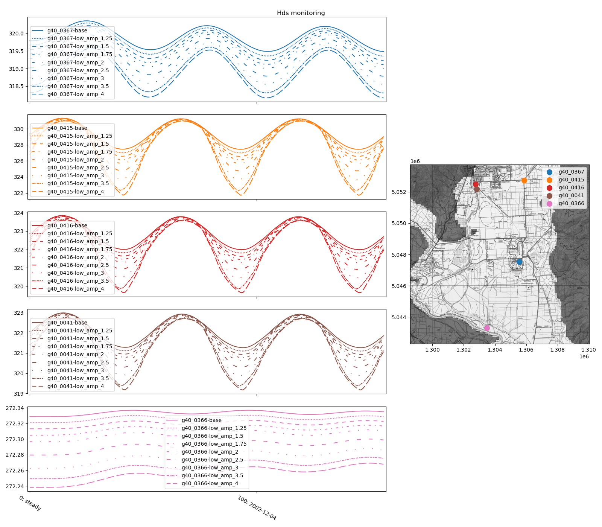
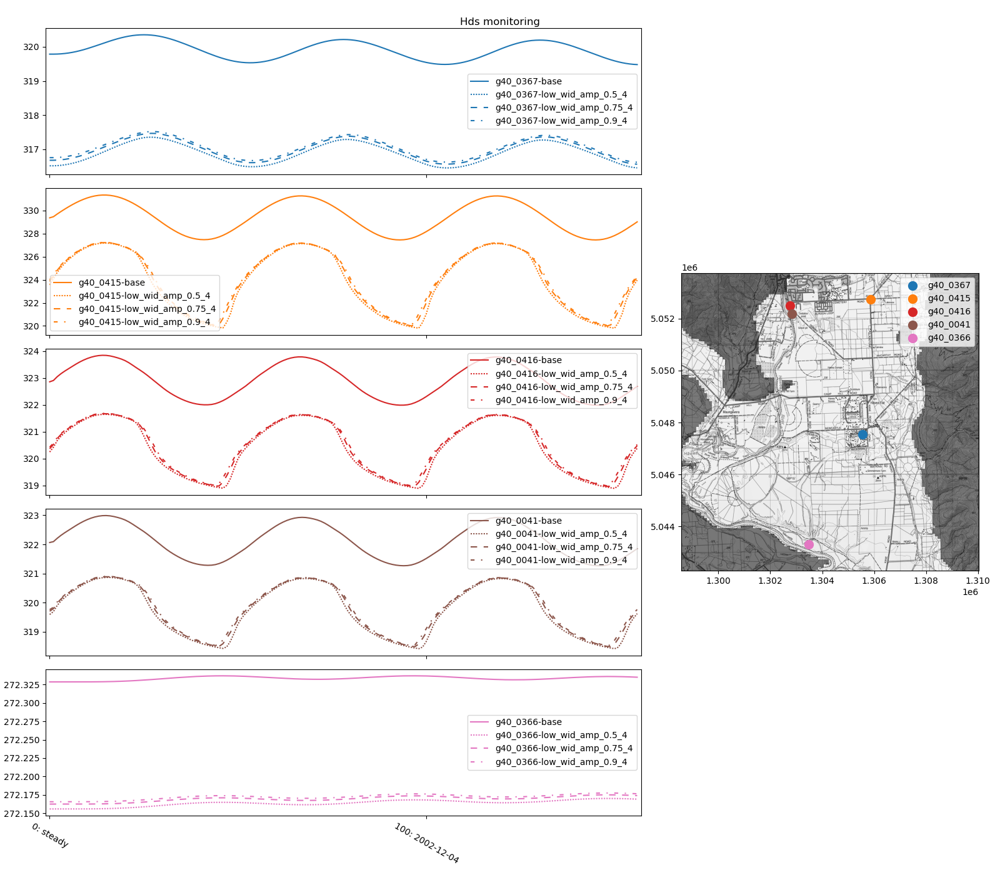
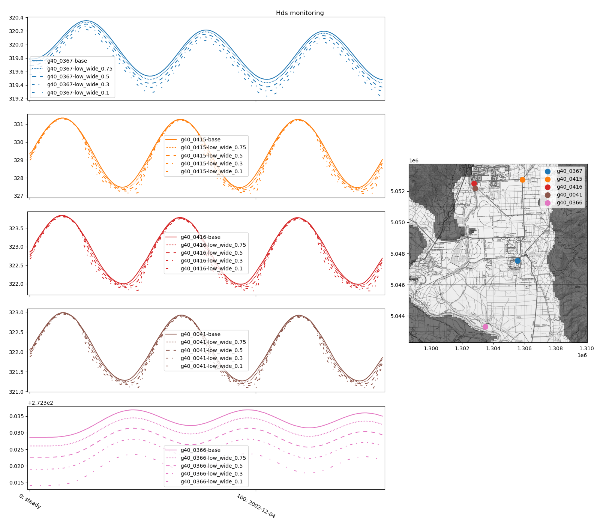
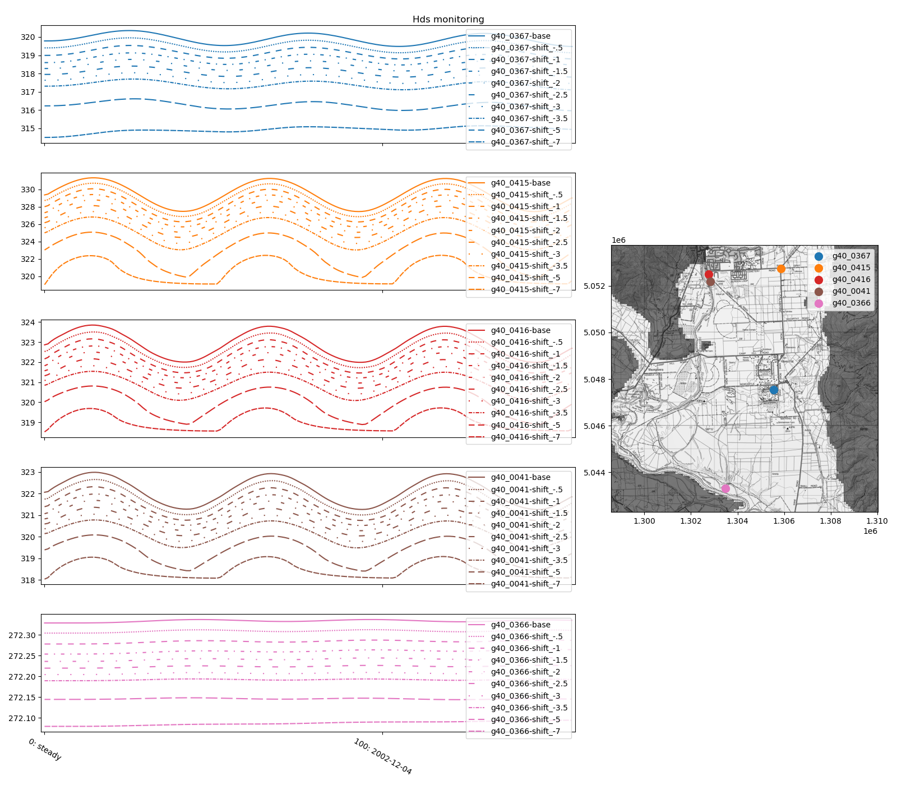

Hawea Transient groundwater model (Hawea Model) scenarios methods and results
############################################################################

.. figure:: ../support_figures/model_2d_boundary_conditions.png
   :height: 650 px
   :align: center

.. class::

    *Figure: Overview of model boundary conditions* # todo new figure

:Author:  Matt Dumont
:Date:  2021-11-02
:Version:  1.0.0
:Status:  Draft
:KSL project: Z22031HAW_hawea-model
:Purpose: This document provides the methodology and results for the model build process

Index
=====
.. contents:: Table of Contents

Module Index
============
-  `README.rst <../Scenarios/README.rst>`_: document describing the scenario modelling methods and results
-   Scenario development and supporting scripts
    -  `scen_period.py <../Scenarios/scen_period.py>`_: script to handle the scenario period
    -  `boundary_condition_plots <../Scenarios/boundary_condition_plots>`_: plots of the scenarios boundary conditions
    -  `base_data <../Scenarios/base_data>`_: base input data for the scenarios
    -  `processed_input_data <../Scenarios/processed_input_data>`_: processed input data for the scenarios, these files were all developed from the base data
    -  `boundary_conditions.py <../Scenarios/boundary_conditions.py>`_:  develop the input boundary conditions for the scenarios
    -  `supporting_data_analysis <../Scenarios/supporting_data_analysis>`_: additional data analysis scripts to support creating boundary conditions
    -  `scenario_outputs.py <../Scenarios/scenario_outputs.py>`_: script to make consistent scenario outputs
    -  `run_flow_scenario.py <../Scenarios/run_flow_scenario.py>`_: script to run a flow scenario
    -  `run_scenario.py <../Scenarios/run_scenario.py>`_: script to run a scenario (in multiprocessing)
-  Model information and MT3D indicator modelling
    -  `run_mt3d_scenario.py <../Scenarios/run_mt3d_scenario.py>`_:  script to support running MT3D
    -  `mt3d_indicator_scens.py <../Scenarios/mt3d_indicator_scens.py>`_: script to run MT3D indicator scenarios
    -  `compare_boundary_sensitivity.py <../Scenarios/compare_boundary_sensitivity.py>`_: compare the results of the boundary condition sensitivity analysis
    -  `model_info_scenarios.py <../Scenarios/model_info_scenarios.py>`_: script to run model information scenarios
    -  `model_info_scen_results <../Scenarios/model_info_scen_results>`_: model results and plots for model information scenarios
        -  `0_results <../Scenarios/model_info_scen_results/0_results>`_: plots for model information scenarios
        -  {scenario name}: Model results for model information scenarios: input and output data for the scenario
    -  `mt3d_indicator_scenarios <../Scenarios/mt3d_indicator_scenarios>`_: model results and plots for the MT3D scenarios
-  Low Lake Hawea level scenarios
    -  `low_lake_scenario_data.py <../Scenarios/low_lake_scenario_data.py>`_: script to develop typological lake levels and perturbations
    -  `low_lake_scenarios.py <../Scenarios/low_lake_scenarios.py>`_: script to run low lake scenarios
    -  `compare_low_lake.py <../Scenarios/compare_low_lake.py>`_: script to compare low lake scenarios
    -  `low_lake_scenarios <../Scenarios/low_lake_scenarios>`_: model results and plots for low lake scenarios
        -  `0_results <../Scenarios/low_lake_scenarios/0_results>`_: plots for low lake scenarios
        -  {scenario name}: Model results for low lake scenarios: input and output data for the lake scenario
- Allocation modelling
    -  `allocation_zones.py <../Scenarios/allocation_zones.py>`_: get and plot allocation zones
    -  `allo_rch_hillside.py <../Scenarios/allo_rch_hillside.py>`_: scripts to get and compare the allocation, hillside recharge, and LSR for each zone
    -  `allocation_scenarios.py <../Scenarios/allocation_scenarios.py>`_: script to develop all allocation scenarios and to run the non-gridded allocation scenarios
    -  `run_grid_allocation.py <../Scenarios/run_grid_allocation.py>`_: script to run the gridded allocation scenarios
    -  `compare_allocation_scens.py <../Scenarios/compare_allocation_scens.py>`_: script to compare allocation scenarios
    -  `allocation_scenarios <../Scenarios/allocation_scenarios>`_:  model results for allocation scenarios
    -  `allocation_results <../Scenarios/allocation_results>`_: plots of allocation results
        -  `old_allo_zones.png <../Scenarios/allocation_results/old_allo_zones.png>`_: figure of the old allocation zones (Wilson et al., 2012)
        -  `new_allo_zones.png <../Scenarios/allocation_results/new_allo_zones.png>`_: figure of the new allocation zones
        -  `Hawea Flat_results <../Scenarios/allocation_results/Hawea Flat_results>`_: results for the gridded Hawea Flat allocation scenarios
        -  `Maungawera Flat_results <../Scenarios/allocation_results/Maungawera Flat_results>`_: results for the gridded Maungawera Flat allocation scenarios
        -  `Terrace-Hill_results <../Scenarios/allocation_results/Terrace-Hill_results>`_: results for the gridded Terrace-Hill allocation scenarios
        -  `nat_current_full <../Scenarios/allocation_results/nat_current_full>`_: results for the naturalised, current allocation, and full allocation scenarios
        -  `Te Awa_results <../Scenarios/allocation_results/Te Awa_results>`_: results for the gridded Te Awa allocation scenarios
        -  `Terrace-River_results <../Scenarios/allocation_results/Terrace-River_results>`_: results for the gridded Terrace-River allocation scenarios
        -  `mangawera_valley <../Scenarios/allocation_results/mangawera_valley>`_: results for the Maungawera Valley allocation reduction scenarios
        -  `allo_zone_rch <../Scenarios/allocation_results/allo_zone_rch>`_: results comparing LSR, hillside inflows, and allocation for each zone
        -  `example_quantile_plots <../Scenarios/allocation_results/example_quantile_plots>`_: example quantile plots for the allocation scenarios to support presentations
-  Wetland Setback Modelling # todo add more detail
    -  `wetland_setback_campbells <../Scenarios/wetland_setback_campbells>`_: wetland setback modelling for Campbells wetland scripts and results
    -  `wetland_setback_butterfield <../Scenarios/wetland_setback_butterfield>`_: wetland setback modelling for Butterfield wetland scripts and results

Scenarios Overview
==================
+-----------------------------+--------------------------------------------------------------------------+
| Scenario Type               | Key Questions                                                            |
+=============================+==========================================================================+
| Model information Scenarios | How does the model behave, and what impacts groundwater levels?          |
| Low lake scenarios          | What happens if the management of Lake Hawea changes significantly?      |
| MT3D indicator scenarios    | Where is the water sourced from?                                         |
| Allocation Scenarios        | What is a sustainable level of Abstraction?                              |
| Wetland setback scenarios   | where, and to what extent, does abstraction impact significant wetlands? |
+-----------------------------+--------------------------------------------------------------------------+

Boundary Conditions Overview
==========================

The table below has an overview of the different possible boundary conditions for the model Scenarios. Some of these
boundary conditions were defined in the `model_build readme <../model_build/README.RST>`_ and other are defined more
fully below. Note that we also used static recharge, hill inflows, lake levels, and river flows for the scenarios. These
were simply the steady state component of each boundary condition (i.e. the mean value).

+-------------------------+---------+---------------------+-------------------------------------------------------------------------------------+---------------------------------------------------+
| Boundary condition name | Package | Water component     | Overview                                                                            | Reference                                         |
+=========================+=========+=====================+=====================================================================================+===================================================+
| dryland_rch             | Rch     | LSR                 | scenario period ERA5 dry-land recharge                                              | `model_build readme <../model_build/README.RST>`_ |
| irr_rch                 | Rch     | LSR                 | scenario period ERA5 irrigated recharge                                             | `model_build readme <../model_build/README.RST>`_ |
| hist_rch                | Rch     | LSR                 | opt period met recharge                                                             | `model_build readme <../model_build/README.RST>`_ |
| hist_era5_rch           | Rch     | LSR                 | opt period ERA5 recharge                                                            | `model_build readme <../model_build/README.RST>`_ |
| large rivers            | Str     | Hawea and Clutha R. | ISO weekly mean river flows / stage                                                 | `model_build readme <../model_build/README.RST>`_ |
| hillside flows          | Str/Wel | Hillside inflows    | long record of hillside inflows                                                     | `model_build readme <../model_build/README.RST>`_ |
| race losses             | Wel     | race losses         | ISO weekly mean race losses                                                         | `model_build readme <../model_build/README.RST>`_ |
| no_pump                 | Wel     | GW abstraction      | No abstraction                                                                      | n/a                                               |
| pump curve              | Wel     | GW abstraction      | typological annual pumping curve (0-1)                                              | below                                             |
| static_pump             | Wel     | GW abstraction      | steady state optimisation pumping                                                   | below                                             |
| extended_pump           | Wel     | GW abstraction      | ISO weekly mean pumping                                                             | below                                             |
| extended_full_allo      | Wel     | GW abstraction      | ISO weekly mean of maximum daily allocation normalised to historical pumping record | below                                             |
| extended_max_allo       | Wel     | GW abstraction      | Maximum daily allocation applied to every day of the year                           | below                                             |
| extended_max_allo_pc    | Wel     | GW abstraction      | Maximum daily allocation applied to pump curve                                      | below                                             |
| reduced abstraction     | Wel     | GW abstraction      | allocation reduction (fraction of extended_pump)                                    | below                                             |
| grid_pump               | Wel     | GW abstraction      | gridded abstraction (additional allocation)                                         | below                                             |
| lake                    | Ghb     | Lake Hawea          | Long record of Lake Hawea levels                                                    | `model_build readme <../model_build/README.RST>`_ |
| low lake levels         | Ghb     | Lake Hawea          | typological low Lake Hawea levels                                                   | below                                             |
+-------------------------+---------+---------------------+-------------------------------------------------------------------------------------+---------------------------------------------------+

Boundary conditions Methodology
===============================

The sections below provide additional documentation for the boundary condition options that have not been sufficiently
described in the `model build readme <../model_build/README.RST>`_.

Groundwater abstraction
-----------------------
Development of the pumping curve
^^^^^^^^^^^^^^^^^^^^^^^^^^^^^^^^
# todo

Scenarios/boundary_condition_plots/pumping/grid_pumping_curve.png

extended_pump
^^^^^^^^^^^^^^^^^^^^^^^^^^^^^^^^
# todo

extended_full_allo
^^^^^^^^^^^^^^^^^^^^^^^^^^^^^^^^
# todo

extended_max_allo
^^^^^^^^^^^^^^^^^^^^^^^^^^^^^^^^
# todo

extended_max_allo_pc
^^^^^^^^^^^^^^^^^^^^^^^^^^^^^^^^
# todo

Additional abstraction (grid_pump)
^^^^^^^^^^^^^^^^^^^^^^^^^^^^^^^^^^^^^^^^^^^^^^^^^^^^^^^^
# todo
Scenarios/boundary_condition_plots/pumping/grid_pumping_locs/Hawea Flat_grid_pumps.png

Reduced abstraction (reduced allocation scenarios)
^^^^^^^^^^^^^^^^^^^^^^^^^^^^^^^^^^^^^^^^^^^^^^^^^^
# todo

Plots of the abstractions
^^^^^^^^^^^^^^^^^^^^^^^^^^^^^^
Scenarios/boundary_condition_plots/pumping
Scenarios/boundary_condition_plots/pumping_use_allo_difs

Lake Hawea Levels for low lake scenarios
----------------------------------------
# todo

Standard Scenario Outputs
=========================

Indicator monitoring points
^^^^^^^^^^^^^^^^^^^^^^^^^^^^^^
# todo

Scenarios/indicator_wells.png

Data outputs
^^^^^^^^^^^^

We have developed standard data outputs for the scenarios, they are as follows:
- all_well_output_dataset.csv:# todo
- converged.txt: text file with a boolean value indicating whether the model converged
- key_input_data.csv:# todo
- output_dataset.csv:# todo
- zone_budget.csv:# todo

In addition, some scenarios also contain the following files:
- {}.list: list file from the model runs.
- {}_hds: compressed and split model heads
- plots: plots of the model results (similar to the plots in the
         `Standard optimisation outputs in the model_optimisation <../model_optimisation/README.RST>`_)

Figure outputs
^^^^^^^^^^^^^^
# todo
- comp_plots:
- qq_plots:
- quantile_plots:

Reading quantile plots
^^^^^^^^^^^^^^^^^^^^^^
# todo

Reading q-q plots
^^^^^^^^^^^^^^^^^^^^^^
# todo

Adequate penetration
--------------------
# todo

Scenario Methods & Results
===========================

Model information scenarios
----------------------------
+--------------------+---------------------------------------------------------------------------------+
| Scenario Name      | purpose/comment                                                                 |
+====================+=================================================================================+
| optimised          | Optimised model results                                                         |
| long_current       | Long scenario with long_current abstraction and irr_LSR                         |
| long_nat           | Long current, but with dryland recharge, and no pumping (races left on)         |
| no_pumping         | Long current, but with no pumping                                               |
| hillslope_only_var | What extent does the hillslope inflow variation influence total model variation |
| lake_only_var      | What extent does the Lake Hawea level variation influence total model variation |
| pump_only_var      | What extent does the groundwater abstraction influence total model variation    |
| rch_only_var       | What extent does the LSR variation influence total model variation              |
| static_pumping     | What variation exists with only pumping held static                             |
+--------------------+---------------------------------------------------------------------------------+

Boundary condition sensitivity
^^^^^^^^^^^^^^^^^^^^^^^^^^^^^^
# todo table and example plot and link to all plots

Naturalised vs current without abstraction
^^^^^^^^^^^^^^^^^^^^^^^^^^^^^^^^^^^^^^^^^
# todo example plots and link to all plots

Naturalised vs current vs long current
^^^^^^^^^^^^^^^^^^^^^^^^^^^^^^^^^^^^^^
# todo example plots and link to all plots

Naturalised vs current vs long current (opt period only)
^^^^^^^^^^^^^^^^^^^^^^^^^^^^^^^^^^^^^^^^^^^^^^^^^^^^^^^^
# todo example plots and link to all plots bit of description

Low Lake Hawea Level Scenarios
------------------------------

The Low Lake Hawea Level scenarios are designed to test the sensitivity of the model to the Lake Hawea head boundary
conditions and to test the impacts of the complex moraine structure specifically.  These scenarios involve creating a
synthetic lake level boundary conditions and then ascertaining how the model responds to these conditions.  The figures
below show all of the synthetic lake level scenarios that were tested.

.. class::

    *Figure: ake Hawea head boundary conditions for the low_amp_{} scenarios

.. class::

    *Figure: Lake Hawea head boundary conditions for the low_wid_amp_{} scenarios

.. class::

    *Figure: Lake Hawea head boundary conditions for the low_wide_{} scenarios

.. class::

    *Figure: Lake Hawea head boundary conditions for the shift_{} scenarios

.. class::

    *Figure: Lake Hawea head boundary conditions for the lake_drop_{} scenarios.

Methods
^^^^^^^
# todo

Results overview
^^^^^^^^^^^^^^^^
# todo discuss results

The sections below so some key figures for the various lake level scenarios.  Many more figures for each scenario are
available in the `low lake level results <Scenarios/low_lake_scenarios/0_results>`_ folder.
Scenarios/low_lake_scenarios/0_results/lake_drop/comp_plots/hds_monitoring.png

Lake_drop Scenario results
~~~~~~~~~~~~~~~~~~~~~~~~~~~~~~~~~

.. figure:: ../Scenarios/low_lake_scenarios/0_results/lake_drop/comp_plots/hds_monitoring.png
   :height: 650 px
   :align: center

.. class::

    *Figure: Responses at the high frequency monitoring bores for the lake drop scenarios.

Low_amp Scenario results
~~~~~~~~~~~~~~~~~~~~~~~~~~~~~~~~~

.. class::

    *Figure: Responses at the high frequency monitoring bores for the low_amp scenarios.

Low_wid_amp Scenario results
~~~~~~~~~~~~~~~~~~~~~~~~~~~~~~~~~

.. class::

    *Figure: Responses at the high frequency monitoring bores for the low_wide_amp scenarios.

Low_wide Scenario results
~~~~~~~~~~~~~~~~~~~~~~~~~~~~~~~~~

.. class::

    *Figure: Responses at the high frequency monitoring bores for the low_wide scenarios.

Shift results
~~~~~~~~~~~~~~~~~~~~~~~~~~~~~~~~~

.. class::

    *Figure: Responses at the high frequency monitoring bores for the shift scenarios.

MT3D Indicator Scenarios
------------------------
+--------------------+-----------------------------------------------------------------------------------+
| Scenario name      |  Boundary condition concentration                                                 |
+====================+===================================================================================+
| all_any            |  all boundary conditions set to 1 (process check)                                 |
| all_hill_indicator |  all hillside inflows (excluding John and Grandview creeks) set to 1              |
| all_str            |  all stream boundary conditions set to 1                                          |
| hill_rch_indicator |  all hillside inflows (excluding John and Grandview Creeks) and recharge set to 1 |
| lake_con_indicator |  all lake boundary conditions set to 1                                            |
| not_any            |  all boundary conditions set to 0 (process check)                                 |
| not_str            |  all boundary conditions (except str package                                      |
| race_con_indicator |  all race cells set to 1                                                          |
| rch_indicator      |  recharge concentration set to 1                                                  |
+--------------------+-----------------------------------------------------------------------------------+

Methods
^^^^^^^
# todo

Results
^^^^^^^
# todo

../Scenarios/mt3d_indicator_scenarios/plots/lake_con_indicator.png
../Scenarios/mt3d_indicator_scenarios/plots/hill_rch_indicator.png
../Scenarios/mt3d_indicator_scenarios/plots/race_con_indicator.png
../Scenarios/mt3d_indicator_scenarios/plots/all_str.png

Recommended Allocation Zones
----------------------------
# todo (no recommended allocation limits)

Scenarios/allocation_results/new_allo_zones.png
Scenarios/allocation_results/old_allo_zones.png

Allocation Scenarios
--------------------

# todo table see mt3d indicators

Allocation via Zonal recharge
^^^^^^^^^^^^^^^^^^^^^^^^^^^^
# todo

Naturalised vs current vs full
^^^^^^^^^^^^^^^^^^^^^^^^^^^^^^^^^^
# todo

Hawea Flat
^^^^^^^^^^^^^^^^^^^^^^^^^^^^^^^^^^
# todo

Mangawera valley
^^^^^^^^^^^^^^^^^^^^^^^^^^^^^^^^^^
# todo

Maungawera Flat
^^^^^^^^^^^^^^^^^^^^^^^^^^^^^^^^^^
# todo

Te Awa
^^^^^^^^^^^^^^^^^^^^^^^^^^^^^^^^^^
# todo

Terrace-Hill
^^^^^^^^^^^^^^^^^^^^^^^^^^^^^^^^^^
# todo

Terrace-River
^^^^^^^^^^^^^^^^^^^^^^^^^^^^^^^^^^
# todo

Wetland Setback Scenarios
=========================
# todo

Methodology
-------------
# todo

Campbells Wetland Setback Scenarios
------------------------------------
# todo

Butterfield Wetland Setback Scenarios
-------------------------------------
# todo

References
===========

- `Wilson, J., 2012. Hawea Basin Groundwater Review. prepared by Resouce Science Unit of Otago Regional Council, June 2012, Dunedin. <../scott_model/Hawea_Basin_Groundwater_Review_2012_FINAL.pdf>`_