Hawea Transient groundwater model (Hawea Model) build methods and results
############################################################################

.. figure:: {}
   :scale: 50 %
   :align: center

.. class:: centered

    *Figure: *

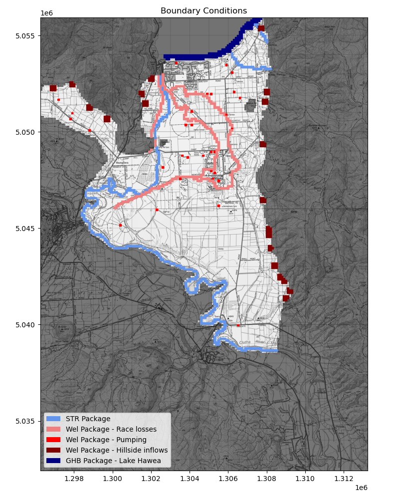

.. class::

    *Figure: Overview of model boundary conditions*

:Author:  Matt Dumont
:Date:  2021-11-02
:Version:  1.0.0
:Status:  Draft
:KSL project: Z22031HAW_hawea-model
:Purpose: This document provides the methodology and results for the model build process

Index
=====
.. contents:: Table of Contents

Module Index
============
-  `README.rst <README.rst>`_: this document
-  `base_data <base_data>`_: raw input data for the model build
-  `processed_input_data <processed_input_data>`_: processed data for the model build that was built by the scripts in this folder from the raw data in the base_data folder
-  `project_model_tools.py <project_model_tools.py>`_: a script to define the model tools instance, and the model structure
-  `get_boundary_condition_data.py <get_boundary_condition_data.py>`_: a script to get the boundary condition data
-  `supporting_data_analysis <supporting_data_analysis>`_: scripts to support creating the boundary condition data and structure
    -  `all_wells.py <supporting_data_analysis/all_wells.py>`_: a script to get all the well location data
    -  `base_concept_diagram.py <supporting_data_analysis/base_concept_diagram.py>`_: a script to build a base concept diagram of the 3d model structure
    -  `compare_met_era5land.py <supporting_data_analysis/compare_met_era5land.py>`_: compare precip and PET between the available met station and the ERA5 land data
    -  `explore_structure.py <supporting_data_analysis/explore_structure.py>`_:
    -  `get_era_5_land.py <supporting_data_analysis/get_era_5_land.py>`_: script to get ERA5-land data
    -  `get_pumping_data.py <supporting_data_analysis/get_pumping_data.py>`_: get and process historical pumping data
    -  `hillside_inflows.py <supporting_data_analysis/hillside_inflows.py>`_: model and process estimates from the hillside inflows
    -  `irrigation_race_losses.py <supporting_data_analysis/irrigation_race_losses.py>`_:  get and process the historical race loss data
    -  `lake_data.py <supporting_data_analysis/lake_data.py>`_: get and process the historical lake data
    -  `map_flowmeter_to_wells.py <supporting_data_analysis/map_flowmeter_to_wells.py>`_: a process to map the flowmeter data to the most likely well
    -  `plot_borelogs.py <supporting_data_analysis/plot_borelogs.py>`_:  a process to plot the borelogs in the model
    -  `recharge_model.py <supporting_data_analysis/recharge_model.py>`_: develop and create LSR estimates from met and ERA5-land data
    -  `river_data.py <supporting_data_analysis/river_data.py>`_: : a process to get and process the river data
-  `modflow_model.py <modflow_model.py>`_: a script to build a modflow model instance
-  `utils.py <utils.py>`_: a script to define some utility functions
-  `zones.py <zones.py>`_: a script to define indicative model zones

Model boundaries
================

The model domain (see figure below) was initially defined to include the following aquifers:

- **The main Hawea flat aquifer** stretching from Lake Hawea in the North to the base of the High terrace in the South. This aquifer is bounded by the Hawea river on the West and the Grandview Ridge on the East
- **The High terrace aquifer** stretching from the base of the High terrace in the North to Clutha River in the South This aquifer is also bounded by the Hawea river on the West and the Grandview Ridge on the East
- **Aquifers near the Hawea river** including Te Awa, Maungawera Flat, and river adjacent aquifers to the south of Maungawera flat and east of the High terrace.
- **The Maungawera Valley aquifer** including the Maungawera valley aquifer from the approximate Hawea River/ Lake Wanaka flow divide in the Northwest to the Maungawera Flat Aquifer
- **The Sandy Point Aquifer** which is to the East of the Clutha river to the South of the High terrace aquifer.  This aquifer is also bounded by the Grandview Ridge on the East

During the model build the steep topography of the Sandy Point Aquifer caused model convergence issues.
The Sandy Point has minimal data available (one historical groundwater measurement) Therefore we resolved the convergence
issue by removing the Sandy Point Aquifer from the model domain. We still produced estimates of Land surface recharge (LSR) and
Hillside inflows to this aquifer, which were used to inform groundwater allocation decisions.

The boundaries of the model domain were all defined by no-flow boundary conditions. In addition at the Lake Hawea Dam,
Camp Hill, and Cameron Hill bedrock is exposed. Therefore these outcrops were also defined as no-flow boundaries.
Finally, the Camp Hill Medial Moraine, located between Te Awa and the Maungawera Flat aquifers, is comprised of poorly sorted
and unworked moraine sediments. While there are a few domestic supply bores in this area, the groundwater system is
likely minimal, particularly in comparison with the other outwash dominated aquifers.  We therefore chose to defined this area
as a no-flow boundary.

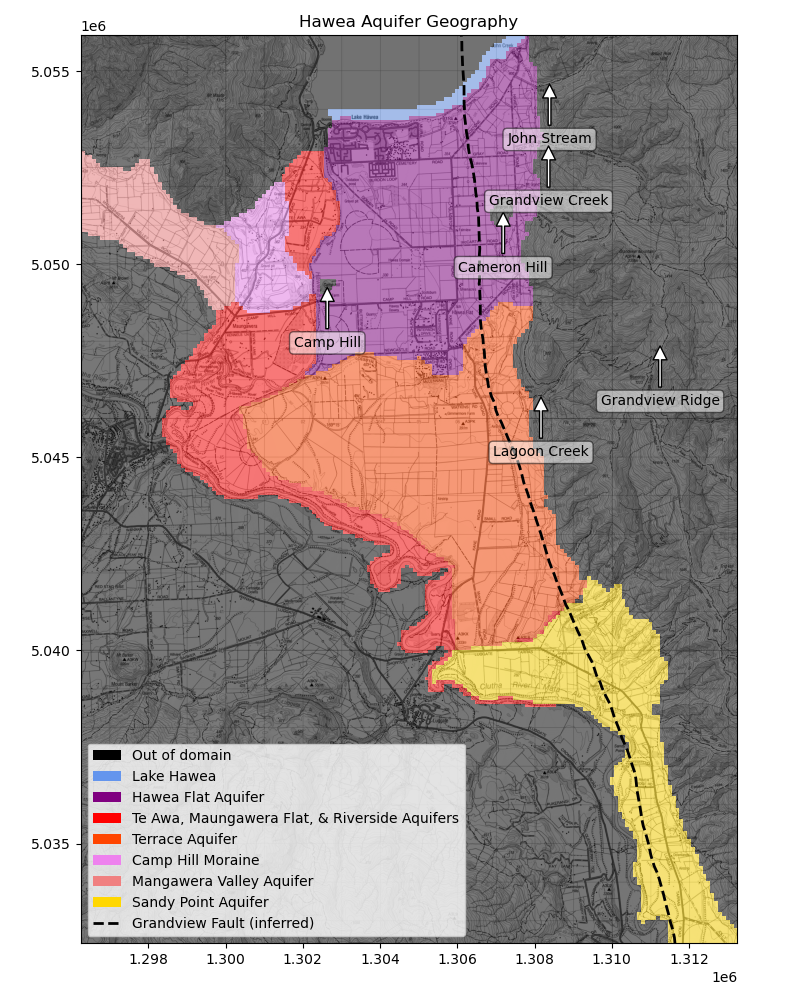

.. class:: centered

    *Figure: Map of the model domain with key features labelled*

Model Time period
=================
This model is a transient groundwater model with the first period defined as a steady state period. For the purposes
of boundary conditions we defined two time periods for the model:

- **Optimisation period**: 2015-07-18 to 2020-06-27:
    - the period where we have the most data available across boundary conditions, observations (targets)
    - details on defining the optimisation period are in the `optimisation readme <../optimisation/README.rst>`_
- **Scenario Period**: 1980-07-18 to 2020-12-01
    - the period where we have reasonable data available across boundary conditions, but minimal observations (targets)
    - details on defining the scenario period are in the `scenario readme <../Scenarios/README.rst>`_

Model Structure
===============

The model structure was initially created as a 1 layer model, but during the course of the optimisation
it became clear that the model could not reproduce the data without additional structure and layering. For more
information on teh optimisation process see the `optimisation readme <../optimisation/README.rst>`_.

1 layer model structure
------------------

the 1 layer model was largely based on Wilson et al. (2012).  the model top was defined based on a 15m DEM (from NZWaM - Hydro), and the
model bottom was initially set from the model bottom used in Wilson et al. (2012).  The model bottom and top were then adjusted as follows:

- All cells with stream package cells with the stream rbot parameter below the model bottom were set as 0.5 m below rbot.
- A number of cells which routinely caused dry cells (and instability in the model) had the bottom gradient reduced
- The model top was adjusted so that the tops were always at least 0.5m above the rbot of the stream package cells.
- there were a number of cells near the clutha river that caused dry cells due to the incised nature of the river.
  these cells the bottom was set to the bottom of the nearby river cells
- the model bottom was adjusted to ensure that the model thickness was at least 2m

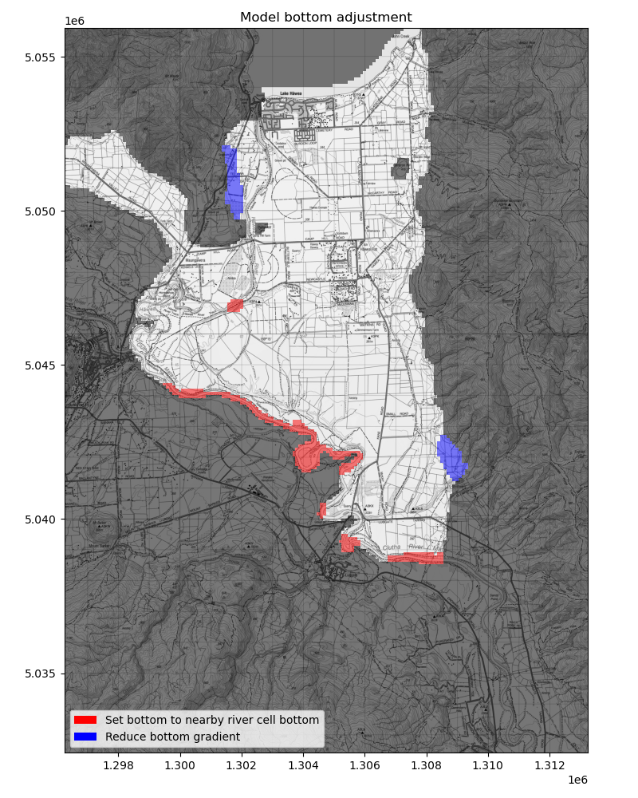

.. class:: centered

    *Figure: location where the gradient of the bottom or the absolute bottom elevations were reduced*

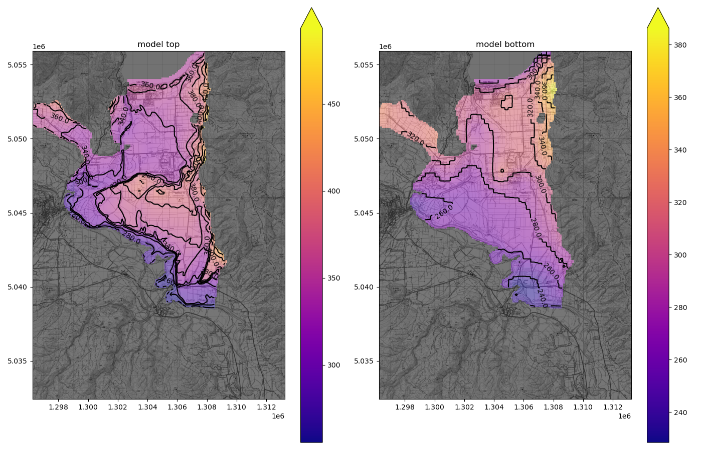

.. class:: centered

    *Figure: Model top and bottom*

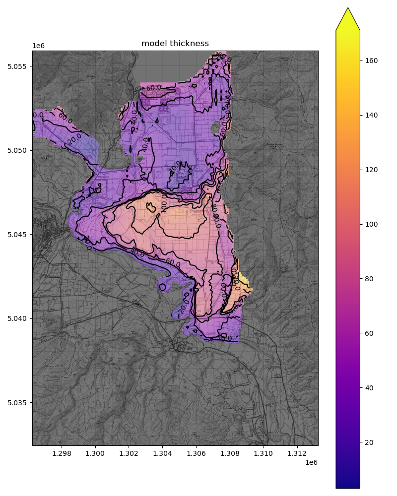

.. class:: centered

    *Figure: Model thickness*

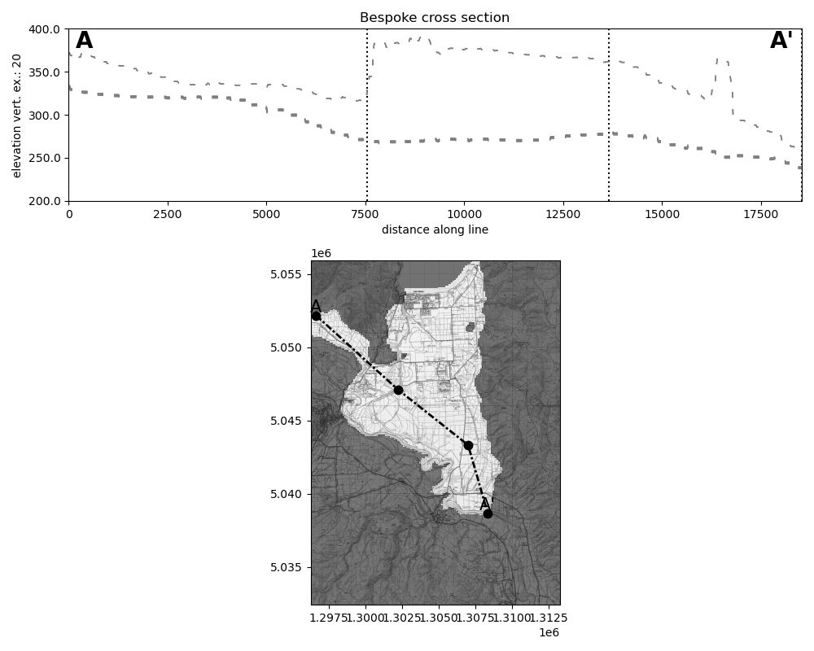

.. class:: centered

    *Figure: Example model cross-section 1*

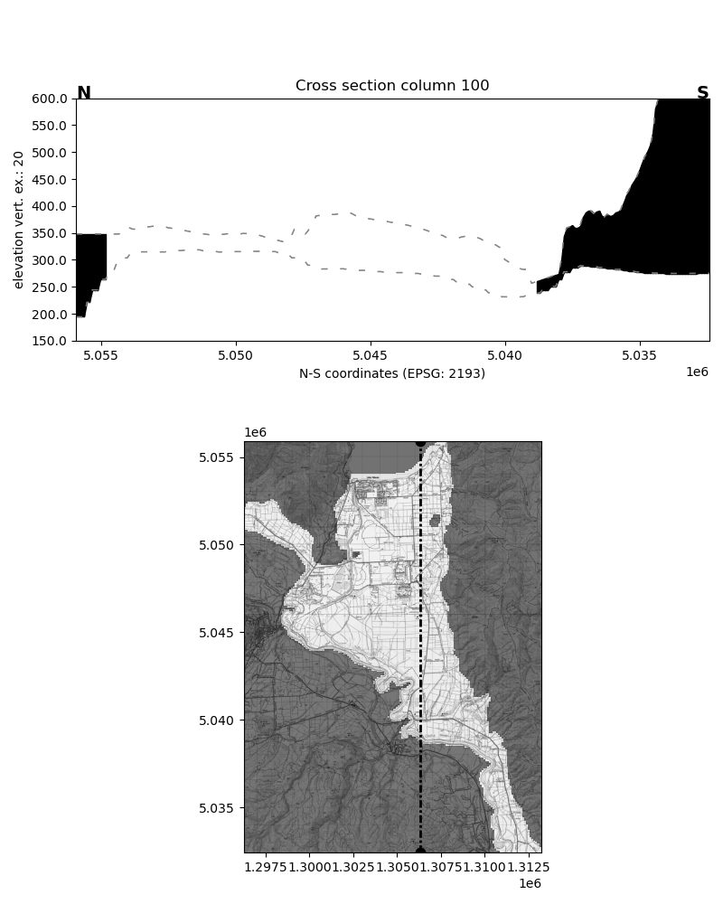

.. class:: centered

    *Figure: Example model cross-section 2*

multi-layer (3d) model structure
------------------
# todo

The multi-layer model structure was created better represent the complex geology in and around the Southern edge of
Lake Hawea. There is likely to be other areas of the model domain that have more complex geology; however excluding
the structure at the Lake Hawea moraine precluded our model from fitting the observed data. For more information on
the optimisation process see the `optimisation readme <../optimisation/README.rst>`_.

Lake Hawea Moraine Conceptual Model
^^^^^^^^^^^^^^^^^^^^^^^^^^^^^^^^^^^^

In the 1 layer model structure the Lake Hawea moraine was represented as a single layer and it's impact on the groundwater
system was parameterised as a single parameter -- hydraulic conductivity.  However, in reality the Lake Hawea moraine is a complex
geological structure. From a groundwater perspective The key observations that precluded the 1 layer model from fitting the data
were the high frequency measurements at well G40/0415 (roughly at the intersection of Cemetery Road and Gladstone Road.
These observations showed that the groundwater levels in this well are highly correlated with the lake levels, but with
approximately 10m of vertical displacement. We developed and fit a very simple numerical model to the groundwater levels
at G40/0415 to better understand the relationship between the lake levels and the groundwater levels in this well.
The model parameterised the groundwater levels as:

$$h_{gw}(t) = /frac{/sum{h_{lake mod}(n)}_{n=t+l}^{t+l+s}}{s}$$

$$h_{lake mod}(t) = ((h_{lake}(t) -  \bar{h_{lake}}) * a) + \bar{h_{lake}} + \Delta h$$

where
- `h_{gw}` is the groundwater level,
- `h_{lake}` is the lake level,
- `t` is the time (day),
- `l` is the lag parameter (days),
- `s` is the number of days to smooth the lake levels,
- `\bar{h_{lake}}` is the mean lake level,
- `\Delta h` is the vertical step parameter,
- `a` is the lake level amplitude modifier,

# todo simple fit
support_figures/lake_gw_level.png

support_figures/borelogs.png
support_figures/concept_diagram_0.png
support_figures/concept_diagram_1.png
support_figures/hds_closeup_h_g40_0415_0000.png
support_figures/hds_closeup_h_g40_0415_0000_MSE.png
support_figures/hds_closeup_h_g40_0415_0000_shape.png
support_figures/lake_gw_level.png

Implementation of the Lake Hawea Moraine Conceptual Model into the groundwater model
^^^^^^^^^^^

# todo

Model boundary conditions
=========================

Land surface recharge (LSR)
---------------------------

LSR model
^^^

We chose to use the `Rushton model <https://doi.org/10.1016/j.jhydrol.2005.06.022>`_ to estimate LSR.
The Rushton model is simple easy to implement and has been used in a number of other studies.
In general the Rushton model uses the following methods to estimate soil moisture balance:

1. Calculation of infiltration to the soil zone (In), and near surface soil storage for the end of the current day
    (SOILSTOR).
    Note that Infiltration (In) as specified by the Rushton algorithms is not just infiltration
    (Rainfall-Runoff). It also includes SOILSTOR from the previous day.
2. Estimation of Actual ET
    The spreadsheet calculates TAW and RAW from field capacity, wilting point, and rooting depth data.
    Typical values for field capacity and wilting point are given in Table 19 of Allen et al. (1998).
    Rooting Depth changes with the season, and is typically 0.5-1m for grass (Table 22 of Allen et al.,1998)
    A depletion Factor, p, needs to estimated for the calculation of RAW. p is the average fraction of TAW
    that can be depleted from the root zone before moisture stress (reduction in ET)
    For NZ conditions p should be around 0.4-0.6, typically 0.5 for grass. See Table 22 of Allen et al.
    (1998) for more values
    Fracstor (near surface soil retention) needs to be estimated. Typical values are 0 for a coarse sandy
    soil, 0.4 for a sandy loam, 0.75 for a clay loam (Rushton, 2006, pg 388)
3. Calculation of Soil Moisture Deficit and recharge.
    Note that the Soil Moisture Deficit equation, section (d) of Rushton, is ambiguous. SURFSTOR for
    this equation should be for the end of the current day, as calculated in section (b).
    The three steps outlined above partition near surface soil storage between near surface soil storage for
    the following day, AET, and the soil moisture deficit/reservoir respectively

Groundwater recharge occurs only when the soil moisture deficit is negative, ie there is surplus water in the soil
moisture reservoir

We also added an irrigation component to the Rushton model as follows:

1. Natural irrigation demand (before irrigation is applied) is calculated to reach the target value (taw * self.irrig_targ)
if Irrigate (bool parameter):
   1. define the irrigation index (those cells with soil moisture < trig (taw* irrig_trig) AND which have
      not been irrigated more recently than the minimum number of days between irrigation (min_irrig_return))
   2. Calculate used irrigation demand
      * if date is not in the irrigation days (between irrig start and stop) then use demand = 0
      * else use demand = max(max_irrigation applied, irrigation demand + irrigation inefficiency)
   3. irrigate from the scheme (irrig_available)
   4. where excess demand remains irrigate from storage
   5. where excess water from the scheme is available add it to storage up to maximum storage
   6. add irrigation water to use_rain and recalculate the soil moisture balance,
      note that irrigation will only be allowed to runoff if allow_irrigation_to_runoff = True
   7. calculate remaining irrigation demand (after irrigation is applied)
2. next day

LSR model inputs -> Precip and PET
^^^^

We used two sets of inputs for meteorological data to estimate LSR:

- **ERA5-land**: a global reanalysis dataset of meteorological data (1950 - 2020)
  `access via <https://cds.climate.copernicus.eu/cdsapp#!/dataset/reanalysis-era5-land?tab=overview>`_
- **Met station data**: Hawea met station data provided by ORC (2012-2021)

We chose to use these two datasets as the met station data is measured data and is therefore more accurate and covers
the full optimisation period. For the longer scenario period we relied on the ERA5-land data as it is an available,
well documented and validated reanalysis that is available for the full scenario period.

LSR model inputs -> Irrigated area and efficiency
^^^^

The Rushton model accounts requires irrigation efficiency and irrigation area to be specified. The irrigation area
is from `MFE's national irrigated land spatial dataset <https://environment.govt.nz/publications/national-irrigated-land-spatial-dataset-2020-update/>`_. The
irrigation efficiency, triggers, return frequencies and application rates are all specified
in `<the recharge modelling script ../model_build/supporting_data_analysis/recharge_model.py>`_ and are largely informed
from `McIndoe (2002) <https://researcharchive.lincoln.ac.nz/bitstream/handle/10182/5122/Use_of_water.pdf?sequence=1>`_

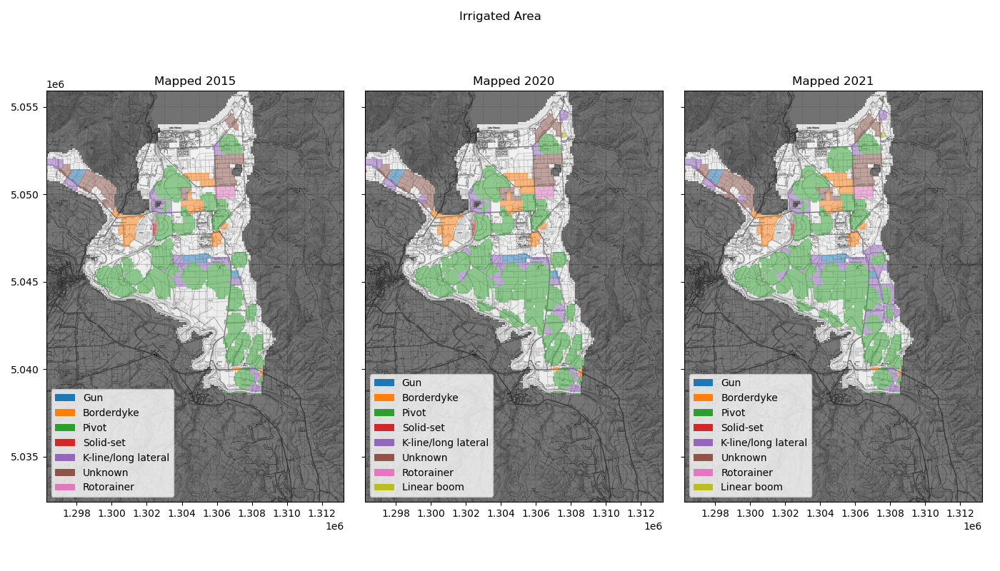

.. class:: centered

    *Figure: irrigated area and irrigation types*

Correcting ERA5-land data
^^^^

Unsurprisingly, the ERA5-Land has biases and unit conversion isues.  We corrected the ERA5-land data by simple multilinear
regression.  For the PET we used the daily Era5-land PET and the season as the predictor variables and daily met PET.  For the precipitation we
used the weekly mean ERA5-land precipitation as the predictor variable and the weekly mean met precipitation as the dependent variable.
The results of the regression are shown in the figure below.

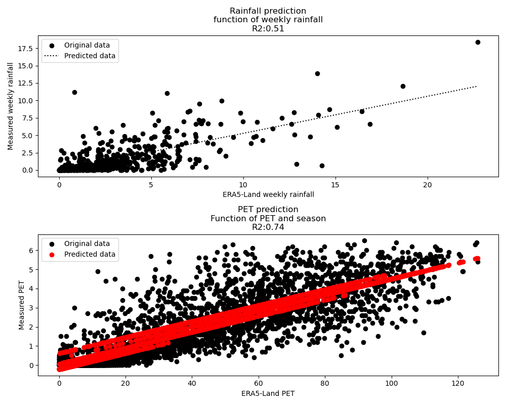

.. class:: centered

    *Figure: Era5-land vs met data and regressions*

Met station based LSR
^^^^^

The weekly mean met station based recharge and spatial mean recharge are presented in the figures below.

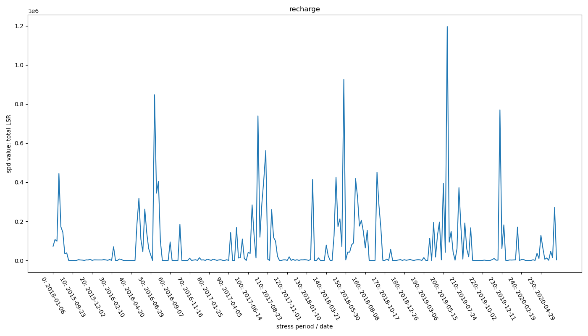

.. class:: centered

    *Figure: Weekly mean met data recharge*

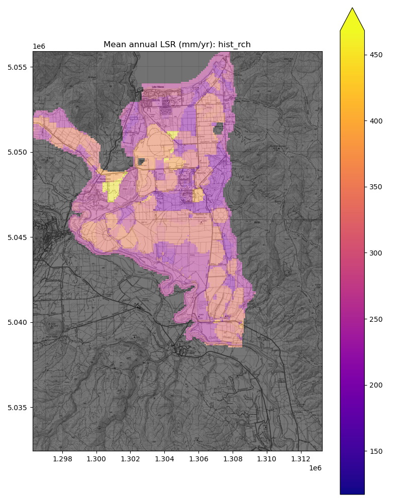

.. class:: centered

    *Figure: spatial variation of mean met data recharge*

Correcting ERA5-land based LSR
^^^

The ERA5-land based recharge was biased relative to the met station based recharge despite the corrections applied to the
meteorological data.  We corrected the ERA5-land based recharge by two simple multilinear regressions one for irrigated sites
and another for dryland sites based on the weekly mean LSR.  The regressions and the results are shown in the figures below.

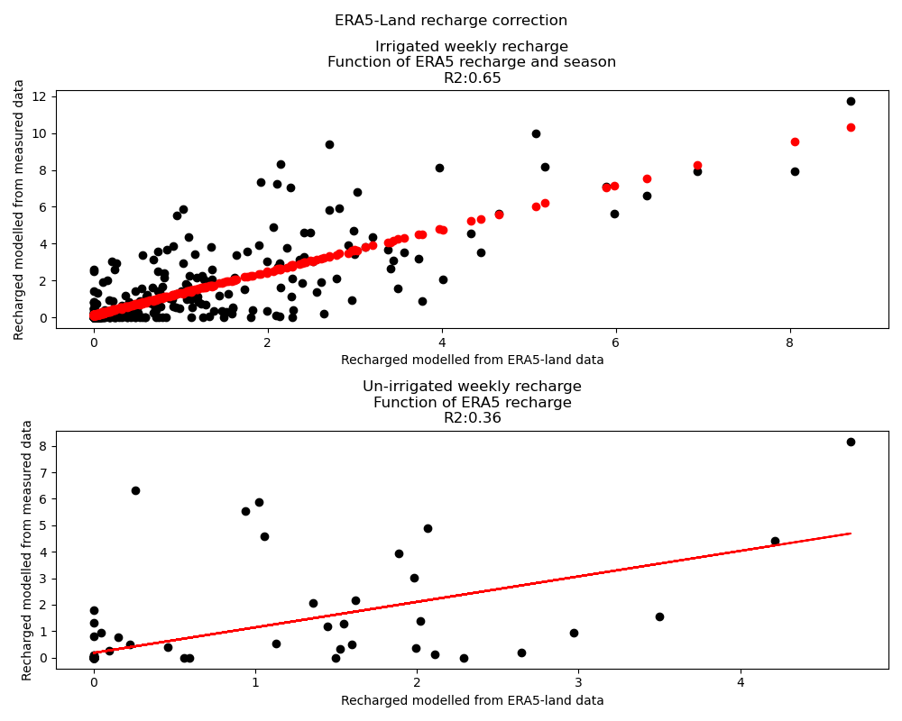

.. class:: centered

    *Figure: regressions for ERA5-land and metdata recharge*

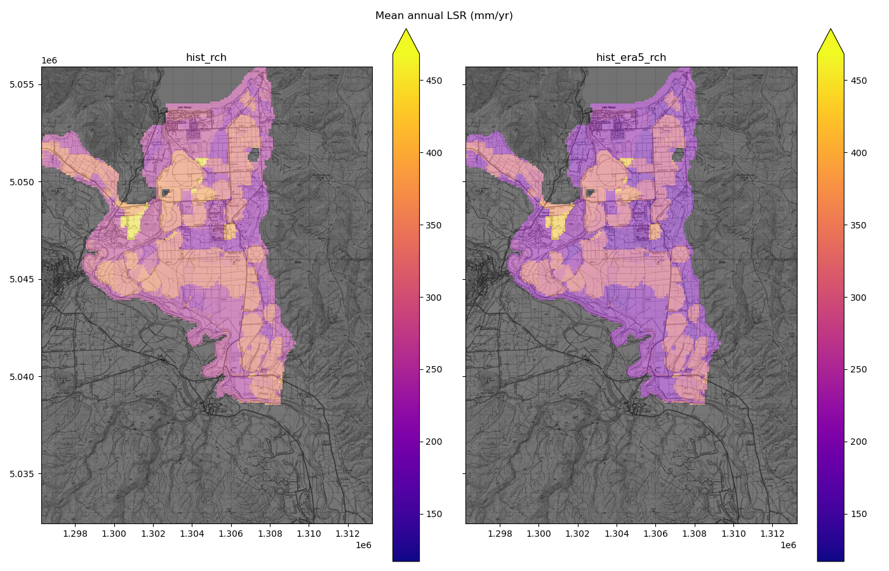

.. class:: centered

    *Figure: comparison for the spatially distributed mean recharge, Note that hist_rch is the metdata based recharge and  hist_era5_rch is the same period, but using the ERA5-land data*

While the regressions are not perfect, they do improve the large scale bias between the ERA5-land based recharge and the met station based recharge.
We use the met station based recharge for the optimisation and the ERA5-land based recharge for the scenarios. While this does introduce some bias in
our scenarios we analyse the results of the scenarios relative to the optimisation period run with the ERA5-land based recharge, which should
mitigate the bias.

Generating a Long record of LSR
^^^^^^

The advantage of using the ERA5-land data is that it is available for the full scenario period.  We generated several
long records of LSR for the full scenario period. The records are defined as follows and are show in the figure below.

- **dryland_rch**: recharge calculated from ERA5-land assuming this is no irrigation in the catchment (e.g. no irrigation losses)
- **irr_rch**: recharge calculated from ERA5-land assuming that irrigation in the catchment maintains the spatial coverage from 2021,
  but all irrigation is applied via pivot irrigators (e.g. 85% irrigation efficiency)
- **hist_rch**: recharge calculated from the met station data for the optimisation period (2015-2020)
- **hist_era5_rch**: recharge calculated from ERA5-land for the optimisation period (2015-2020)

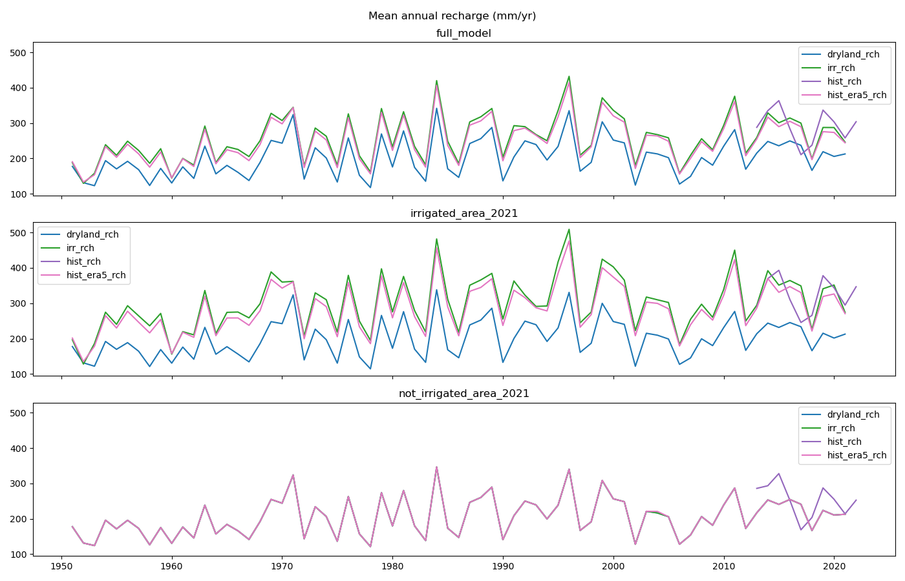

.. class:: centered

    *Figure: comparison of the temporal recharge*

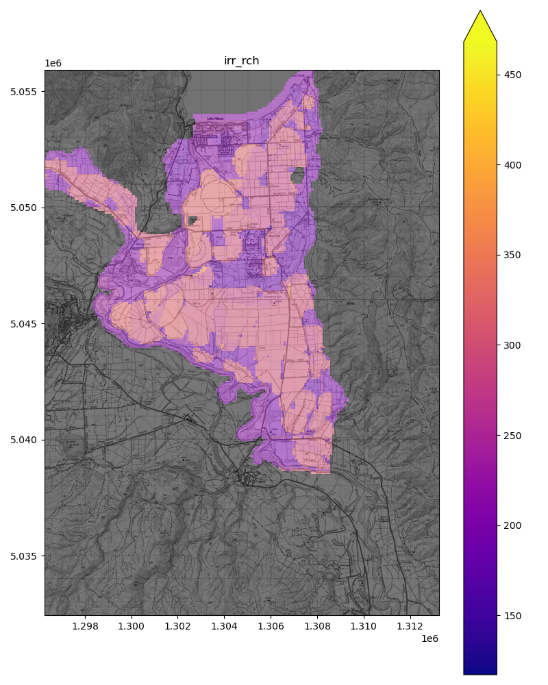

.. class:: centered

        *Figure: spatially distributed mean recharge for the irr_rch scenario*

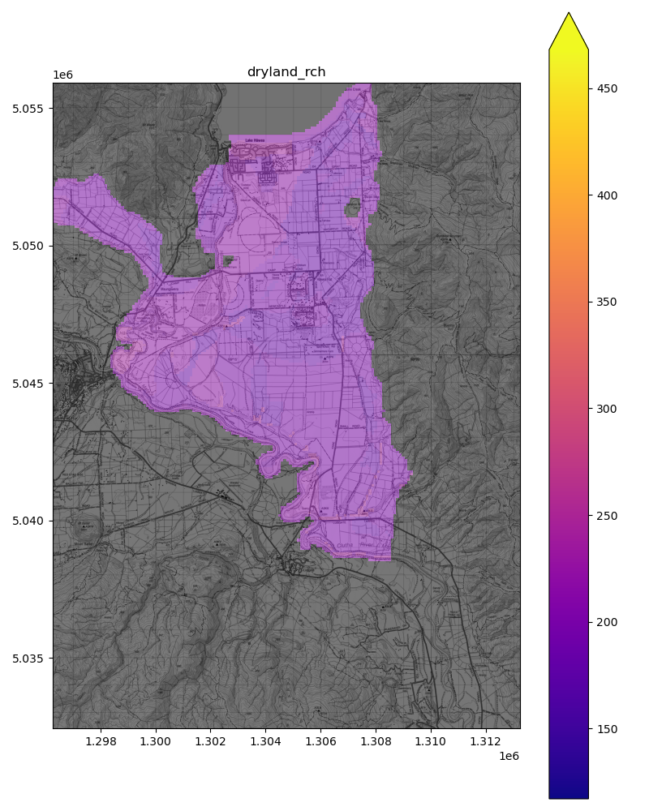

.. class:: centered

        *Figure: spatially distributed mean recharge for the dryland_rch scenario*

Groundwater Abstraction (pumping)
----------------------------------
# todo

Near river bores
^^^^^
# todo

Major Rivers (Hawea river and Clutha River)
-------------------------------------------

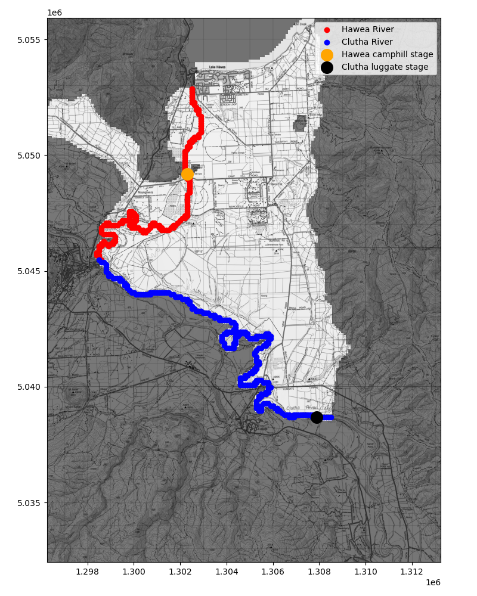

.. class:: centered

    *Figure: Major Rivers and Stage monitoring locations*

The Hawea and Clutha rivers were included in the model using `the stream boundary condition package. <https://water.usgs.gov/nrp/gwsoftware/modflow2000/MFDOC/str.html>`_.
The stream boundary condition package models both stream flow and surface-ground water interactions. While the
Package allows for modelling of stream stage, for this model we specified the stream stage. The package requires the following inputs:

- Stream location and river bed elevation
- Stream stage
- Stream flow (at the top segment of each stream)
- `The stream bed conductance factor <https://water.usgs.gov/nrp/gwsoftware/modflow2000/MFDOC/frequently_asked_questions.html?anchor=conductance>`_

We defined the stream location with a carefully drawn line along the river bed informed by a LiDAR dataset provided by Otago Regional Council.
The raw river bed elevation was defined as the minimum LiDAR elevation in each river model cell.  This left a river profile that was
not consistently decreasing downstream.  To correct this we used a rolling mean to define the river bed elevation.  Finally we inset the
river bottom by 2.5 m so that the river bed elevation was always below the river stage.

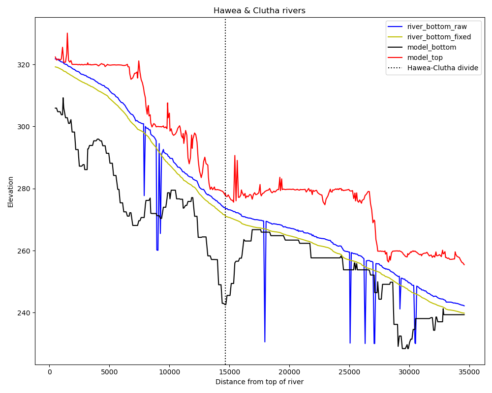

.. class:: centered

    *river bed elevations*

The stream bed conductance factor was a parameter in the model inversion.  See `the model parameterisation readme for more information <model_parameterisation/README.rst>`_
The steam flow did not need to be particularly precise as the river would never come close to losing all of its water to the
aquifer system.  Therefore we set the Hawea river flow to the the historical flow measured at Camp Hill.  The Clutha river
flow was arbitrarily set to 10 * the Hawea river flow.  We prescribed the river stage for both the Hawea and Clutha rivers
by interpolating historical river stage data at Camp Hill (Hawea River) and at a point on the Clutha River 200 m
downstream of Luggate Confluence. The Clutha stage data did not cover the full optimisation period; therefore we used the
ISO-weekly mean river stage for the missing data. The Hawea river stage data was temporally complete. To interpolate the
river stage spatially we simply applied the stage measured at Camphill relative to the river bed elevation to the river bed elevation
in all other Hawea River model cells.  The same approach was used for the Clutha river; however where the Clutha river joined the
Hawea river there was an offset. To avoid this offset causing model convergence issues we linearly interpolated the Stage
at the end of the Hawea River to the stage on the Clutha River 200m downstream of Luggate Confluence.  The river stages generated
this way do not cover the full scenario period.  Therefore we used the ISO-weekly mean river stage for the scenario period.

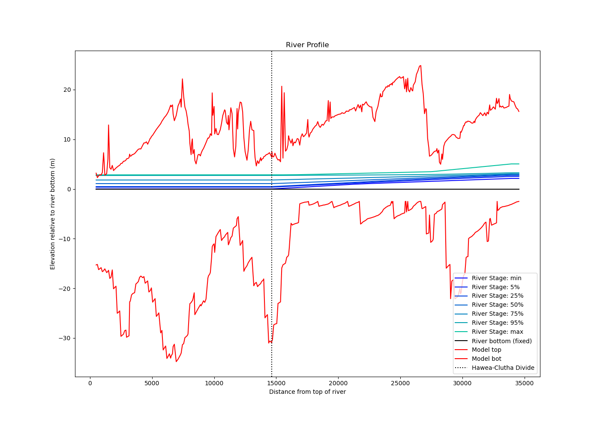

.. class:: centered

    *Figure: river stage relative to river bed elevation*

Lake Hawea
----------

Lake Hawea was modelled with the `General Head Boundary Package <https://water.usgs.gov/nrp/gwsoftware/modflow2000/MFDOC/ghb.html>`_,
which allows for time varient heads to be set.  The package requires the following inputs:

- Location
- Head
- Conductance

For this model the Lake locations were defined as all layers where the model cells that intersected the lake polygon.
The lake conductance as set to a very high value (1e10) so that the only parameter defining the lake - model interaction
was the cell's hydraulic properties (e.g. hydraulic conductivity). The lake head was set base on the historical lake stage
measured at the dam.  The historical lake stage covered both the full optimisation period and the full scenario period.

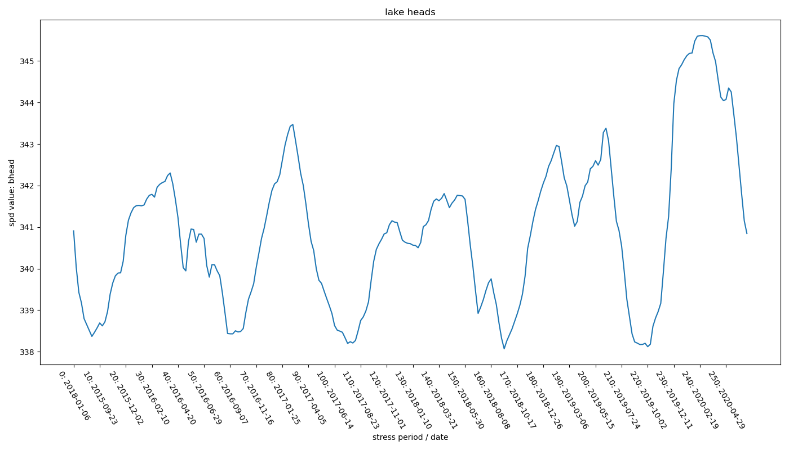

.. class:: centered

    *Figure: Lake levels for the optimisation period*

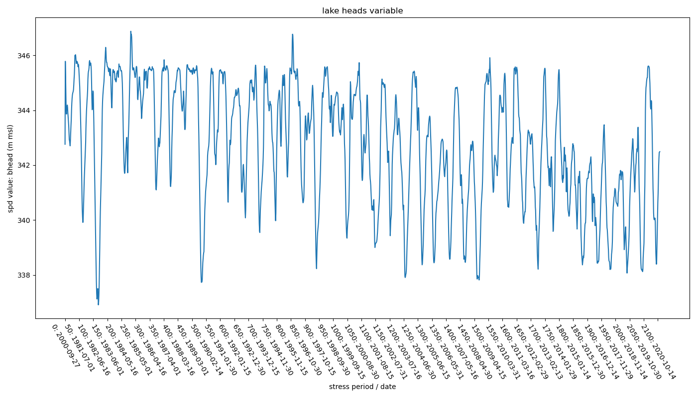

.. class:: centered

    *Figure: Lake levels for the Scenario period*

Irrigation Supply Race Losses (race losses)
-------------------------------------------

There are a number of irrigation supply races across the model domain. Estimates of race water losses are uncertain,
however `McIndoe (2002) <https://researcharchive.lincoln.ac.nz/bitstream/handle/10182/5122/Use_of_water.pdf?sequence=1>`_
suggests that approximately 10% of the race flows are lost to groundwater
we have access to records of daily race takes from the Hawea Irrigation Co. from 2012-01-01 to 2021-12-31, which covers
full optimisation period. For the scenario period we simply used the ISO weekly mean race losses.

Race losses were implemented as well boundary conditions using the `Wel package <https://water.usgs.gov/nrp/gwsoftware/modflow2000/MFDOC/wel.html>`_.
Well boundary conditions were placed in every model cell that intersected the race shapefiles and the flux was specified as
10% of the daily race flows spread evenly across every 'race' boundary condition.

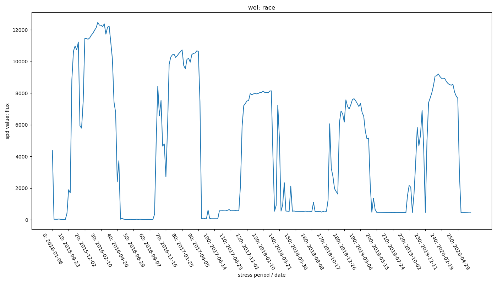

.. class:: centered

    *Figure: race losses (m/day) during the optimisation period*

Hillside stream inflows (hillside inflows)
------------------------------------------
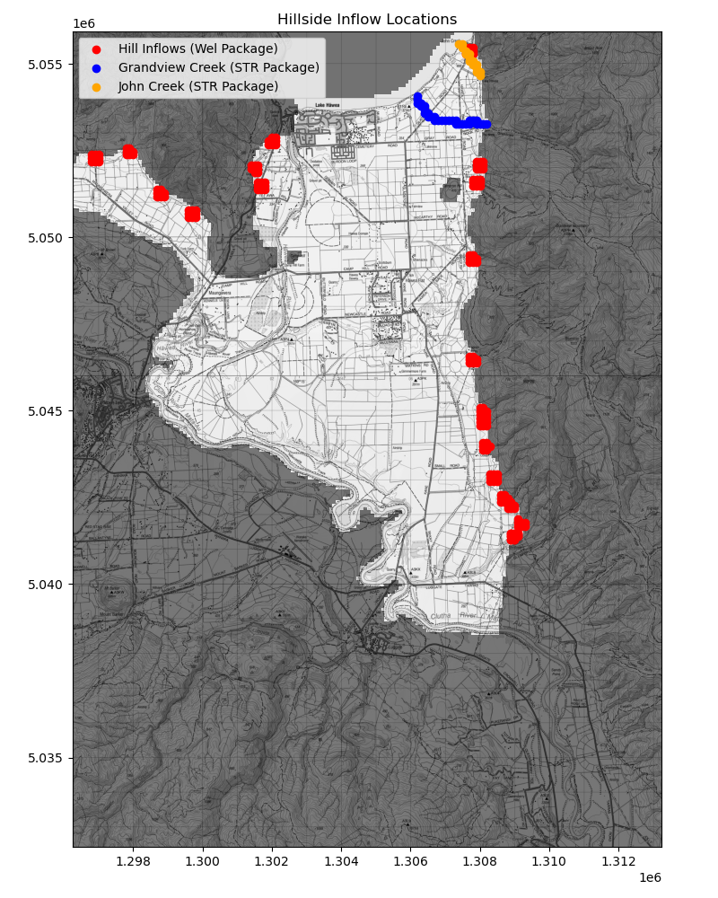

.. class:: centered

    *Figure: Hillside inflow locations*

Method to estimate hillside inflows
^^^^^^^^^^^^^^^^^^^^^^^^^^^^^^^^^^^

There is has been rather minimal gauging data for the various hillside creeks that flow into the model domain, but it
likely that these creeks contribute significantly to the groundwater budget. Recorders were put into Grandview and
Lagoon Creek during the winter of 2017, so we have a daily data flow record for the period 2017-08-21 to 2021-02-09.
This period is insufficient for even the optimisation period, let alone the scenario period. In addition there are another
19 hillside creeks that have not been gauged. We choose to estimate the hillside inflows based on the long term record of
nearby Lindis River. The Lindis River is a much larger that drains the mountains to the east of Lake Hawea. While the
Lindis River catchment is much larger than the hillside inflows, it drains areas with similar geography and climate and has
a historical high frequency gauging record at Lindis Peak starting in 1976-09-23. To estimate the hillside inflows used
the following methodology:

#. We estimated the catchment area (CA) for each of the Hillside catchments that flow into the model domain
   using `pysheds <http://mattbartos.com/pysheds/>`_
#. We manually estimated the Lindis River Catchment above the Lindis Peak recorder (by drawing a shapefile).
   Note we did not use pysheds here as the lower gradient topography in the Lindis River created complications
   with the precision of the available DEM
#. We normalised the daily flows of the Lindis River, Lagoon Creek, and Grandview Creek to their respective catchment
   areas
#. We calculated the mean annual low flow (MALF) normalised to the catchment area for each of the hillside creeks
   and the Lindis River
#. We then conducted a logarithmic regression of the MALF/CA against catchment area (see figure below).  Note that our
   regression predicted a MALF of zero at a catchment area of 0.14 km^2, which is consistent with the behaviour we would
   likely expect.
#. we then conducted a multiple linear regression of daily flows of the hillside creeks against the independent
   variables of Lindis River Flow/CA and the predicted MALF/CA. (see figure below) The Root Mean Squared errors for the
   daily and monthly flows at Lagoon Creek and Grandview Creek are shown in the table below.
#. We then used both of these regressions to predict the daily flows of the hillside creeks for the period of
   1976-09-23 to 2021-06-30. Where the prediction was negative we set the flow to zero.
#. Finally to reduce the impact of very high flows (where overland flow may not be inconsequential) we set any daily
   flows greater than the 98th percentile of the daily flows to the 98th percentile.

This methodology certainly has its limitations, regression scores are not as high as we would like, but given the minimal
data this was one of the very few options available. Other options could be based on rainfall-runoff modelling, but this
would be very complex, and would introduce additional biases associated with the meteorological data and other modelling
parameters. The root mean squared error of the daily flows at Lagoon Creek and Grandview Creek are presented in the table
below. Note that the monthly mean flows are much better predicted than the daily flows. Given these
RSME values we would consider our predictions to be good enough for the modelling process.  In addition
we added a parameterised multiplier to the hillside inflows during our model inversion.

==========  ==================  ==================
Creek       rsme_daily (m3/s)   rsme_monthly(m3/s)
==========  ==================  ==================
Grandview   0.057               0.036
Lagoon      0.024               0.014
==========  ==================  ==================

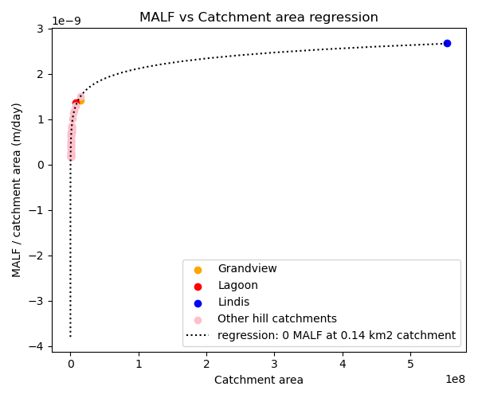

.. class:: centered

    *Figure: The relationship used to predict the catchment area normalised MALFs*

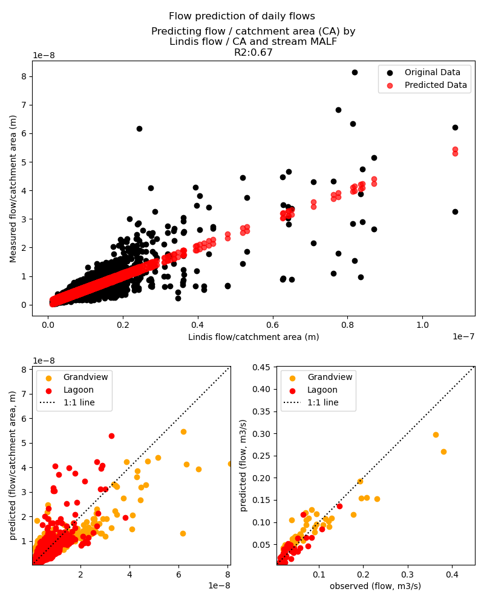

.. class:: centered

    *Figure: The relationship used to predict daily hillside creek flows*

Large Hillside Inflows (Grandview and John Creek) implementation
^^^^^^^^^
Both John creek and Grandview Creek can have significant flows, flow directly into Lake Hawea, and sometimes do not
lose all of their water to groundwater. Therefore we implemented these using `the stream boundary condition package. <https://water.usgs.gov/nrp/gwsoftware/modflow2000/MFDOC/str.html>`_.
This allowed the model to partition the groundwater losses across the length of the stream.  The stream bottom was set
to 2 m below the model top. The stream bottoms were then adjusted so that they were continuously decreasing downstream.
the conductance factor was parameterised. The stream flow at the top of the stream was set using the inflow estimates
described above and the stream stage was set at the smoothed model top (i.e. 2 m above the stream bottom).

Smaller Hillside inflows (other hillside inflows) implementation
^^^^
All of the smaller inflows were implemented using the `Well package <https://water.usgs.gov/nrp/gwsoftware/modflow2000/MFDOC/wel.html>`_.
a series of 9 well boundary conditions were placed, centered on model cells that intersected the hillside inflow shapefiles.
The flux was set to the daily hillside inflow estimate divided by 9 and spread evenly across the 9 well boundary conditions.

Model Zones
===========

A number of model zones were generated to more easily visualise the model results. The generated zones are shown below.

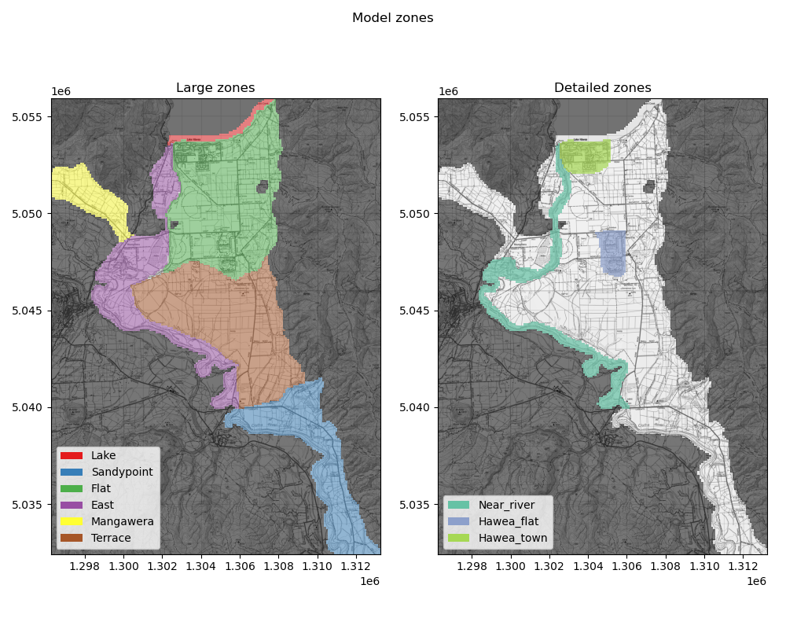

.. class:: centered

    *Figure: helpful model zones*

References
===========

- `McIndoe, I., 2002. Efficient and reasonable use of water for irrigation. <https://researcharchive.lincoln.ac.nz/bitstream/handle/10182/5122/Use_of_water.pdf?sequence=1.>`_
- `Rushton, K.R., Eilers, V.H.M., Carter, R.C., 2006. Improved soil moisture balance methodology for recharge estimation. Journal of Hydrology 318, 379-399. <https://doi.org/10.1016/j.jhydrol.2005.06.022>`_
