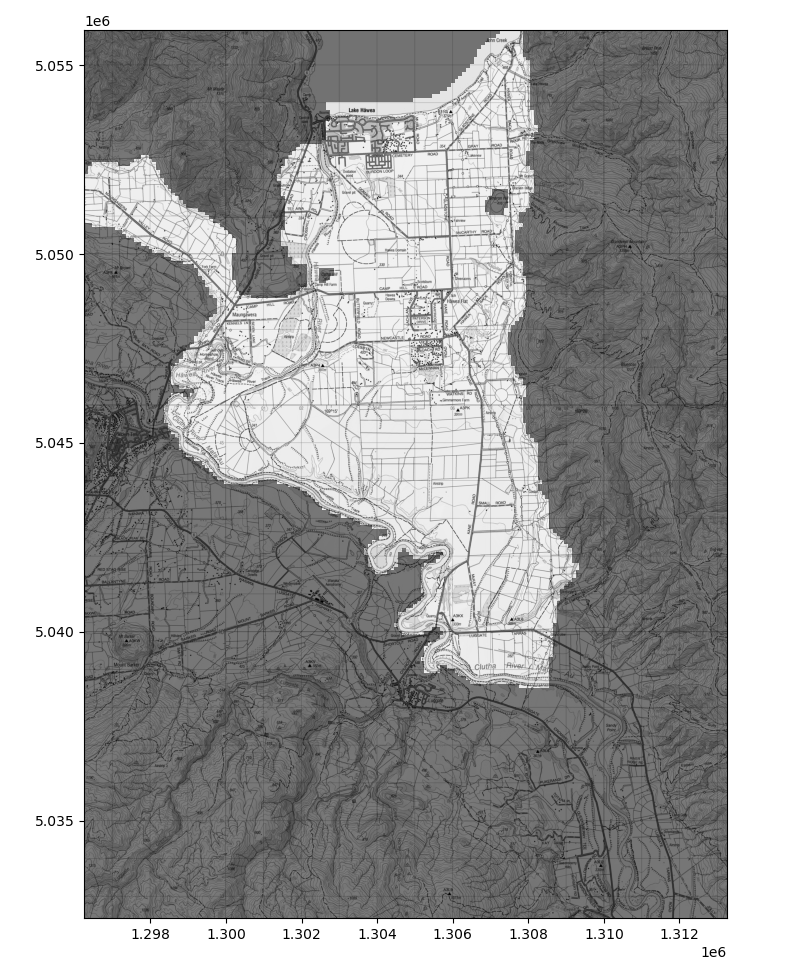

Hawea Transient groundwater model (Hawea Model) build methods and results
############################################################################

.. figure:: {}
   :scale: 50 %
   :align: center

.. class:: centered

    *Figure: *

.. class::

    *test caption # todo make a good figure with all boundary conditions*

:Author:  Matt Dumont
:Date:  2021-11-02
:Version:  1.0.0
:Status:  Draft
:KSL project: Z22031HAW_hawea-model
:Purpose: This document provides the methodology and results for the model build process

Index
=====
.. contents:: Table of Contents

Module Index
============
# todo copy from base readme
-  `README.rst <README.rst>`_: this document
-  `base_data <base_data>`_: raw input data for the model build
-  `processed_input_data <processed_input_data>`_: processed data for the model build that was built by the scripts in this folder from the raw data in the base_data folder
-  `project_model_tools.py <project_model_tools.py>`_: a script to define the model tools instance, and the model structure
-  `get_boundary_condition_data.py <get_boundary_condition_data.py>`_: a script to get the boundary condition data
-  `supporting_data_analysis <supporting_data_analysis>`_: scripts to support creating the boundary condition data and structure
    -  `all_wells.py <supporting_data_analysis/all_wells.py>`_: a script to get all the well location data
    -  `base_concept_diagram.py <supporting_data_analysis/base_concept_diagram.py>`_: a script to build a base concept diagram of the 3d model structure
    -  `compare_met_era5land.py <supporting_data_analysis/compare_met_era5land.py>`_: compare precip and PET between the available met station and the ERA5 land data
    -  `explore_structure.py <supporting_data_analysis/explore_structure.py>`_:
    -  `get_era_5_land.py <supporting_data_analysis/get_era_5_land.py>`_: script to get ERA5-land data
    -  `get_pumping_data.py <supporting_data_analysis/get_pumping_data.py>`_: get and process historical pumping data
    -  `hillside_inflows.py <supporting_data_analysis/hillside_inflows.py>`_: model and process estimates from the hillside inflows
    -  `irrigation_race_losses.py <supporting_data_analysis/irrigation_race_losses.py>`_:  get and process the historical race loss data
    -  `lake_data.py <supporting_data_analysis/lake_data.py>`_: get and process the historical lake data
    -  `map_flowmeter_to_wells.py <supporting_data_analysis/map_flowmeter_to_wells.py>`_: a process to map the flowmeter data to the most likely well
    -  `plot_borelogs.py <supporting_data_analysis/plot_borelogs.py>`_:  a process to plot the borelogs in the model
    -  `recharge_model.py <supporting_data_analysis/recharge_model.py>`_: develop and create LSR estimates from met and ERA5-land data
    -  `river_data.py <supporting_data_analysis/river_data.py>`_: : a process to get and process the river data
-  `modflow_model.py <modflow_model.py>`_: a script to build a modflow model instance
-  `utils.py <utils.py>`_: a script to define some utility functions
-  `zones.py <zones.py>`_: a script to define indicative model zones

Model boundaries
================

The model domain (see figure below) was initially defined to include the following aquifers:

- **The main Hawea flat aquifer** stretching from Lake Hawea in the North to the base of the High terrace in the South. This aquifer is bounded by the Hawea river on the West and the Grandview Ridge on the East
- **The High terrace aquifer** stretching from the base of the High terrace in the North to Clutha River in the South This aquifer is also bounded by the Hawea river on the West and the Grandview Ridge on the East
- **Aquifers near the Hawea river** including Te Awa, Maungawera Flat, and river adjacent aquifers to the south of Maungawera flat and east of the High terrace.
- **The Maungawera Valley aquifer** including the Maungawera valley aquifer from the approximate Hawea River/ Lake Wanaka flow divide in the Northwest to the Maungawera Flat Aquifer
- **The Sandy Point Aquifer** which is to the East of the Clutha river to the South of the High terrace aquifer.  This aquifer is also bounded by the Grandview Ridge on the East

During the model build the steep topography of the Sandy Point Aquifer caused model convergence issues.
The Sandy Point has minimal data available (one historical groundwater measurement) Therefore we resolved the convergence
issue by removing the Sandy Point Aquifer from the model domain. We still produced estimates of Land surface recharge (LSR) and
Hillside inflows to this aquifer, which were used to inform groundwater allocation decisions.

The boundaries of the model domain were all defined by no-flow boundary conditions. In addition at the Lake Hawea Dam,
Camp Hill, and Cameron Hill bedrock is exposed. Therefore these outcrops were also defined as no-flow boundaries.
Finally, the Camp Hill Medial Moraine, located between Te Awa and the Maungawera Flat aquifers, is comprised of poorly sorted
and unworked moraine sediments. While there are a few domestic supply bores in this area, the groundwater system is
likely minimal, particularly in comparison with the other outwash dominated aquifers.  We therefore chose to defined this area
as a no-flow boundary.

.. class:: centered

    *Figure: Map of the model domain with key features labelled #todo*

Model Time period
=================
This model is a transient groundwater model with the first period defined as a steady state period. For the purposes
of boundary conditions we defined two time periods for the model:

- **Optimisation period**: 2015-07-18 to 2020-06-27:
    - the period where we have the most data available across boundary conditions, observations (targets)
    - details on defining the optimisation period are in the `optimisation readme <../optimisation/README.rst>`_
- **Scenario Period**: 1980-07-18 to 2020-12-01
    - the period where we have reasonable data available across boundary conditions, but minimal observations (targets)
    - details on defining the scenario period are in the `scenario readme <../Scenarios/README.rst>`_

Model Structure
===============

2d model structure
------------------

# todo top, bottom definitino

3d model structure
------------------
# todo

Model boundary conditions
=========================

Land surface recharge (LSR)
---------------------------

LSR model
^^^
# todo

LSR model inputs -> Precip and PET
^^^^
# todo
ERA5-land and met station data

LSR model inputs -> Irrigated area and efficiency
^^^^
# todo
support_figures/irrigated_area.png

irrigation efficiency, triggers, return frequencies and application rates are all specified
in `<the recharge modelling script ../model_build/supporting_data_analysis/recharge_model.py>`_

Correcting ERA5-land data
^^^^
# todo
optimisation/pre_optimisation_plots_png/era5_correction/era5_data_correction.png

Met station based LSR
^^^^^
optimisation/pre_optimisation_plots_png/stress_period_data/rch_time.png

Correcting ERA5-land based LSR
^^^
optimisation/pre_optimisation_plots_png/era5_correction/era5_rch_correction.png
Scenarios/boundary_condition_plots/spatial_rch_hist_comp.png

# todo

Generating a Long record of LSR
^^^^^^
# todo dryland, irr_rch, hist_rch, hist_era5

Scenarios/boundary_condition_plots/temporal_rch.png
Scenarios/boundary_condition_plots/spatial_rch_irr_rch.png
Scenarios/boundary_condition_plots/spatial_rch_dryland_rch.png

Groundwater Abstraction (pumping)
----------------------------------
# todo

Near river bores
^^^^^
# todo

Major Rivers (Hawea river and Clutha River)
-------------------------------------------

.. figure:: ../support_figures/river_locs.png
   :scale: 50 %
   :align: center

.. class:: centered

    *Figure: Major Rivers and Stage monitoring locations*

The Hawea and Clutha rivers were included in the model using `the stream boundary condition package. <https://water.usgs.gov/nrp/gwsoftware/modflow2000/MFDOC/str.html>`_.
The stream boundary condition package models both stream flow and surface-ground water interactions. While the
Package allows for modelling of stream stage, for this model we specified the stream stage. The package requires the following inputs:

- Stream location and river bed elevation
- Stream stage
- Stream flow (at the top segment of each stream)
- `The stream bed conductance factor <https://water.usgs.gov/nrp/gwsoftware/modflow2000/MFDOC/frequently_asked_questions.html?anchor=conductance>`_

We defined the stream location with a carefully drawn line along the river bed informed by a LiDAR dataset provided by Otago Regional Council.
The raw river bed elevation was defined as the minimum LiDAR elevation in each river model cell.  This left a river profile that was
not consistently decreasing downstream.  To correct this we used a rolling mean to define the river bed elevation.  Finally we inset the
river bottom by 2.5 m so that the river bed elevation was always below the river stage.

.. figure:: ../support_figures/river_top_bot.png
   :scale: 50 %
   :align: center

.. class:: centered

    *river bed elevations*

The stream bed conductance factor was a parameter in the model inversion.  See `the model parameterisation readme for more information <model_parameterisation/README.rst>`_
The steam flow did not need to be particularly precise as the river would never come close to losing all of its water to the
aquifer system.  Therefore we set the Hawea river flow to the the historical flow measured at Camp Hill.  The Clutha river
flow was arbitrarily set to 10 * the Hawea river flow.  We prescribed the river stage for both the Hawea and Clutha rivers
by interpolating historical river stage data at Camp Hill (Hawea River) and at a point on the Clutha River 200 m
downstream of Luggate Confluence. The Clutha stage data did not cover the full optimisation period; therefore we used the
ISO-weekly mean river stage for the missing data. The Hawea river stage data was temporally complete. To interpolate the
river stage spatially we simply applied the stage measured at Camphill relative to the river bed elevation to the river bed elevation
in all other Hawea River model cells.  The same approach was used for the Clutha river; however where the Clutha river joined the
Hawea river there was an offset. To avoid this offset causing model convergence issues we linearly interpolated the Stage
at the end of the Hawea River to the stage on the Clutha River 200m downstream of Luggate Confluence.  The river stages generated
this way do not cover the full scenario period.  Therefore we used the ISO-weekly mean river stage for the scenario period.

.. figure:: ../optimisation/pre_optimisation_plots_png/stress_period_data/River_profile.png
   :scale: 50 %
   :align: center

.. class:: centered

    *Figure: river stage relative to river bed elevation*

Lake Hawea
----------

Lake Hawea was modelled with the `General Head Boundary Package <https://water.usgs.gov/nrp/gwsoftware/modflow2000/MFDOC/ghb.html>`_,
which allows for time varient heads to be set.  The package requires the following inputs:

- Location
- Head
- Conductance

For this model the Lake locations were defined as all layers where the model cells that intersected the lake polygon.
The lake conductance as set to a very high value (1e10) so that the only parameter defining the lake - model interaction
was the cell's hydraulic properties (e.g. hydraulic conductivity). The lake head was set base on the historical lake stage
measured at the dam.  The historical lake stage covered both the full optimisation period and the full scenario period.

.. figure:: ../optimisation/pre_optimisation_plots_png/stress_period_data/lake_time.png
   :scale: 50 %
   :align: center

.. class:: centered

    *Figure: Lake levels for the optimisation period*

.. figure:: ../Scenarios/boundary_condition_plots/lake_spd_variable.png
   :scale: 50 %
   :align: center

.. class:: centered

    *Figure: Lake levels for the Scenario period*

Irrigation Supply Race Losses (race losses)
-------------------------------------------

There are a number of irrigation supply races across the model domain. Estimates of race water losses are uncertain,
however the best estimate is from # todo refrence suggesting that approximately 10% of the race flows are lost to groundwater
we have access to records of daily race takes from the Hawea Irrigation Co. from 2012-01-01 to 2021-12-31, which covers
full optimisation period. For the scenario period we simply used the ISO weekly mean race losses.

Race losses were implemented as well boundary conditions using the `Wel package <https://water.usgs.gov/nrp/gwsoftware/modflow2000/MFDOC/wel.html>`_.
Well boundary conditions were placed in every model cell that intersected the race shapefiles and the flux was specified as
10% of the daily race flows spread evenly across every 'race' boundary condition.

.. figure:: ../optimisation/pre_optimisation_plots_png/stress_period_data/well_race_time.png
   :scale: 50 %
   :align: center

.. class:: centered

    *Figure: race losses (m/day) during the optimisation period*

Hillside stream inflows (hillside inflows)
------------------------------------------
.. figure:: ../support_figures/hillside_inflow_locations.png
   :scale: 50 %
   :align: center

.. class:: centered

    *Figure: Hillside inflow locations*

Method to estimate hillside inflows
^^^^^^^^^^^^^^^^^^^^^^^^^^^^^^^^^^^

There is has been rather minimal gauging data for the various hillside creeks that flow into the model domain, but it
likely that these creeks contribute significantly to the groundwater budget. Recorders were put into Grandview and
Lagoon Creek during the winter of 2017, so we have a daily data flow record for the period 2017-08-21 to 2021-02-09.
This period is insufficient for even the optimisation period, let alone the scenario period. In addition there are another
19 hillside creeks that have not been gauged. We choose to estimate the hillside inflows based on the long term record of
nearby Lindis River. The Lindis River is a much larger that drains the mountains to the east of Lake Hawea. While the
Lindis River catchment is much larger than the hillside inflows, it drains areas with similar geography and climate and has
a historical high frequency gauging record at Lindis Peak starting in 1976-09-23. To estimate the hillside inflows used
the following methodology:

#. We estimated the catchment area (CA) for each of the Hillside catchments that flow into the model domain
   using `pysheds <http://mattbartos.com/pysheds/>`_
#. We manually estimated the Lindis River Catchment above the Lindis Peak recorder (by drawing a shapefile).
   Note we did not use pysheds here as the lower gradient topography in the Lindis River created complications
   with the precision of the available DEM
#. We normalised the daily flows of the Lindis River, Lagoon Creek, and Grandview Creek to their respective catchment
   areas
#. We calculated the mean annual low flow (MALF) normalised to the catchment area for each of the hillside creeks
   and the Lindis River
#. We then conducted a logarithmic regression of the MALF/CA against catchment area (see figure below).  Note that our
   regression predicted a MALF of zero at a catchment area of 0.14 km^2, which is consistent with the behaviour we would
   likely expect.
#. we then conducted a multiple linear regression of daily flows of the hillside creeks against the independent
   variables of Lindis River Flow/CA and the predicted MALF/CA. (see figure below) The Root Mean Squared error for the
   daily flows at Lagoon Creek and Grandview Creek was #todo m^3/s and #todo m^3/s respectively.
#. We then used both of these regressions to predict the daily flows of the hillside creeks for the period of
   1976-09-23 to 2021-06-30. Where the prediction was negative we set the flow to zero.
#. Finally to reduce the impact of very high flows (where overland flow may not be inconsequential) we set any daily
   flows greater than the 98th percentile of the daily flows to the 98th percentile.

This methodology certainly has its limitations, regression scores are not as high as we would like, but given the minimal
data this was one of the very few options available. Other options could be based on rainfall-runoff modelling, but this
would be very complex, and would introduce additional biases associated with the meteorological data and other modelling
parameters. The root mean squared error of the daily flows at Lagoon Creek and Grandview Creek are presented in the table
below. Note that the monthly mean flows are much better predicted than the daily flows. Given these
RSME values we would consider our predictions to be good enough for the modelling process.  In addition
we added a parameterised multiplier to the hillside inflows during our model inversion.

==========  ==================  ==================
Creek       rsme_daily (m3/s)   rsme_monthly(m3/s)
==========  ==================  ==================
Grandview   0.057               0.036
Lagoon      0.024               0.014
==========  ==================  ==================

.. figure:: ../optimisation/pre_optimisation_plots_png/hillslope_inflow_correction/malf_fit.png
   :scale: 50 %
   :align: center

.. class:: centered

    *Figure: The relationship used to predict the catchment area normalised MALFs*

.. figure:: ../optimisation/pre_optimisation_plots_png/hillslope_inflow_correction/flow_fitting.png
   :scale: 50 %
   :align: center

.. class:: centered

    *Figure: The relationship used to predict daily hillside creek flows*

Large Hillside Inflows (Grandview and John Creek) implementation
^^^^^^^^^
Both John creek and Grandview Creek can have significant flows, flow directly into Lake Hawea, and sometimes do not
lose all of their water to groundwater. Therefore we implemented these using `the stream boundary condition package. <https://water.usgs.gov/nrp/gwsoftware/modflow2000/MFDOC/str.html>`_.
This allowed the model to partition the groundwater losses across the length of the stream.  The stream bottom was set
to 2 m below the model top. The stream bottoms were then adjusted so that they were continuously decreasing downstream.
the conductance factor was parameterised. The stream flow at the top of the stream was set using the inflow estimates
described above and the stream stage was set at the smoothed model top (i.e. 2 m above the stream bottom).

Smaller Hillside inflows (other hillside inflows) implementation
^^^^
All of the smaller inflows were implemented using the `Well package <https://water.usgs.gov/nrp/gwsoftware/modflow2000/MFDOC/wel.html>`_.
a series of 9 well boundary conditions were placed, centered on model cells that intersected the hillside inflow shapefiles.
The flux was set to the daily hillside inflow estimate divided by 9 and spread evenly across the 9 well boundary conditions.

Model Zones
===========

A number of model zones were generated to more easily visualise the model results. The generated zones are shown below.

.. figure:: ../optimisation/pre_optimisation_plots_png/zones.png
   :scale: 50 %
   :align: center

.. class:: centered

    *Figure: helpful model zones*

References
===========
# todo try to get rid of this, instead link to the DOI instead