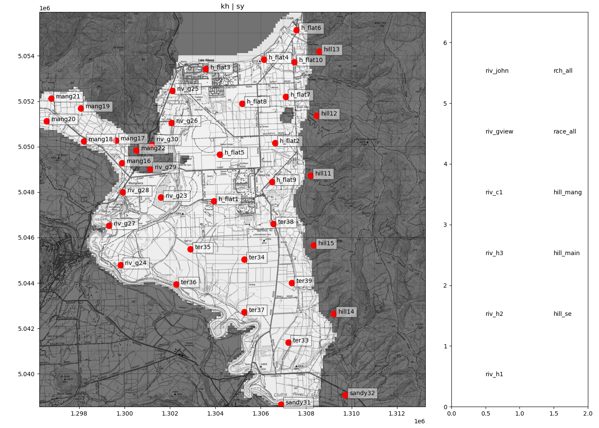
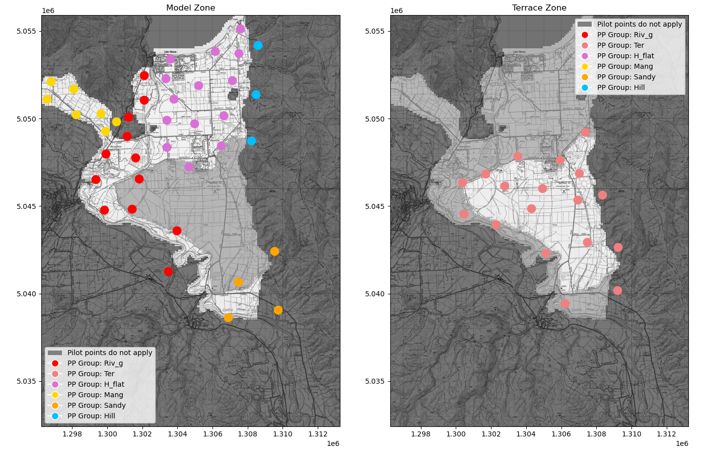
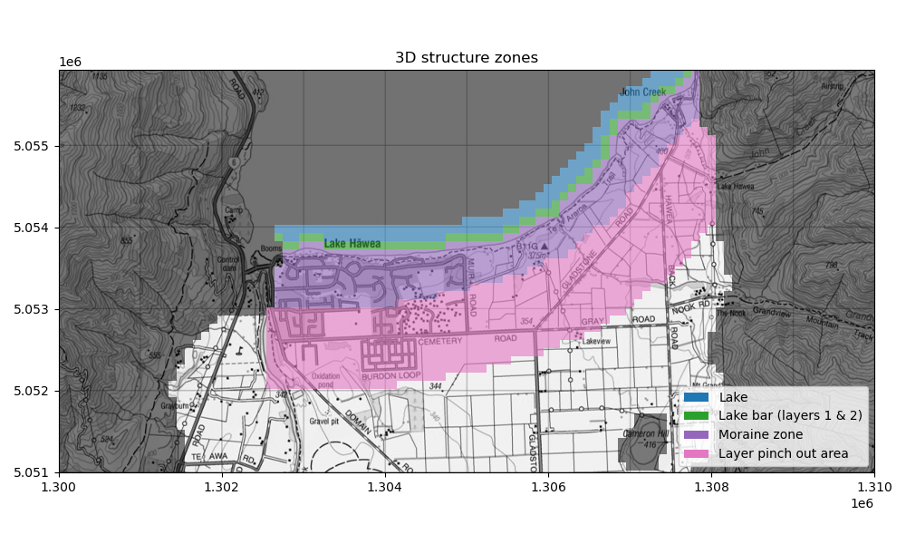
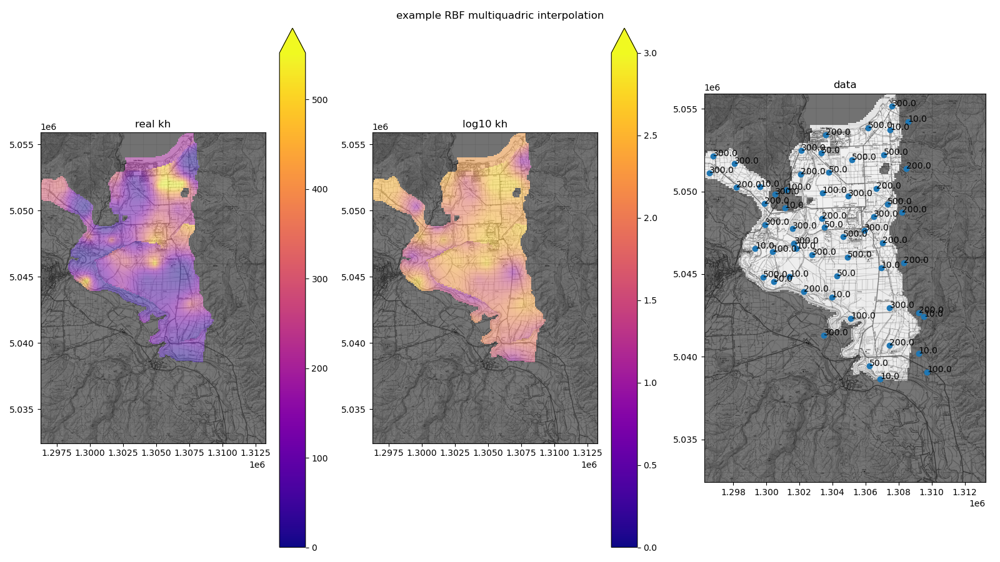
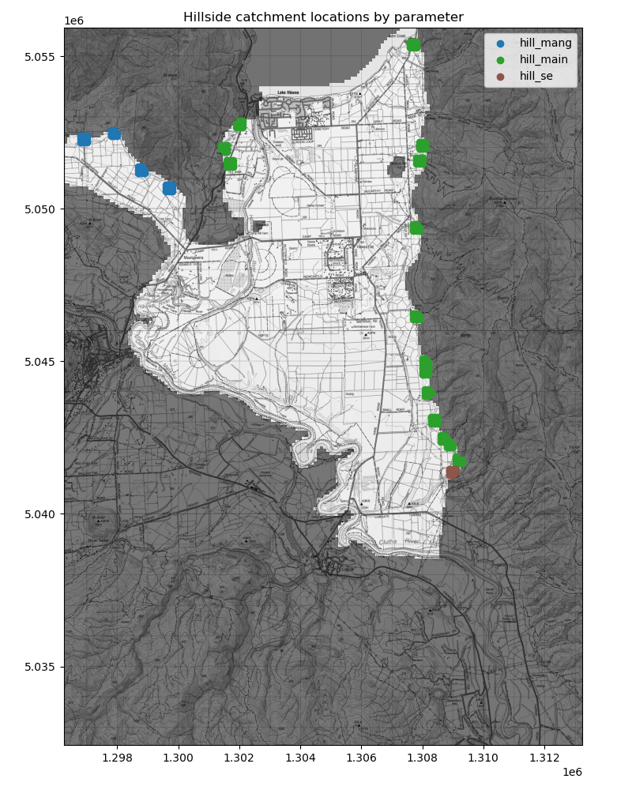
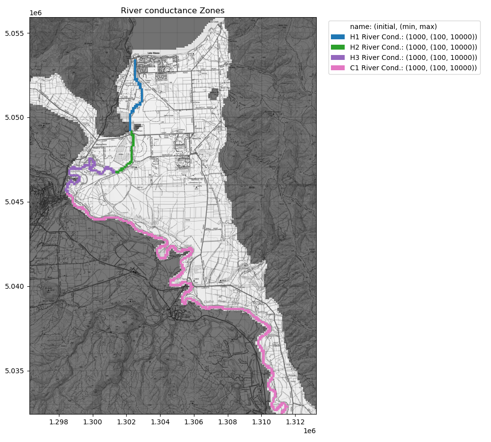

Hawea Transient groundwater model (Hawea Model) parameterization
###################################################################

.. class:: centered

   Figure: All Hawea Model parameters and their location in the model domain.

:Author:  Matt Dumont
:Date:  2021-11-02
:Version:  1.0.0
:Status:  Final
:KSL project: Z22031HAW_hawea-model
:Purpose: This document describes the development of model parameters

Index
=====
.. contents:: Table of Contents

Module Index
============
-  `README.rst <../model_parameterisation/README.rst>`_: this document
-  `base_data <../model_parameterisation/base_data>`_: raw input data for the model parameterisation
-  `processed_data <../model_parameterisation/processed_data>`_: processed data for the model parameterisation that was built by the scripts in this folder from the raw data in the base_data folder
-  `static_params.py <../model_parameterisation/static_params.py>`_: a script to define the static model parameters
-  `pilot_points.py <../model_parameterisation/pilot_points.py>`_: a script to create, define, and interpolate pilot points for kh and sy
-  `inital_parametersiation.py <../model_parameterisation/inital_parametersiation.py>`_: a script to define the initial model parameters (before optimisation)
-  `plot_parameter_names.py <../model_parameterisation/plot_parameter_names.py>`_: a script to plot the parameter names generates parameter_map.png
-  `optimised_parameterisation.py <../model_parameterisation/optimised_parameterisation.py>`_: a script to easily access optimised parameter sets
-  `optimised_parameter_sets <../model_parameterisation/optimised_parameter_sets>`_: optimised parameter sets
    - `3d_v1a_opt.par <../model_parameterisation/optimised_parameter_sets/3d_v1a_opt.par>`_: optimised parameter set for the 3D model version 1a
    - `3d_v1b_opt.par <../model_parameterisation/optimised_parameter_sets/3d_v1b_opt.par>`_: optimised parameter set for the 3D model version 1b
    - `3d_v1d_opt.par <../model_parameterisation/optimised_parameter_sets/3d_v1d_opt.par>`_: optimised parameter set for the 3D model version 1d
-  `parameter_map.png <../model_parameterisation/parameter_map.png>`_: a map of the model parameters

Static parameters
=================
There are four static parameters in the model. They are:

+----------------+-----------------------------------+-------+--------------------------------------------------------------------------------------------------------------+
| Parameter Name | Parameter type                    | Value | Comment                                                                                                      |
+================+===================================+=======+==============================================================================================================+
| lake_ss        | specific storage in the lake zone | 1e-10 | Minimal storage in the lake zone                                                                             |
+----------------+-----------------------------------+-------+                                                                                                              |
| lake_sy        | specific yield in the lake zone   | 1e-10 |                                                                                                              |
+----------------+-----------------------------------+-------+--------------------------------------------------------------------------------------------------------------+
| vka            | vertical conductivity             | 1     | Set to 1 as we are not modelling vertical gradients (no z data for targets)                                  |
+----------------+-----------------------------------+-------+--------------------------------------------------------------------------------------------------------------+
| lake_conduct   | lake conductance                  | 1e10  | Set high so that lake hydraulic conductivity is the only parameter bounding the lake-groundwater interaction |
+----------------+-----------------------------------+-------+--------------------------------------------------------------------------------------------------------------+

Spatial parameters
==================

.. class:: centered

   Figure: Spatial parameters for hydraulic conductivity (kh) and specific yield (sy) in the model domain.

.. class:: centered

        *Figure: 3D spatial view of the multi-layer model structure zones*

Hydraulic conductivity (kh) and specific yield (sy) were parameterised using pilot points in two discrete zones; one
for the high terrace and another for the rest of the model. We chose to divide the model into two zones because it would
be reasonable that the significantly older high terrace sediments could have different hydraulic properties to the
younger sediments in the rest of the model. In addition this sharp parameter change could allow for the impacts of
the Q4 Albert Town Advance moraine which we did not explicitly represent in the model.  Pilot points extend beyond the
active model domain to allow interpolated values to be calculated at the boundary of the active model domain.  Note that
specific storage, and parameters for the moraine zones are described in `other parameters` below.  The interpolated parameters
apply to all layers in the model (inc. the layer pinch out zone) except in the moraine zone where
these parameters apply to only layer 2 (the bottom layer recalling that layering follows python indexing format
layer 0 = top layer). These parameters do not apply to the lake zone or the lake bar zone.

We initially parameterised the model as a relatively homogeneous system. We considered leveraging the parameters
generated by Wilson et al. (2012), but decided against is as it could introduce bias from the previous model.
Parameter ranges and initial values are defined in the table below.

+-----------------+---------+------+------+
| Parameter group | Initial | Min  | Max  |
+=================+=========+======+======+
| Main Kh         | 3e2     | 1e-2 | 1e4  |
+-----------------+---------+      +      +
| Terrace Kh      | 5e1     |      |      |
+-----------------+---------+------+------+
| Main Sy         | 1e-2    | 1e-4 | 3e-1 |
+-----------------+         +      +      +
| Terrace Sy      |         |      |      |
+-----------------+---------+------+------+

Wilson et al. (2012) assessed the annual lake fluctuation in Lake Hawea using the Jacob tidal equation. They found values
of specific yield = 0.012 and a transmissivity estimate of 1300 $m^2/d$. We used the specific yield value to set
the initial values for the specific yield.  The tidal estimates of transmissivity do not include the complex three
dimensional structure which almost certainly limits the transmissivity.  We therefore set the initial value to a higher
value than the tidal estimate. We set the upper bound based on the highest recorded transmissivity from pump tests, though
as noted in Wilson et al. (2012) these tests are somewhat suspect. We set the lower bound at an arbitrary, but very low value allowing kh to
span six orders of magnitude.

Interpolating spatial parameters
----------------------------------

We interpolated the pilot points to continuous values using Radial basis function (RBF) interpolation with a multiquadric
kernel.  The RBF interpolation was performed using the `scipy.interpolate.Rbf` function.  The RBF interpolation was
preformed on log (base 10) transformed values.  An example of the RBF interpolation is shown below.

.. class:: centered

   Figure: Example of the RBF interpolation of the spatial parameters.  The interpolated values are shown for the
   bottom layer of the model.

Other parameters
================
A number of other parameters were included in the model.  These parameters are listed in the table below.
Recall layering follows Python indexing format e.g. layer 0 = top layer.

+----------------------------+---------+--------------+-----------+-----------+-------+-----------------------+
| Parameter type             | Package | Name         | Initial   | Min       | Max   | Applies to            |
+============================+=========+==============+===========+===========+=======+=======================+
| Hillside inflow multiplier | Wel     | hill_se      |   1       | 0.8       | 1.2   | see figure below      |
+----------------------------+---------+--------------+-----------+-----------+-------+                       +
| Hillside inflow multiplier | Wel     | hill_main    |   1       | 0.8       | 1.2   |                       |
+----------------------------+---------+--------------+-----------+-----------+-------+                       +
| Hillside inflow multiplier | Wel     | hill_mang    |   1       | 0.8       | 1.2   |                       |
+----------------------------+---------+--------------+-----------+-----------+-------+-----------------------+
| Recharge Multiplier        | Rch     | rch_all      |   1       | 0.5       | 1.2   |  full model domain    |
+----------------------------+---------+--------------+-----------+-----------+-------+                       +
| Race loss multiplier       | Wel     | race_all     |   1       | 0.8       | 1.2   |                       |
+----------------------------+---------+--------------+-----------+-----------+-------+-----------------------+
| River Conductance          | Riv     | riv_h1       |   1000    | 100       | 10000 | see figure below      |
+----------------------------+---------+--------------+-----------+-----------+-------+                       +
| River Conductance          | Riv     | riv_h2       |   1000    | 100       | 10000 |                       |
+----------------------------+---------+--------------+-----------+-----------+-------+                       +
| River Conductance          | Riv     | riv_h3       |   1000    | 100       | 10000 |                       |
+----------------------------+---------+--------------+-----------+-----------+-------+                       +
| River Conductance          | Riv     | riv_c1       |   1000    | 100       | 10000 |                       |
+----------------------------+---------+--------------+-----------+-----------+-------+                       +
| River Conductance          | Riv     | riv_gview    |   100     | 50        | 5000  |                       |
+----------------------------+---------+--------------+-----------+-----------+-------+                       +
| River Conductance          | Riv     | riv_john     |   100     | 50        | 5000  |                       |
+----------------------------+---------+--------------+-----------+-----------+-------+-----------------------+
| Conductivity               | Upw     | kh_mor_l0    |   300     | 0.001     | 1000  | moraine zone layer 0  |
+----------------------------+---------+--------------+-----------+-----------+-------+                       +
| Specific Yield             | Upw     | sy_sy_mor_l0 |   0.01    | 0.0001    | 0.3   |         &             |
+----------------------------+---------+--------------+-----------+-----------+-------+                       +
| Specific Storage           | Upw     | sy_ss_mor_l0 |   0.0001  | 0.000001  | 0.001 | lake bar layer 0      |
+----------------------------+---------+--------------+-----------+-----------+-------+-----------------------+
| Conductivity               | Upw     | kh_mor_l1    |   0.0001  | 0.0000001 | 1     | moraine zone layer 0  |
+----------------------------+---------+--------------+-----------+-----------+-------+                       +
| Specific Yield             | Upw     | sy_sy_mor_l1 |   0.001   | 0.0001    | 0.3   |         &             |
+----------------------------+---------+--------------+-----------+-----------+-------+                       +
| Specific Storage           | Upw     | sy_ss_mor_l1 |   0.0001  | 0.000001  | 0.001 | lake bar layers 1 & 2 |
+----------------------------+---------+--------------+-----------+-----------+-------+-----------------------+
| Specific Storage           | Upw     | sy_ss_rest   |   0.0001  | 0.000001  | 0.001 | area of pilot points  |
+----------------------------+---------+--------------+-----------+-----------+-------+-----------------------+
| Conductivity               | Upw     | kh_lake      |   300     | 0.001     | 1000  | lake zone all layers  |
+----------------------------+---------+--------------+-----------+-----------+-------+-----------------------+

We set the initial parameters and ranges for the multipliers (hill_se, hill_main, hill_mang, rch_all, race_all) to
allow a 20% change around the predicted in the inflow values.  The initial values for the Hawea and Clutha River conductance
(riv_h1, riv_h2, riv_h3, riv_c1) were roughly pulled from the model developed in Wilson et al. (2012).
The initial values for the smaller river conductance (riv_gview, riv_john) were set as an order of magnitude lower
than the Hawea and Clutha River conductance. The ranges for the river conductance are somewhat arbitrary but act to allow
the model to explore a range of values.  The initial and ranges of kh_lake, and kh_mor_l0 were set to the values used
for the main pilot points. The specific storage values (sy_ss_rest, sy_ss_mor_l0, sy_ss_mor_l1) were set to typical
specific storage values.  The specific yield parameters were set to the range used for
the main pilot points.  The initial value for sy_sy_mor_l0 was set to the starting pilot point values while the initial
value for sy_sy_mor_l1 was set an order of magnitude lower.  kh_mor_l1 (the moraine low conductivity unit) was set to
the typical values for glacial till.

.. class:: centered

   Figure: Spatial location of the hillside inflow multiplier parameters.

.. class:: centered

   Figure: Spatial location of the river conductance parameters.

References
===========

- `Wilson, J., 2012. Hawea Basin Groundwater Review. prepared by Resouce Science Unit of Otago Regional Council, June 2012, Dunedin. <../scott_model/Hawea_Basin_Groundwater_Review_2012_FINAL.pdf>`_