Hawea Transient groundwater model (Hawea Model) build optimisation and results
############################################################################

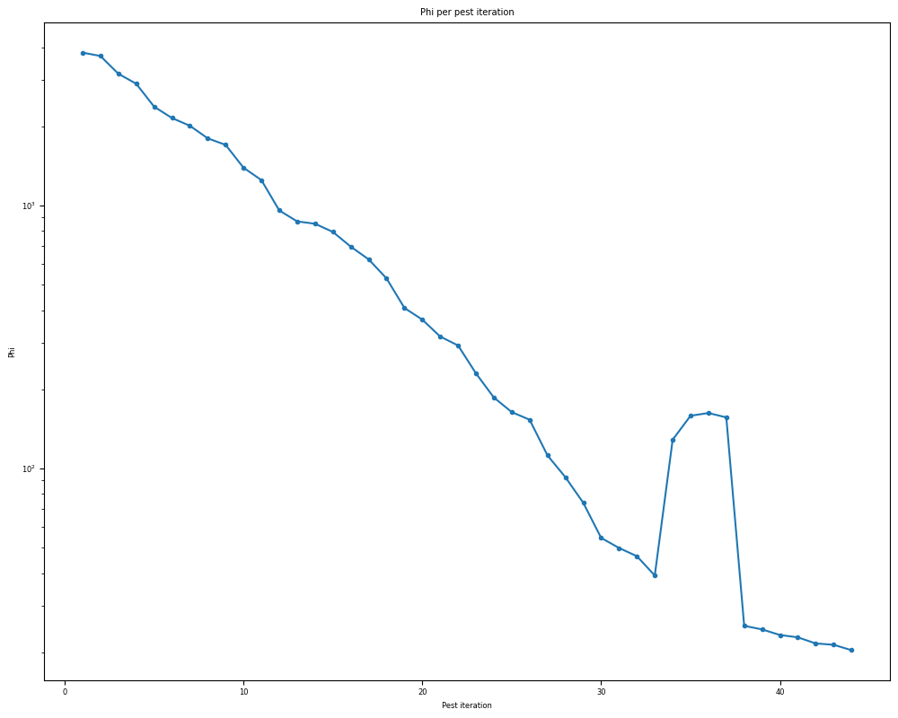

.. class:: centered

    *Figure: Model objective function over the optimisation*

:Author:  Matt Dumont
:Date:  2021-11-02
:Version:  1.0.0
:Status:  Draft
:KSL project: Z22031HAW_hawea-model
:Purpose: This document provides the methodology and results for the model optimisation process and discusses the model limitations

Index
=====
.. contents:: Table of Contents

Module Index
============
-  `README.rst <../optimisation/README.rst>`_: readme document detailing the optimisation process and methodology
-  PEST optimisation build, run, and post processing scripts
    -  `build_optimisation.py <../optimisation/build_optimisation.py>`_: script and functions to build the PEST files
    -  `a_build_run_optimisation_version.py <../optimisation/a_build_run_optimisation_version.py>`_: build and run a PEST optimisation
    -  `run_opt_step_models.py <../optimisation/run_opt_step_models.py>`_:  run the step models from a PEST optimisation
    -  `manual_optimisations <../optimisation/manual_optimisations>`_:  manual optimisations that were run, in the end these never contributed more than some information to the modeller
    -  `model_utils_for_forward_run.py <../optimisation/model_utils_for_forward_run.py>`_: functions to build and run a model from PEST parameter files
    -  `compare_parameterisations.py <../optimisation/compare_parameterisations.py>`_: script to compare parameters across multiple parameter files
    -  `hawea_plot_optimisation.py <../optimisation/hawea_plot_optimisation.py>`_: script to plot the optimisation results
    -  `plot_multiple_high_freq.py <../optimisation/plot_multiple_high_freq.py>`_: script to plot multiple high frequency observations for given PEST obs files
-  Manage optimisation period:
    -  `determine_opt_start.py <../optimisation/determine_opt_start.py>`_: script to determine the start and end of the optimisation period
    -  `optimisation_period.py <../optimisation/optimisation_period.py>`_: script to manage and hold the information about the optimisation period
-  Optimisation Results
    -  `optimisation_results <../optimisation/optimisation_results>`_: results for the optimisation holding all of the PEST input and output files
        -  `3d_v1a <../optimisation/optimisation_results/3d_v1a>`_:  optimisation results for the 3D model version 1a
        -  `3d_v1b <../optimisation/optimisation_results/3d_v1b>`_:  optimisation results for the 3D model version 1b
        -  `3d_v1d <../optimisation/optimisation_results/3d_v1d>`_:  optimisation results for the 3D model version 1d (final model)
    -  `final_opt_models <../optimisation/final_opt_models>`_:  The final optimised model files
        -  `3d_v1a <../optimisation/final_opt_models/3d_v1a>`_: final optimised model files for the 3D model version 1a
        -  `3d_v1b <../optimisation/final_opt_models/3d_v1b>`_: final optimised model files for the 3D model version 1b
        -  `3d_v1d <../optimisation/final_opt_models/3d_v1d>`_: final optimised model files for the 3D model version 1d (final model)
        -  `compress_uncompress_model.py <../optimisation/final_opt_models/compress_uncompress_model.py>`_:  utilities to compress and uncompress the model files so they could be included in the Git repo (50mb limit)
-  Computational support files
    -  `compile_pest <../optimisation/compile_pest>`_: compile PEST for linux
    -  `pest_run_data <../optimisation/pest_run_data>`_: static data needed by PEST to run the model
    -  `git_setup.sh <../optimisation/git_setup.sh>`_: script to setup the Git repo for the optimisation on a machine
- Model overview
    -  `pre_optimisation_overview.py <../optimisation/pre_optimisation_overview.py>`_: make pre optimisation overview plots
    -  `make_preopt_slideshow.py <../optimisation/make_preopt_slideshow.py>`_: make a pre optimisation slideshow
    -  `pre_optimisation_plots_png <../optimisation/pre_optimisation_plots_png>`_: pre optimisation plots of boundary conditions, targets, parameterisation, and other supporting work, many of these figures are referenced in the various readme.rst files
    -  `make_opt_presentation.py <../optimisation/make_opt_presentation.py>`_: make a presentation of the optimisation results for a meeting

Optimisation overview
=====================

The optimisation process involved changing group weightings, parameter bounds, and the model structure. This chaotic
process is typical in model optimisation and is typically very difficult to follow for anyone other than the primary
modeller.  To try and make this process more transparent and to provide a record of the process, we created a new Git
branch for each optimisation version.  This allowed us to track the changes to the model and reproduce and archive all of
the key input data with any changes.  To reduce the size of the Github repo we deleted all of the abandoned branches,
but we produced a Github release for each abandoned branch so that the data could be recovered if needed.

Broadly speaking there were 3 main stages to the optimisation process:

#. A 1 layer model (2D)
#. Specific sub model (2D) to test whether or not the terrace observations could be fit by
   disconnecting the terrace from the main model
#. A 3 layer model (3D)

Optimisation setup / PEST structure
===================================
The model was optimised via `PEST <http://www.pesthomepage.org/>`_ which is a model calibration and optimisation package.
The interface to the model was handled via `flopy <https://flopy.readthedocs.io/en/3.3.2/introduction.html>`_
which is a Python package for working with MODFLOW models and `pyemu <https://pyemu.readthedocs.io/en/develop/pyemu.html>`_
which is a Python package for working with PEST models. The PEST iterations were run in parallel on a cluster
of linux machines using `Beopest <https://www.prinmath.com/pest/>`_ which is a subpackage of PEST. Beopest was managed
via an in house class called BeopestManager.  In addition, some manual optimisation was undertaken during
the optimisation process to better understand the limits of specific model structures.  These manual optimisations were
undertaken using another in house class called SshDist. The main optimisation script was
`a_build_run_optimisation_version.py <../optimisation/a_build_run_optimisation_version.py>`_

The build of the PEST runfile was undertaken in `build_optimisation.py <../optimisation/build_optimisation.py>`_.
which has a number of component functions:

- `raw_pest <../optimisation/build_optimisation.py#L251>`_:
  - Overarching function to build the PEST runfile (calls the following functions).
  - Also handles the singular value decomposition (SVD) parameters.
- `make_template_and_infiles <../optimisation/build_optimisation.py#L37>`_:
  - Make the template and infiles for PEST to interact with the model parameter inputs.
- `make_ins_and_output_files <../optimisation/build_optimisation.py#L50>`_:
  - Make an example output files (model outputs) and the PEST instruction files to read the model output data (targets).
- `set_control_data <../optimisation/build_optimisation.py#L69>`_:
  - Set the control data for the PEST runfile.
- `set_parameter_data_groups <../optimisation/build_optimisation.py#L145>`_:
  - Set parameter data groups, limits, transformations, and derivative handling.
- `set_obs_data <../optimisation/build_optimisation.py#L190>`_:
  - Set the observation data, weights, and group weightings.

While the full specification for our PEST optimisation is available in the code the following relevant key parameters
are listed below:

- Kh and river conductance parameters were varied on a log transform (`partrans`)
- All other parameters were varied with no transform (`partrans`)
- PEST was run in estimation mode (`pestmode = 'estimation'`)
- PEST allowed model failures in lamda calculation (`lamforgive = 'lamforgive'`)
- PEST allowed model failures in derivative calculation (`derforgive = 'derforgive'`)
- PEST was run with singular value decomposition (`svdmode = 1`)
- The eigenvalue threshold for svd was set to  5e-7 (`svd_dataeigthresh = 5e-7`)

Standard optimisation outputs
=============================

For each optimisation version we produced a number of standard outputs that are consistent across each optimisation
result.  We detail them here so that individuals can have easy access to the key outputs.

The output structure is as follows (links to the files are provided to 3d_v1d which is the final optimised model):

-  Base_Optimisation_plots:
    -  `final_opt_model <../optimisation/optimisation_results/3d_v1d/Base_Optimisation_plots/final_opt_model>`_: plots of the final optimised model including the parameterisation, model heads, and the model
        fits to the observations
       -  `cross_sections <../optimisation/optimisation_results/3d_v1d/Base_Optimisation_plots/final_opt_model/cross_sections>`_: plots of heads in model cross sections
       -  `spatial_hds <../optimisation/optimisation_results/3d_v1d/Base_Optimisation_plots/final_opt_model/spatial_hds>`_: spatial plots of head target residuals
       -  `spatial_riv <../optimisation/optimisation_results/3d_v1d/Base_Optimisation_plots/final_opt_model/spatial_riv>`_: spatial plots of the river gain and losses
       -  `str_flow <../optimisation/optimisation_results/3d_v1d/Base_Optimisation_plots/final_opt_model/str_flow>`_: plots of the stream flow in the river boundary conditions
       -  `Max_heads_(Hawea_aquifer).png <../optimisation/optimisation_results/3d_v1d/Base_Optimisation_plots/final_opt_model/Max_heads_(Hawea_aquifer).png>`_: minimum heads across the model time steps
       -  `Min_heads_(Hawea_aquifer).png <../optimisation/optimisation_results/3d_v1d/Base_Optimisation_plots/final_opt_model/Min_heads_(Hawea_aquifer).png>`_: maximum heads across the model time steps
       -  `Range_of_Heads_(Hawea_aquifer).png <../optimisation/optimisation_results/3d_v1d/Base_Optimisation_plots/final_opt_model/Range_of_Heads_(Hawea_aquifer).png>`_: range of heads across the model time steps
       -  `Steady_state_heads_(Hawea_aquifer).png <../optimisation/optimisation_results/3d_v1d/Base_Optimisation_plots/final_opt_model/Steady_state_heads_(Hawea_aquifer).png>`_: plot of the steady state heads (in layer 0 for most of the model, but layer 2 for the moraine areas)
       -  `3d_hds.png <../optimisation/optimisation_results/3d_v1d/Base_Optimisation_plots/final_opt_model/3d_hds.png>`_: plot of heads in the 3D zone
       -  `SS_budget.png <../optimisation/optimisation_results/3d_v1d/Base_Optimisation_plots/final_opt_model/SS_budget.png>`_: plot of the steady state water budget
       -  `all_riv_targets_mes_mod.png <../optimisation/optimisation_results/3d_v1d/Base_Optimisation_plots/final_opt_model/all_riv_targets_mes_mod.png>`_: plot of the measured vs modelled river targets
       -  `all_riv_targets_residual.png <../optimisation/optimisation_results/3d_v1d/Base_Optimisation_plots/final_opt_model/all_riv_targets_residual.png>`_: plot of the river target residuals
       -  `all_river_fluxes_hill.png <../optimisation/optimisation_results/3d_v1d/Base_Optimisation_plots/final_opt_model/all_river_fluxes_hill.png>`_:  total river fluxes for each conductance parameter zone for John and Grandview Creek
       -  `all_river_fluxes_large.png <../optimisation/optimisation_results/3d_v1d/Base_Optimisation_plots/final_opt_model/all_river_fluxes_large.png>`_: total river fluxes for each conductance parameter zone for the Hawea and Clutha rivers
       -  `dry_cells_l0.png <../optimisation/optimisation_results/3d_v1d/Base_Optimisation_plots/final_opt_model/dry_cells_l0.png>`_: number of time steps with dry cells for layer 0
       -  `dry_cells_l1.png <../optimisation/optimisation_results/3d_v1d/Base_Optimisation_plots/final_opt_model/dry_cells_l1.png>`_: number of time steps with dry cells for layer 1
       -  `dry_cells_l2.png <../optimisation/optimisation_results/3d_v1d/Base_Optimisation_plots/final_opt_model/dry_cells_l2.png>`_: number of time steps with dry cells for layer 2
       -  `flooded_cells_l0.png <../optimisation/optimisation_results/3d_v1d/Base_Optimisation_plots/final_opt_model/flooded_cells_l0.png>`_: number of time steps with flooded cells for layer 0
       -  `flooded_cells_l1.png <../optimisation/optimisation_results/3d_v1d/Base_Optimisation_plots/final_opt_model/flooded_cells_l1.png>`_: number of time steps with flooded cells for layer 1
       -  `flooded_cells_l2.png <../optimisation/optimisation_results/3d_v1d/Base_Optimisation_plots/final_opt_model/flooded_cells_l2.png>`_: number of time steps with flooded cells for layer 2
       -  `hds_all_mod_v_meas.png <../optimisation/optimisation_results/3d_v1d/Base_Optimisation_plots/final_opt_model/hds_all_mod_v_meas.png>`_: plot of the measured vs modelled heads
       -  `hds_all_residual_time.png <../optimisation/optimisation_results/3d_v1d/Base_Optimisation_plots/final_opt_model/hds_all_residual_time.png>`_: plot of the head target residuals
       -  `hds_closeup_h_g40_0041.png <../optimisation/optimisation_results/3d_v1d/Base_Optimisation_plots/final_opt_model/hds_closeup_h_g40_0041.png>`_: plot of measured and modelled heads for well G40/0041
       -  `hds_closeup_h_g40_0120.png <../optimisation/optimisation_results/3d_v1d/Base_Optimisation_plots/final_opt_model/hds_closeup_h_g40_0120.png>`_: plot of measured and modelled heads for well G40/0120
       -  `hds_closeup_h_g40_0129.png <../optimisation/optimisation_results/3d_v1d/Base_Optimisation_plots/final_opt_model/hds_closeup_h_g40_0129.png>`_: plot of measured and modelled heads for well G40/0129
       -  `hds_closeup_h_g40_0366.png <../optimisation/optimisation_results/3d_v1d/Base_Optimisation_plots/final_opt_model/hds_closeup_h_g40_0366.png>`_: plot of measured and modelled heads for well G40/0366
       -  `hds_closeup_h_g40_0367.png <../optimisation/optimisation_results/3d_v1d/Base_Optimisation_plots/final_opt_model/hds_closeup_h_g40_0367.png>`_: plot of measured and modelled heads for well G40/0367
       -  `hds_closeup_h_g40_0415.png <../optimisation/optimisation_results/3d_v1d/Base_Optimisation_plots/final_opt_model/hds_closeup_h_g40_0415.png>`_: plot of measured and modelled heads for well G40/0415
       -  `hds_closeup_h_g40_0416.png <../optimisation/optimisation_results/3d_v1d/Base_Optimisation_plots/final_opt_model/hds_closeup_h_g40_0416.png>`_: plot of measured and modelled heads for well G40/0416
       -  `hds_h_piezo_mod_v_meas.png <../optimisation/optimisation_results/3d_v1d/Base_Optimisation_plots/final_opt_model/hds_h_piezo_mod_v_meas.png>`_: plot of measured and modelled heads for the piezo survey
       -  `hds_h_piezo_residual_time.png <../optimisation/optimisation_results/3d_v1d/Base_Optimisation_plots/final_opt_model/hds_h_piezo_residual_time.png>`_: plot of the piezo survey head residuals
       -  `hds_h_single_1_mod_v_meas.png <../optimisation/optimisation_results/3d_v1d/Base_Optimisation_plots/final_opt_model/hds_h_single_1_mod_v_meas.png>`_: plot of measured and modelled heads for the single head targets Q1
       -  `hds_h_single_1_residual_time.png <../optimisation/optimisation_results/3d_v1d/Base_Optimisation_plots/final_opt_model/hds_h_single_1_residual_time.png>`_: plot of the single head targets Q1 residuals
       -  `hds_h_single_3_mod_v_meas.png <../optimisation/optimisation_results/3d_v1d/Base_Optimisation_plots/final_opt_model/hds_h_single_3_mod_v_meas.png>`_: plot of measured and modelled heads for the single head targets Q3
       -  `hds_h_single_3_residual_time.png <../optimisation/optimisation_results/3d_v1d/Base_Optimisation_plots/final_opt_model/hds_h_single_3_residual_time.png>`_: plot of the single head targets Q3 residuals
       -  `hds_normal_year_all.png <../optimisation/optimisation_results/3d_v1d/Base_Optimisation_plots/final_opt_model/hds_normal_year_all.png>`_: plot of the measured and modelled heads for the normal water year (ISO week mean)
       -  `hds_normal_year_mod_v_meas.png <../optimisation/optimisation_results/3d_v1d/Base_Optimisation_plots/final_opt_model/hds_normal_year_mod_v_meas.png>`_: plot of the measured vs modelled heads for the normal water year (ISO week mean)
       -  `hds_regular_mod_v_meas.png <../optimisation/optimisation_results/3d_v1d/Base_Optimisation_plots/final_opt_model/hds_regular_mod_v_meas.png>`_: plot of the measured and modelled heads for the regular observations (e.g. high frequency)
       -  `hds_regular_residual_time.png <../optimisation/optimisation_results/3d_v1d/Base_Optimisation_plots/final_opt_model/hds_regular_residual_time.png>`_: plot of the regular observation head residuals
       -  `hds_regyear_h_g40_0041.png <../optimisation/optimisation_results/3d_v1d/Base_Optimisation_plots/final_opt_model/hds_regyear_h_g40_0041.png>`_: plot of the regular water year heads (ISO weekly mean) for well, G40/0041
       -  `hds_regyear_h_g40_0366.png <../optimisation/optimisation_results/3d_v1d/Base_Optimisation_plots/final_opt_model/hds_regyear_h_g40_0366.png>`_: plot of the regular water year heads (ISO weekly mean) for well, G40/0366
       -  `hds_regyear_h_g40_0367.png <../optimisation/optimisation_results/3d_v1d/Base_Optimisation_plots/final_opt_model/hds_regyear_h_g40_0367.png>`_: plot of the regular water year heads (ISO weekly mean) for well, G40/0367
       -  `hds_regyear_h_g40_0415.png <../optimisation/optimisation_results/3d_v1d/Base_Optimisation_plots/final_opt_model/hds_regyear_h_g40_0415.png>`_: plot of the regular water year heads (ISO weekly mean) for well, G40/0415
       -  `hds_regyear_h_g40_0416.png <../optimisation/optimisation_results/3d_v1d/Base_Optimisation_plots/final_opt_model/hds_regyear_h_g40_0416.png>`_: plot of the regular water year heads (ISO weekly mean) for well, G40/0416
       -  `more_than_50_outers.png <../optimisation/optimisation_results/3d_v1d/Base_Optimisation_plots/final_opt_model/more_than_50_outers.png>`_: areas in the model that required more than outer 50 iterations to converge
       -  `more_than_100_outers.png <../optimisation/optimisation_results/3d_v1d/Base_Optimisation_plots/final_opt_model/more_than_100_outers.png>`_: areas in the model that required more than outer 100 iterations to converge
       -  `more_than_300_outers.png <../optimisation/optimisation_results/3d_v1d/Base_Optimisation_plots/final_opt_model/more_than_300_outers.png>`_: areas in the model that required more than outer 300 iterations to converge
       -  `more_than_500_outers.png <../optimisation/optimisation_results/3d_v1d/Base_Optimisation_plots/final_opt_model/more_than_500_outers.png>`_: areas in the model that required more than outer 500 iterations to converge
       -  `more_than_800_outers.png <../optimisation/optimisation_results/3d_v1d/Base_Optimisation_plots/final_opt_model/more_than_800_outers.png>`_: areas in the model that required more than outer 800 iterations to converge
    -  `obs_plots <../optimisation/optimisation_results/3d_v1d/Base_Optimisation_plots/obs_plots>`_: plots of the model
       objective function and target residuals through the optimisation process (e.g. at each optimisation step))
    -  `regular_hds_closeup <../optimisation/optimisation_results/3d_v1d/Base_Optimisation_plots/regular_hds_closeup>`_:
       plots of changes in the fit to the regular observations ((e.g. high frequency) through each optimisation step)
    -  `param_plots <../optimisation/optimisation_results/3d_v1d/Base_Optimisation_plots/param_plots>`_: plots of parameter values through the optimisation process (e.g. at each optimisation step)
    -  `param_fail_plots <../optimisation/optimisation_results/3d_v1d/Base_Optimisation_plots/param_fail_plots>`_: plots of parameter values that failed to converge vs those that did not
    -  `param_sen_plots <../optimisation/optimisation_results/3d_v1d/Base_Optimisation_plots/param_sen_plots>`_: plots of parameter sensitivity through the optimisation process (e.g. at each optimisation step)
    -  `parameters_norm_to_bounds.txt <../optimisation/optimisation_results/3d_v1d/Base_Optimisation_plots/parameters_norm_to_bounds.txt>`_: a text file of the parameter values of the final model normalised to the parameter bounds
    -  `parameters_norm_to_bounds_close.txt <../optimisation/optimisation_results/3d_v1d/Base_Optimisation_plots/parameters_norm_to_bounds_close.txt>`_: as above, but only those that are close to their bounds
    -  `parameter_norm_sy_kh.png <../optimisation/optimisation_results/3d_v1d/Base_Optimisation_plots/parameter_norm_sy_kh.png>`_: ignore, bug in plot
    -  `jacobian_filled_0_of_1.png <../optimisation/optimisation_results/3d_v1d/Base_Optimisation_plots/jacobian_filled_0_of_1.png>`_: plots of whether or not the Jacobian was filled (red values had model failure)
    -  `hk_values.png <../optimisation/optimisation_results/3d_v1d/Base_Optimisation_plots/hk_values.png>`_: plot of the final hk parameter values at the pilot points
    -  `kh_array.png <../optimisation/optimisation_results/3d_v1d/Base_Optimisation_plots/kh_array.png>`_: plot of the interpolated final kh parameter values
    -  `sy_values.png <../optimisation/optimisation_results/3d_v1d/Base_Optimisation_plots/sy_values.png>`_: plot of the final sy parameter values at the pilot points
    -  `sy_array.png <../optimisation/optimisation_results/3d_v1d/Base_Optimisation_plots/sy_array.png>`_: plot of the interpolated final sy parameter values

1 layer model (2D) optimisation results
=======================================
With the 1D model we were able to fit many of the targets within the model, but despite numerous (we ran
17 unique optimisations) parameterisations, observation weighting schemes, and change to the model structure
we were unable to replicate the water levels at G40/0415.
The model could either fit the shape of the groundwater levels but there was substantial bias in the mean groundwater
level (too high) or we could fit the mean groundwater level but the shape of the groundwater levels was lost.

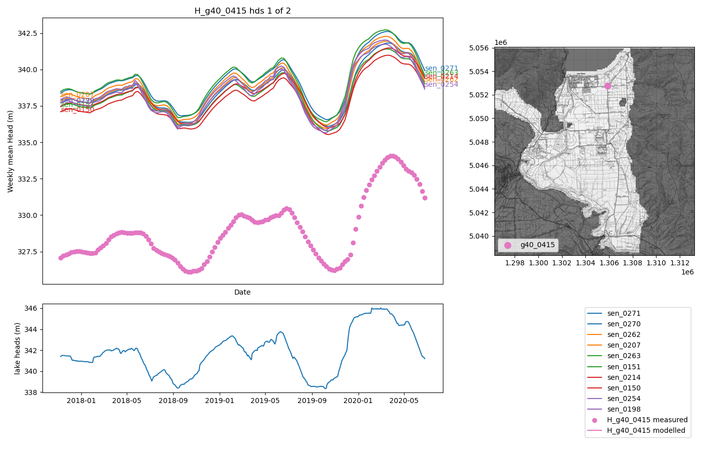

.. class:: centered

    *Figure: the results of the 1 layer model which fit the shape of the groundwater levels, but not the mean*

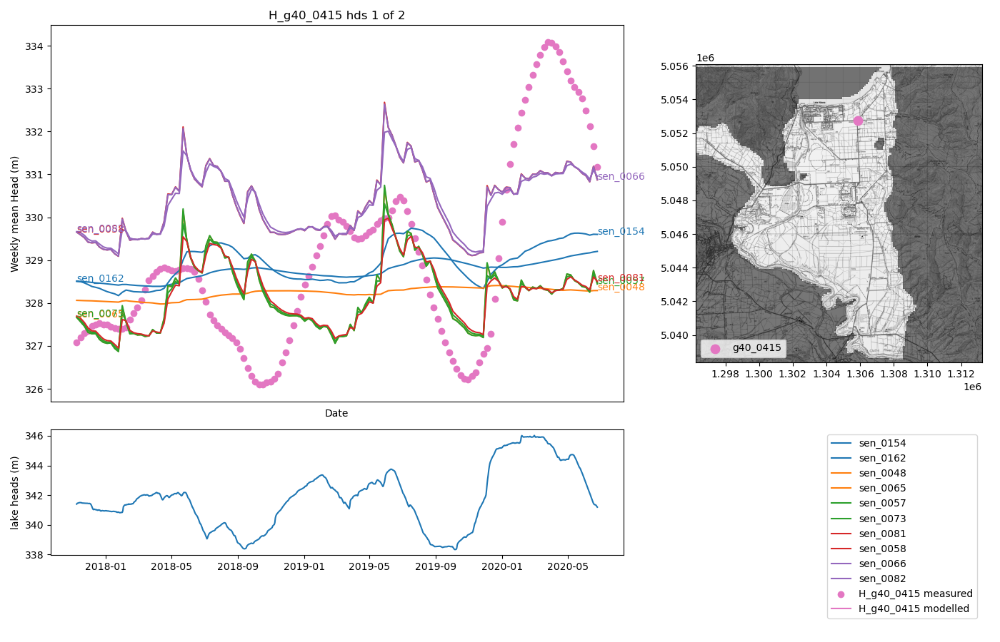

.. class:: centered

    *Figure: the results of the 1 layer model which fit the mean of the groundwater levels, but not the shape*

We do not have other high frequency observations of groundwater levels near the Lake Hawea moraine. However, we do have
a number of static water levels that were measured shortly after drilling the bore.  These water levels, relative to the lake level
at the time of measurement are shown in the figure below.  This figure shows that a constant vertical offset between the
groundwater levels and the lake levels of approximately 10 m.  Some of these boreholes are located in the moraine less
than 200 m from the lake. Many of the water supply wells near the lake (within the mapped moraine) are
relatively deep (e.g. 50+ m).

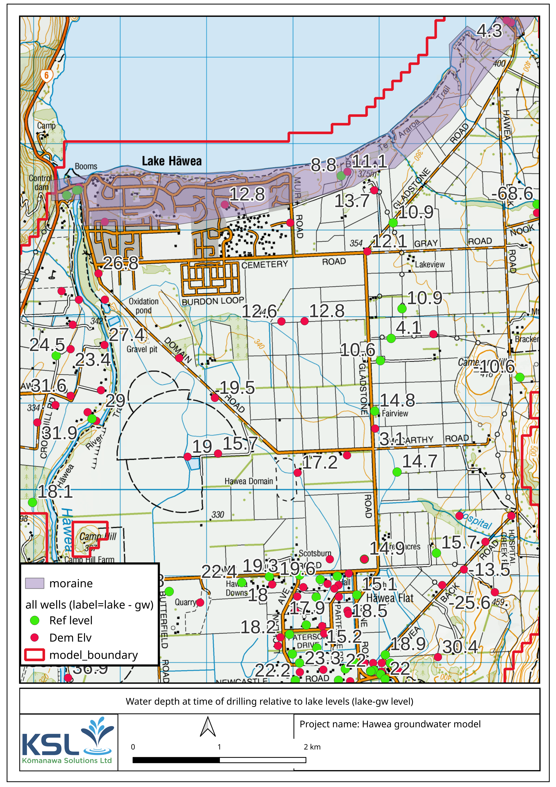

.. class:: centered

        *Figure: all groundwater levels relative to the Lake Hawea level on the sampling date (positive values are groundwater levels below the lake)*

Because we could not reproduce the groundwater levels at G40/0415, we deemed that the we could reject the hypothesis that
a 1 layer model could reproduce the groundwater levels the Hawea system with confidence. This is an essential outcome
from the Hawea groundwater model as the complex three dimensional structure has a key implications for the
management of the groundwater system; the groundwater system is likely to be either disconnected or have other non-linear
responses to Lake Hawea level if the lake falls below a threshold value.

Terrace only model (2D) optimisation results
==============================================

The terrace only model had 1 target to fit, G40/0366.  The model was unable to fit this target.  The heads are higher than
the measured data, and theape of the curve does not match the observed data. The full model was able to fit this target
significantly better.  From these data we can reject the hypothesis that the terrace only model can reproduce the observed
groundwater levels in G40/0366. This suggests that there is indeed some connection between the High Terrace aquifer and
the Hawea Flat aquifer.

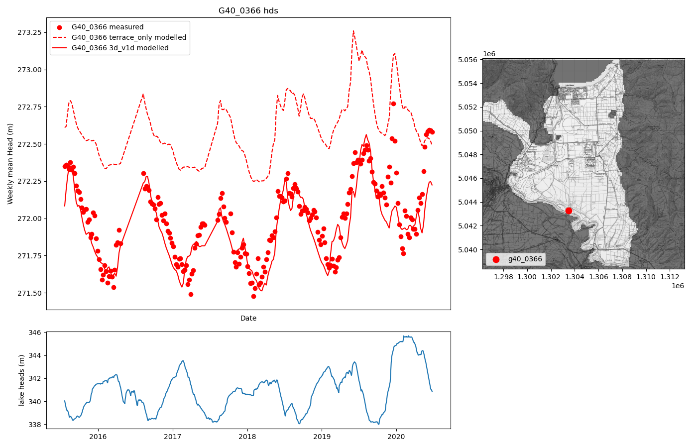

.. class:: centered

    *Figure: Comparison of the terrace only model and the 3d_v1a model at the south end of the High Terrace*

3 layer model (3D) optimisation results
=======================================

We produced 3 final 3 layer models. The differences (relative to the final model 3D_v1d) are listed below.

+----------------------+-------------------------------------------+
| Model  | "bund_top"* | NGMP wells included in objective function |
+======================+===========================================+
| 3d_v1a | 335m msl    | yes                                       |
+----------------------+-------------------------------------------+
| 3d_v1b | 333m msl    | yes                                       |
+----------------------+-------------------------------------------+
| 3d_v1d | 335m msl    | no                                        |
+----------------------+-------------------------------------------+

*the "bund_top" is the elevation of the top of the low conductivity layer in the moraine zone, which is also the
threshold value for the non-linear response of the groundwater system to the lake level.

Final observation weightings:
-----------------------------

+------------------+---------------------+
| Parameter group  | Weighting           |
+==================+=====================+
| 'rwh_hf'         | 0                   |
+------------------+---------------------+
| 'rwh_hf_riv'     | 0                   |
+------------------+---------------------+
| 'h_hf'           | 150                 |
+------------------+---------------------+
| 'h_hf_riv'       | 50                  |
+------------------+---------------------+
| 'h_lf'           | {0, 10}             |
|                  | {v1d, (v1a, v1b)}   |
+------------------+---------------------+
| 'riv'            | 1e-3                |
+------------------+---------------------+
| 'h_piezo'        | 10                  |
+------------------+---------------------+
| 'h_single_1'     | 5                   |
+------------------+---------------------+
| 'h_single_3'     | 5                   |
+------------------+---------------------+

3D_v1d (final model)
---------------------
The model 3d_v1d is the final model that we used for all of the scenarios.  This model did an excellent job reproducing
the groundwater levels in our high frequency monitoring points across all of the historical data. The figures for these high frequency
observation and a discussion of the results are provided in the `Comparison of 3d_v1a, 3d_v1b, and 3d_v1d` section below.
The full set of optimisation plots for this model are available in the `3d_v1d optimisation results plots folder <../optimisation/optimisation_results/3d_v1d/Base_Optimisation_plots>`_.

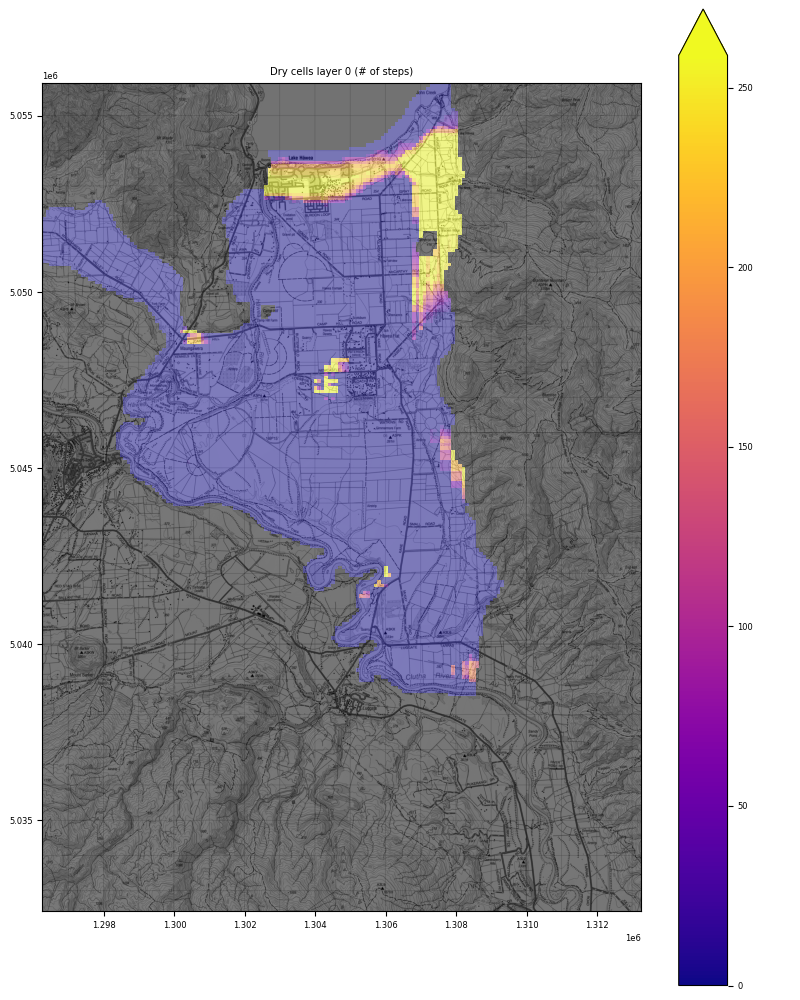

.. class:: centered

        *Figure: the number of model stress periods with dry cells in the final model*

There are a number of areas in the model with consistent dry cells. There are a number dry cells directly south of the moraine.
These are not a concern and are instead simply an artefact of the complex 3D structure in the area. Many more of these persistent dry cells
are relatively isolated and occur in areas of steep topographical gradients (e.g. near the Clutha River,
Camp Hill Moraine, or just adjacent to the Grandview Ridge). These cells are likely caused by structural error
in topographical data and are of little concern.

More concerning are the dry cells in and around the Hawea Flat township.  These dry cells are likely caused by the relative thinning
of the model in this area, local abstraction and parameter structural errors, and/or a missing structure in the model. It is quite possible
that there is a lower conductivity layer to the west of the Hawea Flat township from the Q4 Albert Town Advance. There was not enough
information to justify adding this structure to the model, but it may warrant further investigation.

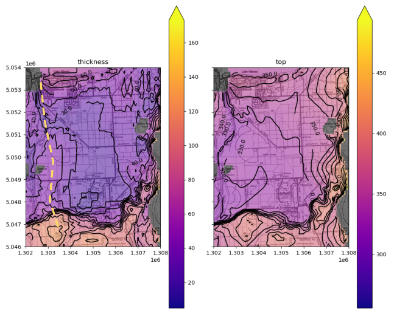

.. class:: centered
        *Figure: the possible indicative location (yellow dashed line) of a moraine structure to the east of the Hawea Flat township*

Finally the model does a very poor job of reproducing the groundwater levels in the area to the east of the inferred Grandview Fault.
There is very limited information in this area (3 single observations) most of which are near boundary conditions
(e.g. Grandview Creek), so it is difficult to draw any conclusions about the cause of the poor model performance in
this area.  Instead, we have to accept that the model is not suitable in this area and the model results should not be used.

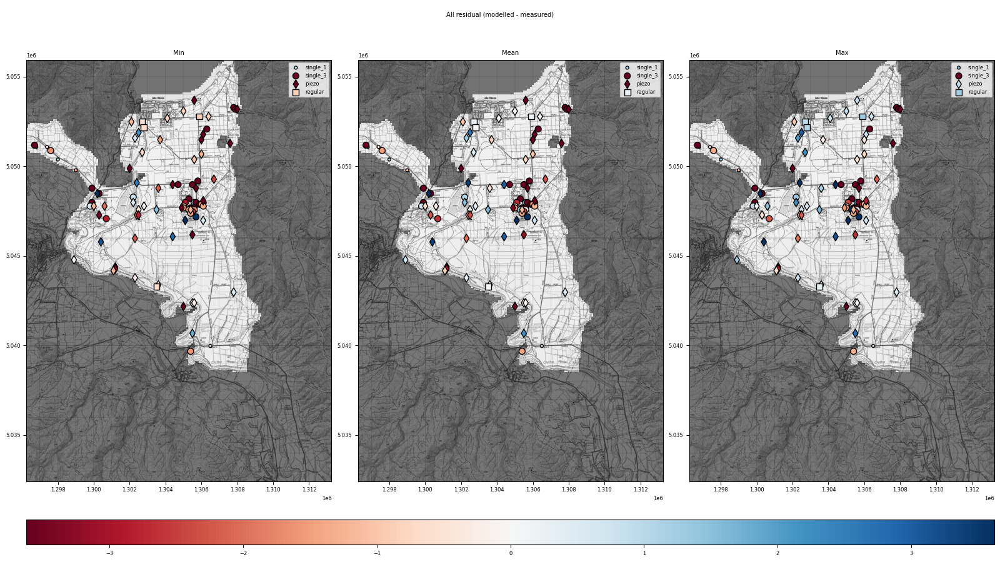

.. class:: centered

    *Figure: the groundwater levels residuals plotted spatially for the full model domain.  Note that where a target has multiple temporal observations the min, mean and max residuals are shown.  The color bar units are m*

In general the model does a good job of replicating the groundwater levels across the model domain.  There are some areas
where the model over or under predicts the groundwater levels. As discussed above the areas to the east of the inferred Grandview Fault
are significant under estimates and the model does not preform well in these areas. There are multiple targets in and around the Hawea flat
township which are underestimated by the model, but given the close proximity of the high frequency observations at bore
G40/0367, we believe that these misfits are most likely due to either poor data quality of the targets or problems arising from applying the
historical measured water levels to the time period within the optimisation period. The latter is the most likely as there is a
significant amount of abstraction in and around the Hawea Flat Township that may not have been present when the historical
water levels were measured.

The two figures below show the modelled groundwater-surface water interaction for the Hawea and Clutha Rivers.
While there are some target misfits, the model does a very good job of reproducing the expected interaction between the
groundwater and surface water systems.  The misfits occur in areas which both lose and gain water across the model period.
The model does a good job reproducing the expected behaviour (gain/loss), but underestimates the total losses relative
to the measured data. As discussed in the `model target readme <../targets_and_sensitive_sites/README.rst>`_ there is significant
uncertainty in the measured gauging, therefore, we feel that the model is performing well in this area. In addition, the
model does an excellent job of reproducing the expert judgment of the surface water and groundwater interaction.  The Hawea
is gaining below the dam to approximately Camp Hill, and then loses a significant amount of water between Camp Hill and sharp
westward bend.

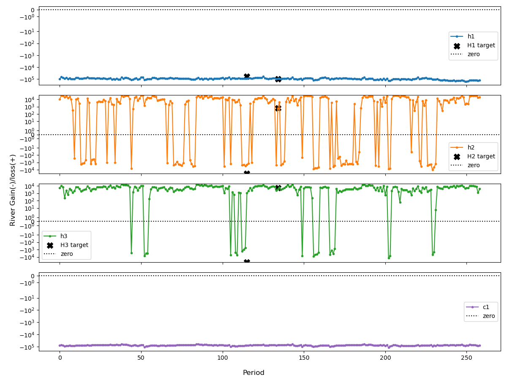

.. class:: centered

        *Figure: the river fluxes for the final model at each of the parameter zones*

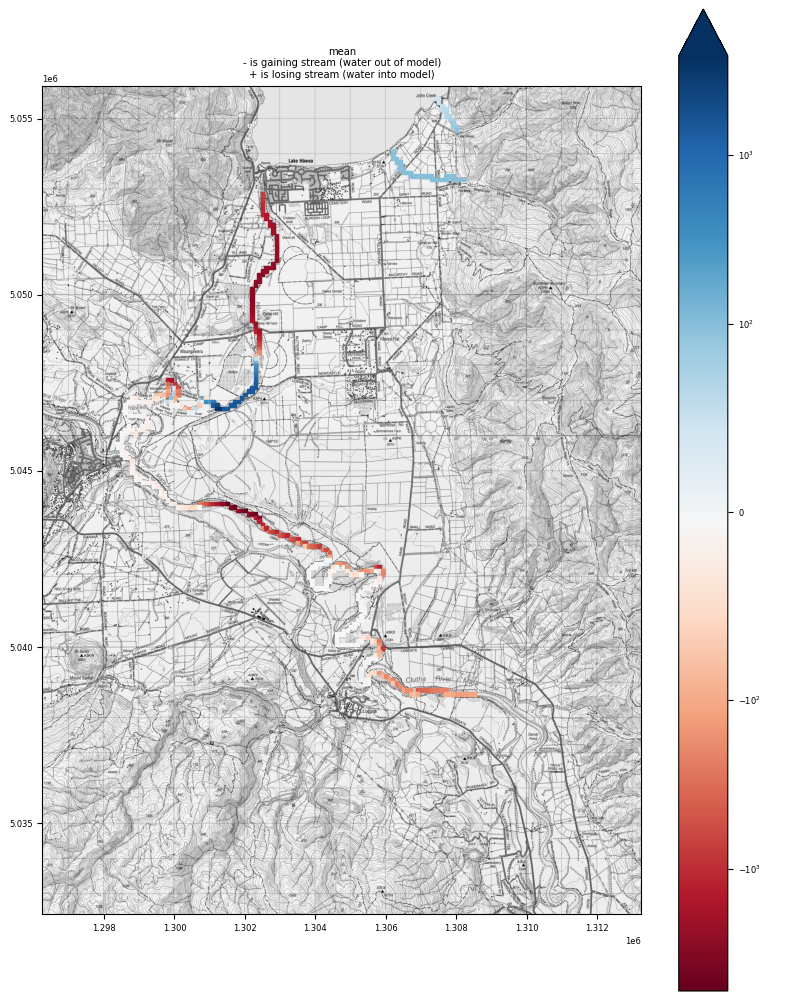

.. class:: centered

        *Figure: the mean river fluxes spatially for the final model*

The figure below shows the steady state groundwater heads around the moraine zone in all three layers.
We don't have any targets to inform this data, but it does produce a key prediction that could be tested in the future.
The model predicts that the groundwater levels are significantly higher in the northeastern edge of the moraine and that
this is the area which ultimately controls flow between the lake and the groundwater system. This is consistent
with either the perched aquifer conceptual model or the local penetration conceptual model (see the Lake Hawea Moraine
Conceptual Model section of `the model build readme <../model_build/README.rst>`_).

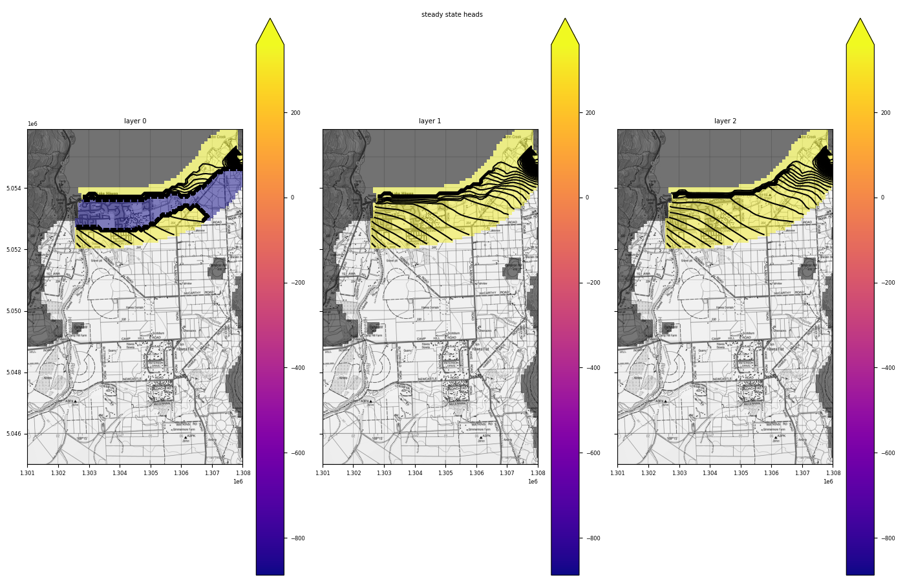

.. class:: centered

        *Figure: the steady state groundwater heads around the moraine zone in all three layers*

3D_v1a
-------
We will not independently discuss the results for 3d_v1a here, but the full set of optimisation
plots for this model are available in the `3d_v1a optimisation results plots folder <../optimisation/optimisation_results/3d_v1a/Base_Optimisation_plots>`_.
A discussion of the differences between the three models is provided below.

3D_v1b
-------
We will not independently discuss the results for 3d_v1a here, but the full set of optimisation
plots for this model are available in the `3d_v1b optimisation results plots folder <../optimisation/optimisation_results/3d_v1b/Base_Optimisation_plots>`_.
A discussion of the differences between the three models is provided below.

Comparison of 3d_v1a, 3d_v1b, and 3d_v1d
----------------------------------------

The figures below show the results for all three of the 3D models for the high frequency groundwater levels.

Fit to higher frequency groundwater levels at G40/0415
~~~~~~~~~~~~~~~~~~~~~~~~~~~~~~~~~~~~~~~~~~~~~~~~~~~~~~~~
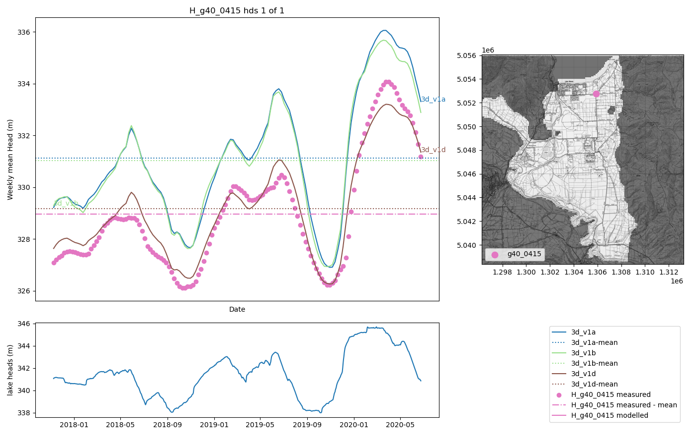

.. class:: centered
        *Figure: the groundwater levels for the 3d_v1a model at bore G40/0415*

Fit to higher frequency groundwater levels at G40/0416
~~~~~~~~~~~~~~~~~~~~~~~~~~~~~~~~~~~~~~~~~~~~~~~~~~~~~~~~
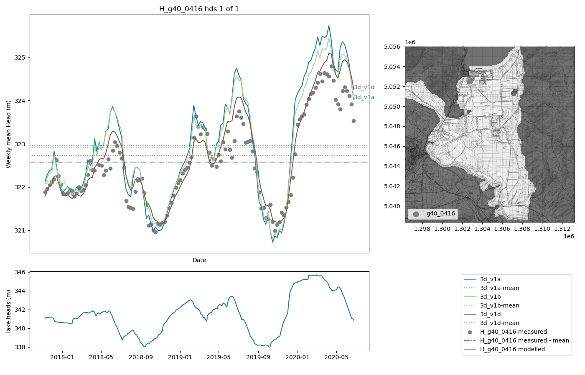

.. class:: centered
        *Figure: the groundwater levels for the 3d_v1a model at bore G40/0416*

Fit to higher frequency groundwater levels at G40/0041
~~~~~~~~~~~~~~~~~~~~~~~~~~~~~~~~~~~~~~~~~~~~~~~~~~~~~~~~
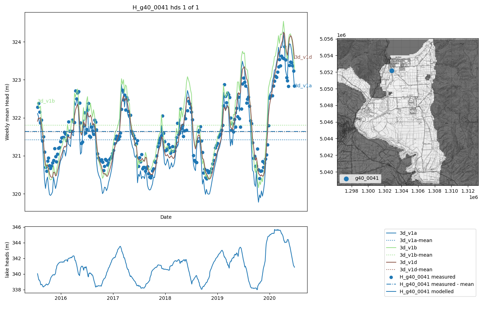

.. class:: centered
        *Figure: the groundwater levels for the 3d_v1a model at bore G40/0041*

Fit to higher frequency groundwater levels at G40/0129
~~~~~~~~~~~~~~~~~~~~~~~~~~~~~~~~~~~~~~~~~~~~~~~~~~~~~~~~
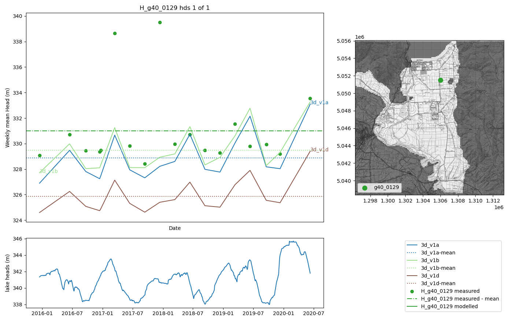

.. class:: centered
        *Figure: the groundwater levels for the 3d_v1a model at bore G40/0129 (NGMP bore)*

Fit to higher frequency groundwater levels at G40/0120
~~~~~~~~~~~~~~~~~~~~~~~~~~~~~~~~~~~~~~~~~~~~~~~~~~~~~~~~

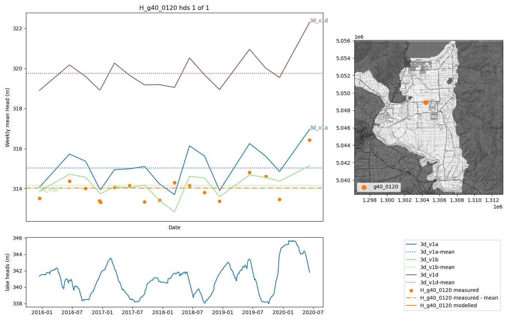

.. class:: centered
        *Figure: the groundwater levels for the 3d_v1a model at bore G40/0120 (NGMP bore)*

Fit to higher frequency groundwater levels at G40/0367
~~~~~~~~~~~~~~~~~~~~~~~~~~~~~~~~~~~~~~~~~~~~~~~~~~~~~~~~
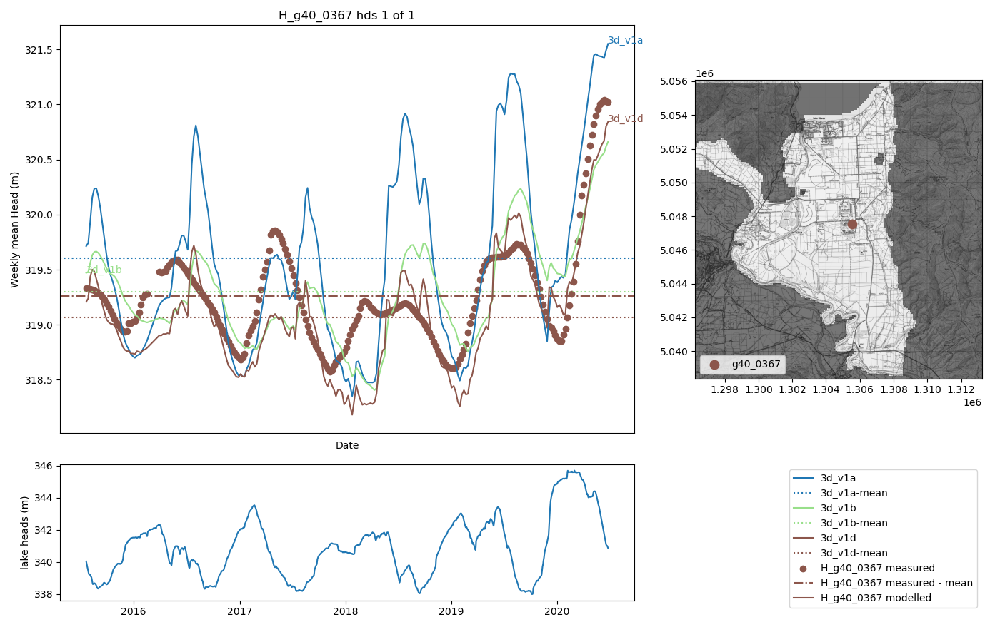

.. class:: centered
        *Figure: the groundwater levels for the 3d_v1a model at bore G40/0367*

Fit to higher frequency groundwater levels at G40/0366
~~~~~~~~~~~~~~~~~~~~~~~~~~~~~~~~~~~~~~~~~~~~~~~~~~~~~~~~
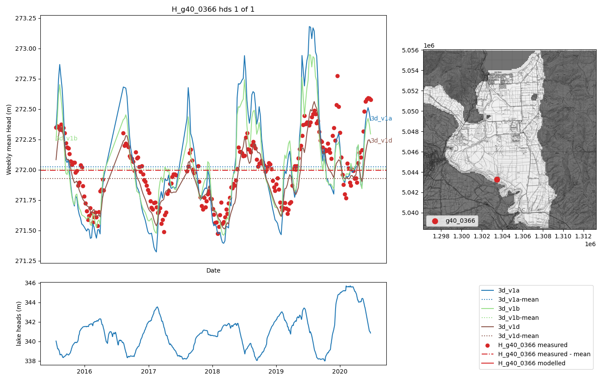

.. class:: centered
        *Figure: the groundwater levels for the 3d_v1a model at bore G40/0366*

Discussion and implications
~~~~~~~~~~~~~~~~~~~~~~~~~~~

Model versions 3D_v1a, 3D_v1b, and 3D_v1d all do an adequate job of replicating the high frequency groundwater level
observations. 3D_v1d does a slightly better job of replicating the high frequency groundwater levels than 3D_v1a and
3D_v1b, but it does this at the expense of the moderate frequency groundwater observations (i.e. the NGMP wells
G40/0129 & G40/0120). This prioritisation was intentional as the NGMP bores are designed to monitor contaminants rather
than static water levels.  These bores are often pumped irrigation bores and structural error in the pumping is likely
to impact the observation fits.  Therefore we suggest that the 3D_v1d model is the best model for predicting the
likely impacts of alternative management conditions.

Model versions 3D_v1a and 3D_v1b produce very similar results.  The key outcome of the similar results from the 3d_v1a
and 3d_v1b models is that the current observations do not constrain the threshold value, below which the groundwater
levels exhibits a non-linear response to the lake level. We discuss plausible ranges for the threshold value in the
`Lake Hawea Moraine Conceptual Model section of the model build readme <../model_build/README.rst#lake-hawea-moraine-conceptual-model>`_,
but we are not able to further constrain this range.  More discussions of the impacts of this threshold are discussed
in the `scenarios readme file. <../scenarios/README.rst>`_.  Note that we did attempt to model the threshold value as
337 m msl, but this optimisation did not converge. However, we did not spend a significant amount of resources trying
to get this optimisation to converge, so we do not believe that the lack of convergence here indicates that the threshold
value cannot be as high as 337 m msl.

Access to final optimised parameter sets and models
===================================================

The final optimised parameter sets for the 3d_v1a, 3d_v1b, and 3d_v1d models are available in this repository in the
`optimised_parameter_sets <../model_parameterisation/optimised_parameter_sets>`_ directory and are accessible
via Python by the `model_parameterisation.optimised_parameterisation.get_3d_v1{a|b|d}_params method <../model_parameterisation/optimised_parameterisation.py>`_.
The final models are available in the `final_opt_models <../optimisation/final_opt_models>`_ directory.  Due to the
limit on file sizes that Github implements, the final models have been compressed and some files have been split into
multiple parts with the 7zip library.  To uncompress these models you must use the `optimisation.final_opt_models.compress_uncompress_model.uncompress_model <../optimisation/final_opt_models/compress_uncompress_model.py#L59>`_
function.

To uncompress the 3d_v1d model to your downloads folder can use the following code:

.. code-block::

    from optimisation.final_opt_models.compress_uncompress_model import
    from project_base import proj_root
    from pathlib
    # proj_root is the path to the root of the repo
    # path to the model in the repo, you can substitute an absolute path
    compressed_path = proj_root.joinpath('optimisation/final_opt_models/3d_v1d')
    # path to save the uncompressed model to (currently set to 3d_v1d in your downloads folder)
    out_path = Path.home().joinpath('Downloads', '3d_v1d')
    uncompress_model(compressed_path, out_path)

Model limitations
=================
There are a number of limitations to this model and the model optimisation. The main limitations are:

- **A non-unique model structure**: Because the complex structure in the moraine zone is not well constrained by the data
  we have assumed a very simple model structure that almost certainly introduces structural error.
  It is likely that some of the parameters in the model are compensating for this model structural error, which may have
  flow on effects, particularly for scenarios that are well outside the model optimisation conditions.
- **A non-unique parameterisation**: the PEST optimisation process is a poorly posed problem (that is there is not enough observations
  to calculate a unique solution to the model parameters). This means that there are multiple solutions to the model parameters
  that represent a good fit to the observations. This model has not undergone a parameter uncertainty process so we cannot
  predict the likely range or implications of the parameter uncertainty. In addition, the uncertainty of the model parameters
  is compounded by the uncertainty in the model structure. There are likely many other model structure/parameter sets
  that would fit the observations as well as this model.
- **Area to the east of grandview fault**: The model has persistent dry cells to the east of the inferred location of the Grandview fault.
  This is likely due a combination of model structural and parameterisation errors. The results from this area should
  not be used and there is currently insufficient data to produce a trustworthy model in this area.
- **Limited data for hillside streams**: The hillside streams are a major source of water to the Hawea aquifer systems,
  but we only have observations from two gauging sites for a limited period of time. We estimated the inflows from a
  a correlation with the Lindis River; however, both of the gauged streams are of similar size so the correlation may not
  hold for the smaller hillside streams.
- **Piezometric survey date**: the only piezometric survey conducted for the Hawea aquifer system was conducted in Sept
  of 2011. This survey was conducted outside our optimisation period (we did not have adequate abstraction information
  to conduct the model optimisation during 2011). A significant portion of the model domain therefore does not have any
  observations taken during the optimisation period, which adds another source of uncertainty to these areas of the model.
- **Parameterisation near Butterfield Reserve**: Butterfield Reserve is a sensitive wetland in an old oxbow of the Hawea
  River. The final parameterisation in this area is for a very low hydraulic conductivity which likely underestimates
  the degree of connectivity between Butterfield Reserve and the Hawea River. Model results here should be used with
  caution.

Recommended additional data
==========================

Over the course of our optimisation process we identified a number of additional data sources that would be useful.
We have listed them here, with a discussion of why the information would be useful, but we have not included any feasibility
assessments or costings to acquire these data sources. We recognise that some of these data sources may not be feasible
but we have included them here so that decision makers can consider their relative value.  We have not ranked these
additional data sources in any way as any prioritisation is an intersection of priories (which we cannot address)
and scientific merit.

- **A high frequency groundwater record near the Northeast Corner of the Hawea Flat aquifer:** One of the key model
  predictions for the complex moraine structure is that groundwater levels (impacted by the lake) should be elevated in
  and around the Grandview/John Creek alluvial fans. Testing this prediction would require a high frequency groundwater
  level record in this area of at least a couple of years in length. The exact location of such a bore would need more
  detailed consideration.
- **A high frequency groundwater record near the exit of the Maungawera Valley:**  The Maungawera Valley has a relative paucity of data
  which makes predictions regarding the sustainable use of groundwater uncertain. A high frequency monitoring bore near
  the exit of the valley (e.g. up valley of the Maungawera Valley Road and Lake Hawea Albert Town Road intersection) would
  act as an integrator for the up valley groundwater system and would provide significantly more information about the
  local groundwater system. The exact location of such a bore would need more detailed consideration.
- **A high frequency bore near the Hawea domain and/or Butterfield Road**: Water from Lake Hawea can flow either toward
  Hawea Flat township or it can flow back towards the Hawea River.  Understanding the piezometric surface in the aforementioned
  area would help constrain that flow. The exact location of such a bore would need more detailed consideration.
- **A detailed investigation of moraine structure**: As mentioned multiple times within this repository, the moraine
  structure is not well constrained by the data. A detailed investigation of the moraine structure would help constrain
  the model structure and reduce the uncertainty in the model predictions. The method of investigation would need
  significant consideration and would likely require a combination of geophysical and drilling investigations.
- **An investigation of structure to West of Hawea flat Township**: As discussed above, glacial geomorphology suggests that
  there could be a low permeability structure to the west of Hawea Flat township associated with a potential lateral
  moraine of the Albert Town advance. Further investigation of this possible structure would help constrain our understanding
  of the groundwater system in this area.
- **multiple concurrent gauging of multiple hillside streams:**  As described in the `model build readme <../model_build/README.rst`_
  the hillside streams are a major source of water to the Hawea aquifer system. However, we only have observations from
  two gauging sites for a limited period of time. We estimated the inflows from a a correlation with the Lindis River;
  however, both of the gauged streams are of similar size so the correlation may not hold for the smaller hillside streams.
  Multiple concurrent gaugings (at high and low flows) of multiple hillside streams (both large and small catchment areas
  would help constrain the predictions of inflows from the hillside streams.
- **Additional Piezometric surveys:** At present the only piezometric survey completed in the Hawea region was
  conducted in Sept of 2011. This survey was conducted we had adequate abstraction information and so we had to transpose
  these groundwater head targets to dates inside the optimisation period, which adds error. One or more additional
  piezometric surveys (e.g. at high and low water levels) would help constrain the model predictions in the areas that
  are only informed by the piezometric survey.
- **Model parameter / structural uncertainty analysis**: In the absence of additional data collection more information
  about the uncertainty of the model predictions could be obtained by conducting a parameter / structural uncertainty
  analysis. Given the significant structural uncertainty in the moraine zone we would recommend calibrating and conducting
  parameter uncertainty analysis on many different model structures. This would be a significant undertaking, but could
  easily build on the work and data analysis from this project and contained within this repo.

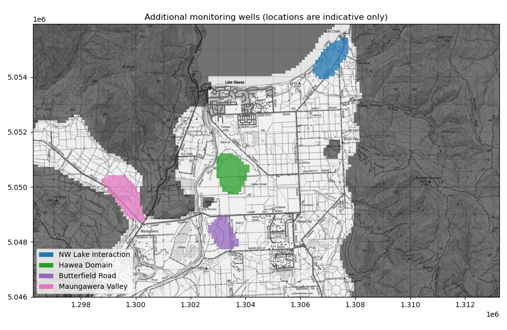

.. class:: centered
        *Figure: Areas for possible additional high frequency monitoring bores*

Optimisation working notes
==========================
These working notes are largely verbatim except that the active branches are elevated above the abandoned branches.
The number indicates the order in which the branches were developed.

Active Branches (optimisation versions)
---------------------------------------

25. Main (3d_v1d)
~~~~~~~~~~~~~

-  The ‘final’ optimised model
-  Contains 3D structure around the Lake Hawea Moraine
-  Best fits for the high frequency targets
-  Bund elevation set to 335 msl
-  NGMP well head observations removed from objective function as there
   is significant tension between these records and the high frequency
   observations. The NGMP wells are pumped irrigation bores and the
   primary purpose for sampling was water quality monitoring

20. 3d_v1a
~~~~~~

-  Identical to “Main (3d_v1d)” except that the NGMP wells were included
   in the objective function
-  decent history matching; however “Main (3d_v1d)” provides better
   results
-  retained as active branch for comparison to “3d_v1b”

21. 3d_v1b
~~~~~~

-  Identical to “3d_v1a” except that the bund elevation was set to 333
   MSL.
-  history matching results were similar to “3d_v1a” suggesting that the
   bund elevation is largely non-unique
-  retained to demonstrate the non-uniqueness of the 3D structure

14. terrace_only
~~~~~~~~~~~~

-  This model structure only includes the High Terrace (south of Hawea
   Flat) to the Clutha River
-  this optimisation was undertaken to see if the High Terrace could be
   history matched (within the accepted parameter ranges) in isolation
   from the rest of the Hawea aquifer system.
-  History matching was not achieved

Abandoned branches (releases, optimisation versions)
----------------------------------------------------

There are many previous branches that were issued as pre releases and
then deleted (effectively archived). There should be no reason for other
users to delve into these previous branches as they ended up with
unsatisfactory history matching; however they are available and briefly
described below (working notes) for completeness.

#.  Main (before 2/11/22) The main build branch. First structural
    version

#.  Structure v2, Changes:

    -  Increase parameterization via pilot points to Maungawera
    -  Add recharge multiplier pilot points across model (NI)
    -  Remove sandy point from model
    -  abandoned but retained

#.  Structure v3,Changes:

    -  Set ss=sy
    -  Set the model to confined to reduce computational burden
    -  This helped but the model preformed poorly,
    -  Error did not reduce saturated thickness.
    -  abandoned and deleted

#.  Structure_v4:

    -  From structure v2
    -  Add new mean annual head targets from regular
    -  Increase steps to 7 in transient
    -  Expand hillside streams to all adjacent cells (up to 9 cells per
       hill)
    -  Optimisation never run here, just saved to version structural
       changes

#.  Structure_v5

    -  From structure_v4
    -  Remove near river pumping wells.

#.  Structure_v6

    -  From structure 5
    -  Add a 1 m confined layer below the bottom of layer 1 (may improve
       stability)

#.  Structure_v6a

    -  From v6, but set ss to sy

#.  Structure_v7 (built but not run)

    -  From structure 5
    -  Reduce thickness to reasonable pumped thickness and then maximum
       30 m sat thickness
    -  Set ss = sy
    -  run as a confined model

#.  Structure_v8

    -  From structure_v6a
    -  increase initial conductivity (to 50, 100 and 70 was too
       unstable)
    -  rch multiplier only by irrigated not irrigated bounds of
       multiplier 0.5-1.2

#. Structure_v9

    -  Fix river targets (they were backwards!)
    -  Implement Grandview and John Creek (+Hawea and Clutha) as str
       package
    -  Lake stage vs g40_0415
    -  Looks fine, honestly the fact that them model isn’t matching it
       suggests some sort of structural error. Reworked transport in
       grandview stream?/ water through grandview stream??? Likely the
       problem google maps shows water in grandview to the lake (and in
       john creek (to the north), all other creeks are probably fine.
    -  Lower basement around g40_0366

#. Structure_v10

    -  Set weight of regular year targets to 0
    -  set each of the ‘h_hf’ targets equal weights despite different
       data lengths
    -  look/lower basement in dry cells near model boundaries
    -  NE hillside area (done)
    -  Near Clutha River (done)
    -  I think I need some more pilot points
    -  Near pt 402 on camp hill moraine (move Maungawera south?) ()
       and another in the moraine (to interpolate with other river group
    -  To stop dry cells south of camp hill moraine
    -  Significant number in the hillslope area just off the bounds to
       allow conductivity to fall there if needed for stability. And to
       manage the change in geologic setting near hillslope
    -  Adjust some locations based on the new pilot point locations
    -  New rivergroup south of Maungawera valley entrance to allow for
       the difference between the two settings
    -  Additional point in the middle of the terrace to manage near
       hillside environment.
    -  Try lowering hillside conductance → set to 100 vs 1000 for
       Hawea/Clutha, which means much of the peak flow does does not
       make it into the model.

#. Structure_v11

    -  Move to 1 global recharge modifier (done)
    -  Much higher initial kh (lake=5, rest = 300) (in progress
    -  Lower sy, and lower sy bounds
    -  Change weights (lower low frequency targets)
    -  Bit of a hail mary before the weekend
    -  retired (even though I’m happy with the parameterisation. If I
       want to change back to vll parameters do it from v12

#. Structure_v12

    -  Increase kh/sy parameterisation in the near lake environment

#. terrace only

    - see above

#. p_lake

    -  As per structure_v11 but with a single additive parameter for
       lake heads (e.g. lake hds = lake hds + mod
    -  A test to see if the lake levels problems are sorted everything
       else works great?
    -  Note the parameter is offset by 100 m as pyemu has bugs!

#. lake_bar

    -  Add a 1 cell thick barrier for kh
    -  Remove additional v12 parameterisation

#. cond_int

    -  Try to fit the heads by simply setting lake conductance (1 cell
       width lake)

#. 3d_v1

    -  Address the 3D moraine issues in structure
    -  3 layers the bottom two pinch out against the bottom of the
       model.
    -  well management
    -  target management
    -  other structural pieces
    -  Add abrupt parameter change at terrace interface
    -  Remove from dam to “dam control” road from model (e.g. no flow)
    -  Re-run pre_optimisation_overview.py
    -  remove the slope fixer on the east side
    -  remove additional parameterisation of v12

#. 3d_v2

    -  As per v1 but fully confined (to increase stability)
    -  Ss[0] = sy[0]
    -  Initial parameters do not manage the drop quite so well. This may
       really need the unconfined aspects of the model.
    -  Bit of a hail mary over xmas. Really need the unconfined action
       to make the ‘waterfall happen’

#. 3d_v1a

    - see above

#. 3d_v1b

    - see above

#. 3d_v1c

    -  As 3d_v1a but with top of bund set to 337
    -  great difficulty getting this to converge
    -  abandoned

#. 3d_v4

    -  As 3d_v1a, but top of bund is set to 340 m MSL instead of 335
    -  Difficult to get model to converge
    -  abandoned

#. 3d_v5

    -  As 3d_v1a, but top of bund is parameterised
    -  Largely unstable

#. 3d_v1d

    - see above

References
===========

- `Wilson, J., 2012. Hawea Basin Groundwater Review. prepared by Resource Science Unit of Otago Regional Council,
   June 2012, Dunedin. <../scott_model/Hawea_Basin_Groundwater_Review_2012_FINAL.pdf>`_