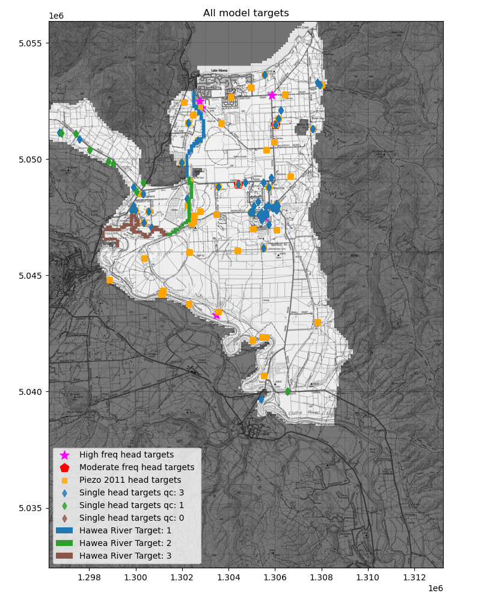
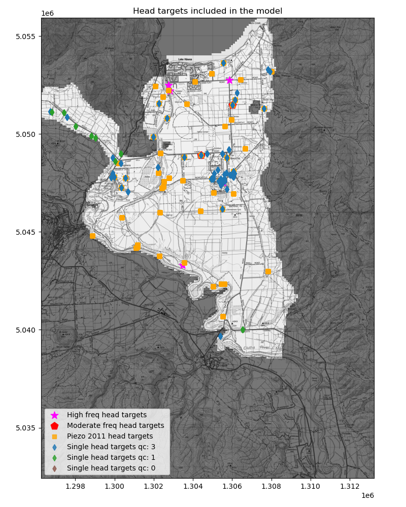
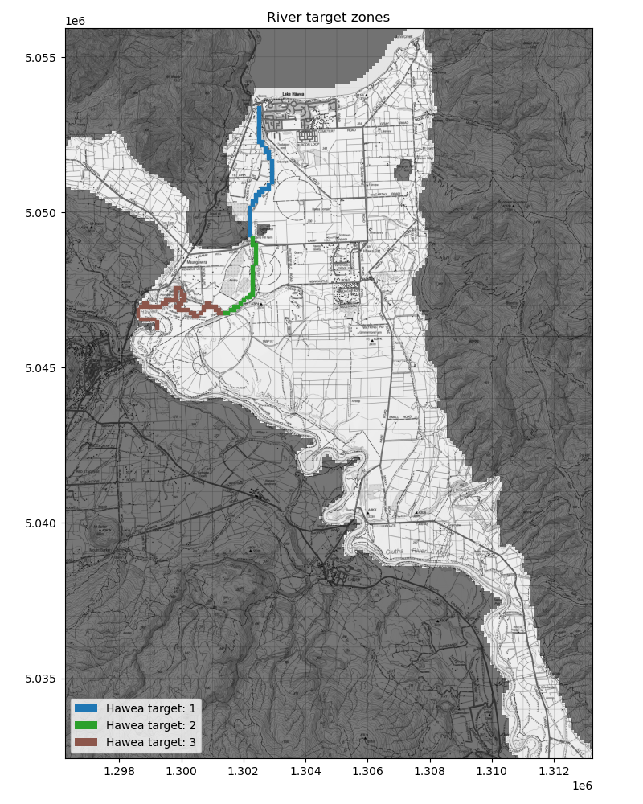
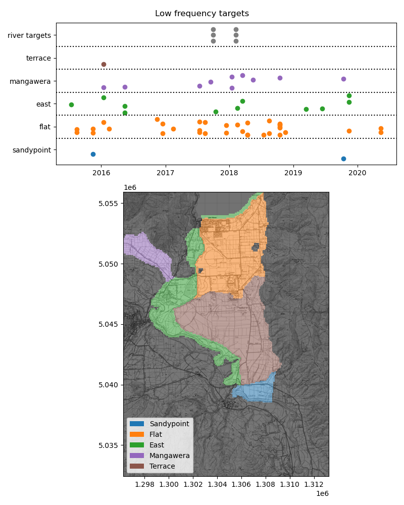
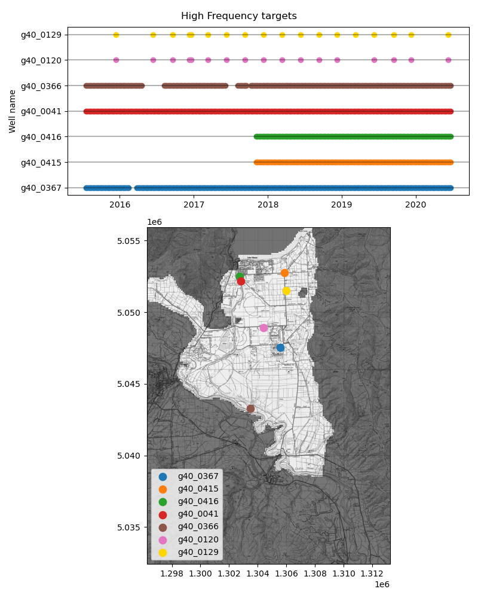

Hawea Transient groundwater model (Hawea Model) Targets and Sensitive sites
################################################

.. class:: centered

   Figure: All Hawea Model targets

:Author:  Matt Dumont
:Date:  2021-11-02
:Version:  1.0.0
:Status:  Draft
:KSL project: Z22031HAW_hawea-model
:Purpose: This document describes the development of model targets and the identification of sensitive sites

Index
=====
.. contents:: Table of Contents

Managing targets outside of the optimisation period
====================================================
# todo

Groundwater head targets
========================

.. class:: centered

   Figure: Spatial distribution of groundwater head targets

# todo
High and moderate frequency targets
----------------------
# todo

Targets from the 2011 Piezometric Survey
------------------------------------------
# todo
Single targets
-----------------
# todo

River gain and loss targets
===========================

.. class:: centered

   Figure: Spatial distribution of river gain/loss targets

Measured data
-------------
Two sets of 4 concurrent river gaugings on the Hawea River were used to develop the river gain/loss targets. The first
set of gaugings were taken on 2017-09-29 and the second set were taken in on 2018-02-07. These targets are inherently
uncertain as the gauging error is typically >=10% of the river discharge and in braided river systems such as the Hawea
River, the river discharge can vary significantly over short distances as water travels in and out of the
river proximal and riverbed gravels. Nevertheless, the river gain/loss targets are the only measured constraint on the
model and are therefore used in the optimisation.

Expert Judgment
---------------
# todo

Temporal distribution of targets
================================
The final temporal distribution of targets in the model is shown in the following figures. Recall that the targets
which were measured outside of the optimisation period were assigned an indicative time during the optimisation
period.

.. class:: centered

   Figure: Temporal distribution of low frequency groundwater head and river gain/loss targets

.. class:: centered

        Figure: Temporal distribution of high frequency groundwater head targets

Model Objective Function and target weighting
=============================================
#todo

Other sensitive sites
======================
# todo

References
===========

- `Wilson, J., 2012. Hawea Basin Groundwater Review. prepared by Resouce Science Unit of Otago Regional Council, June 2012, Dunedin. <scott_model/Hawea_Basin_Groundwater_Review_2012_FINAL.pdf>`_