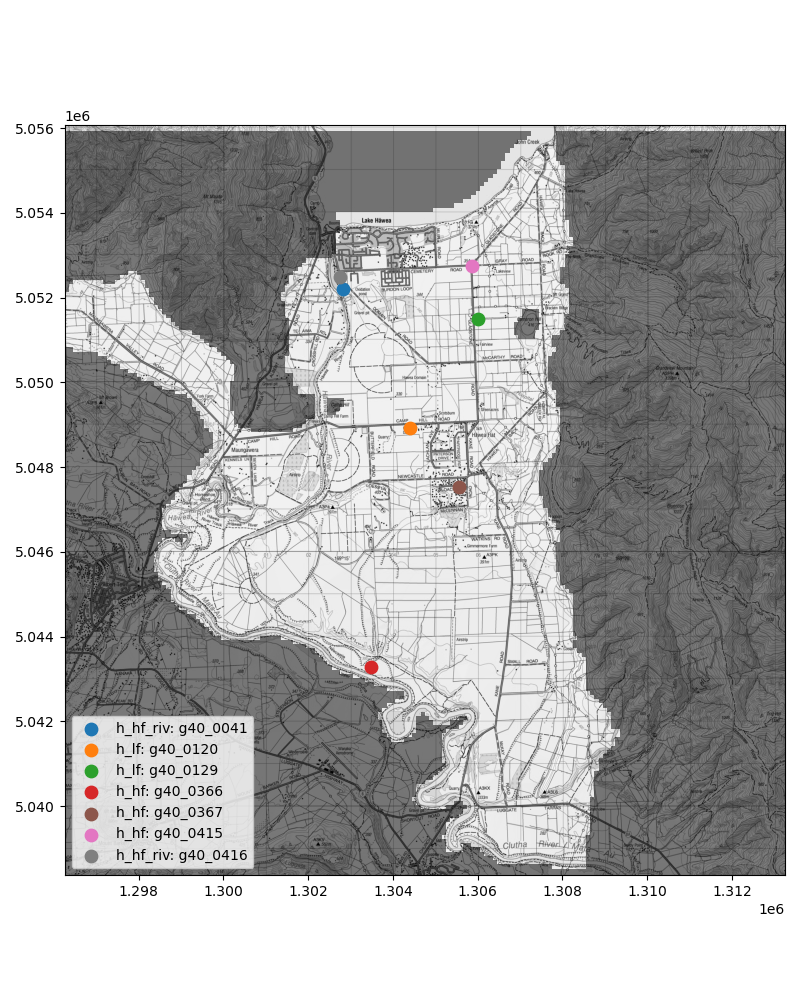
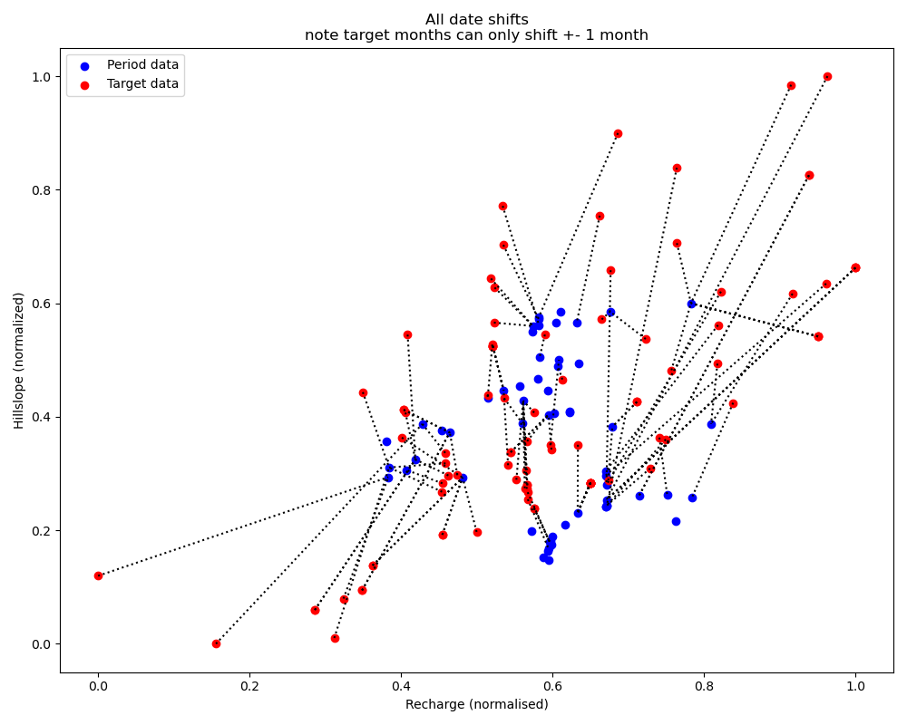
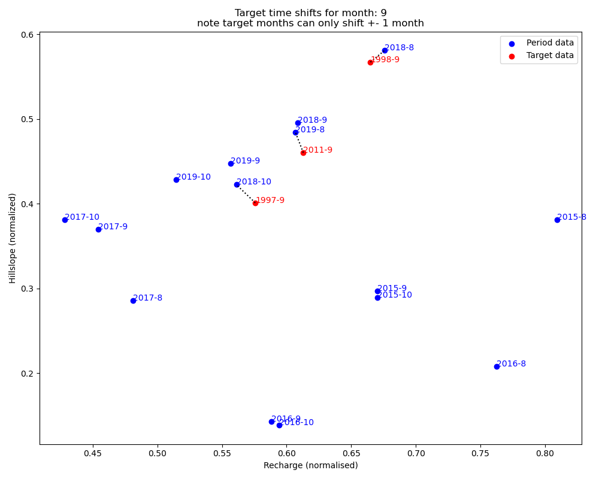
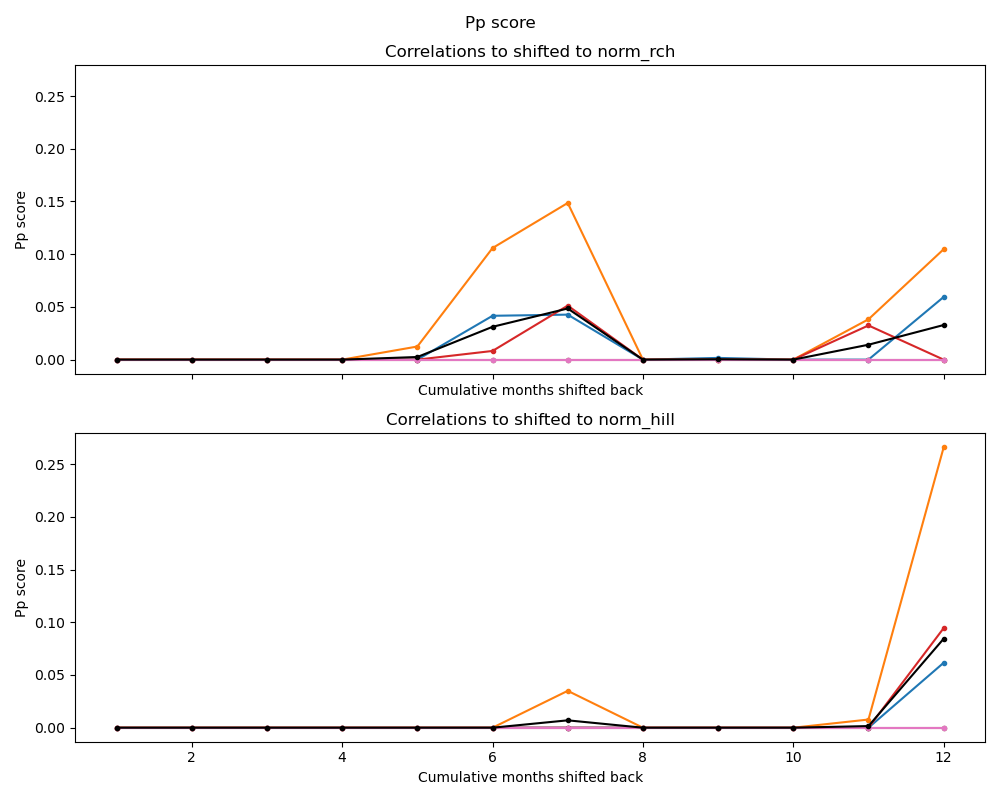
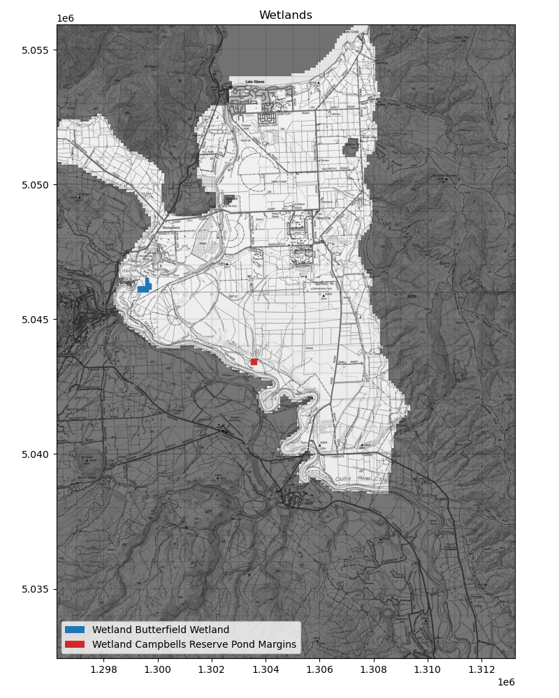

Hawea Transient groundwater model (Hawea Model) Targets and Sensitive sites
################################################

.. figure:: ../support_figures/model_targets.png
   :height: 650 px
   :align: center

.. class:: centered

   Figure: All Hawea Model targets

:Author:  Matt Dumont
:Date:  2021-11-02
:Version:  1.0.0
:Status:  Draft
:KSL project: Z22031HAW_hawea-model
:Purpose: This document describes the development of model targets and the identification of sensitive sites

Index
=====
.. contents:: Table of Contents

Module Index
============
-  `README.rst <../targets_and_sensitive_sites/README.rst>`_ : readme document detailing the methods and data used to develop the targets
-  `model_output.py <../targets_and_sensitive_sites/model_output.py>`_: script to extract consistent model outputs and plots
-  `get_raw_target_data.py <../targets_and_sensitive_sites/get_raw_target_data.py>`_:  ingest raw target data
-  `get_indicative_times.py <../targets_and_sensitive_sites/get_indicative_times.py>`_: get indicative times for the targets that fall outside of the optimisation period
-  `head_targets.py <../targets_and_sensitive_sites/head_targets.py>`_:  definition of the head targets
-  `riv_gain_loss_targets.py <../targets_and_sensitive_sites/riv_gain_loss_targets.py>`_:  definition of the river gain and loss targets
-  `senstive_sites.py <../targets_and_sensitive_sites/senstive_sites.py>`_: identification of sensitive sites
-  `target_structure_checks.py <../targets_and_sensitive_sites/target_structure_checks.py>`_: checks to ensure that the targets and the model structure were not mutually exclusive
-  `base_data <../targets_and_sensitive_sites/base_data>`_: base input data for the targets
-  `processed_data <../targets_and_sensitive_sites/processed_data>`_: processed target data, this was developed from the raw data in the base_data folder

Groundwater head targets
========================
.. figure:: ../optimisation/pre_optimisation_plots_png/targets/spatial_head_targets.png
   :height: 650 px
   :align: center

.. class:: centered

   Figure: Spatial distribution of groundwater head targets

High and moderate frequency targets
----------------------
High and moderate frequency targets were provided by Otago Regional Council (ORC) and included the following wells
note that in the code these targets are often referred to as "regular" targets:

+-----------+------------+-----------------------------------------------------------------------------------------+
| Well name | Group      |  Description                                                                            |
+===========+============+=========================================================================================+
| G40/0041  | h_hf_riv   |  High frequency loggers installed after 2014, near Hawea river                          |
+-----------+------------+-----------------------------------------------------------------------------------------+
| G40/0416  | h_hf_riv   |  High frequency loggers installed after 2014, near Hawea river                          |
+-----------+------------+-----------------------------------------------------------------------------------------+
| G40/0366  | h_hf       |  High frequency loggers installed after 2014                                            |
+-----------+------------+-----------------------------------------------------------------------------------------+
| G40/0367  | h_hf       |  High frequency loggers installed after 2014                                            |
+-----------+------------+-----------------------------------------------------------------------------------------+
| G40/0415  | h_hf       |  High frequency loggers installed after 2014                                            |
+-----------+------------+-----------------------------------------------------------------------------------------+
| G40/0120  | h_lf       |  NGMP wells, which have a longer record than the others, but less frequent sampling     |
+-----------+------------+-----------------------------------------------------------------------------------------+
| G40/0129  | h_lf       |  NGMP wells, which have a longer record than the others, but less frequent sampling     |
+-----------+------------+-----------------------------------------------------------------------------------------+

.. class:: centered
   Figure: Regular groundwater head targets

Targets from the 2011 Piezometric Survey
------------------------------------------

The 2011 piezometric survey was conducted on 21-sept-2011 and is detailed in Wilson et al. (2012). The survey
provides a significant spatial distribution of targets across the model domain and are highly reliable. These targets
make up much of the information used to constrain the model in the optimisation away from the high frequency targets.

Single targets
-----------------
Often when drillers are installing wells, they will take a single, static water level measurement at the time of installation.
This information is less reliable than a Piezometric survey, but it is still useful to constrain areas of the model
where there is little other information. There is often missing information for these records, as such created 4 quality
categories for these targets:

- 0: no date data for the depth to water field -- Not included in the model
- 1: no elevation data present (read from DEM) -- Only included in the model in the Sandy Point and Maungawera Valley,
  where there is a relative dearth of other information.
- 2: no depth data for the well -- No wells matched this category
- 3: as good as it gets -- included in all parts of the model

River gain and loss targets
===========================

.. figure:: ../optimisation/pre_optimisation_plots_png/targets/river_conductance.png
   :height: 650 px
   :align: center

.. class:: centered

   Figure: Spatial distribution of river gain/loss targets

Measured data
-------------
Two sets of 4 concurrent river gaugings on the Hawea River were used to develop the river gain/loss targets. The first
set of gaugings were taken on 2017-09-29 and the second set were taken in on 2018-02-07. These targets are inherently
uncertain as the gauging error is typically >=10% of the river discharge and in braided river systems such as the Hawea
River, the river discharge can vary significantly over short distances as water travels in and out of the
river proximal and riverbed gravels. Nevertheless, the river gain/loss targets are the only measured constraint on the
model and are therefore used in the optimisation.

Expert Judgment
---------------
In addition to the measured datasets described above, the expert judgment of the Hawea River is that it is largely a
gaining reach from the Hawea Dam to Camp Hill.  After Camp Hill the river loses a significant amount of water as the
river turns west against the high terrace. The lower reaches are gaining and losing until it reaches the Clutha River.
The Clutha river is exclusively thought of as a losing reach.  This expert judgement is in agreement with the measured
data and while it is not explicitly included within the model optimisation targets, it was used to qualitatively assess
the performance of the model.

Managing targets outside of the optimisation period
====================================================
Many of the targets used in the model fall outside of the optimisation period. If we only included infromation from
within the optimisation period we would be left with only the "regular" high and moderate frequency targets -- that is
7 spatial targets across the model domain and no targets in the Maungawera valley. Therefore we needed to apply the
targets out of the optimisation period to the most appropriate time within the optimisation period. This is done by:

#. Calculating the last 12 months normalised average recharge and hillslope inflow for each month in the
   scenario period (1980-07-18 to 2020-12-01).  Any targets outside of this period were excluded from the model.
   the choice to use the last 12 months was based off of the annual cycle, and confirmed by calculating the predictive
   power of multiple different time periods (e.g. 6 months, etc.). The annual data provided the best predictive power.
#. The target dates outside of the optimisation period were then assigned to the month within the optimisation period
   that was the closest (cartesian distance of the normalised 12 previous month recharge and hillslope inflows)
   to the target date and had the closest normalised recharge and hillslope.  targets were allowed to shift up to 1 month
   (e.g. a target measured in September could was assigned to the closest August, September or October month). This
   was done to maintain any seasonal effects while allowing a larger potential pool of matches.
#. Targets which were temporally shifted in this way were assigned to all stress periods in the month.

The following figures show the results of this process. Figures of each target month
`are available here <../optimisation/pre_optimisation_plots_png/indicative_target_times>`_

.. class:: centered

   Figure: Target period shifts for all targets

.. class:: centered

   Figure: Target period shifts for the targets measured in September, recall that the 2011-9 targets include the piezometric study

.. class:: centered

   Figure: The predictive power score of different monthly aggregations of the normalised recharge and hillslope inflows

Temporal distribution of targets
================================
The final temporal distribution of targets in the model is shown in the following figures. Recall that the targets
which were measured outside of the optimisation period were assigned an indicative time during the optimisation
period.

.. figure:: ../optimisation/pre_optimisation_plots_png/targets/low_freq_temporal_targets.png
   :height: 650 px
   :align: center

.. class:: centered

   Figure: Temporal distribution of low frequency groundwater head and river gain/loss targets

.. figure:: ../optimisation/pre_optimisation_plots_png/targets/high_freq_temporal_targets.png
    :height: 650 px
    :align: center

.. class:: centered

        Figure: Temporal distribution of high frequency groundwater head targets

Model Objective Function and target weighting
=============================================

The objective function is at a high level simply the weighted sum of squared errors between the modelled values and
target. The weighting strategy is often adjusted during the course of the model optimisation (for more info
on the final weighting scheme see the `optimisation readme <../optimisation/README.rst>`_; however the inital strategy
for the weighting of the targets is described below.

#. We developed a hierarchy of target groups as follows:
    #. **h_hf:** High frequency groundwater head targets: these are high quality data with a high temporal resolution and a
       moderate spatial resolution. They are by far the most important targets within the model
    #. **h_hf_riv:** High frequency groundwater head targets near the Hawea river: these are high quality data with a
       high temporal resolution, but they are adjacent to the Hawea river so are more susceptible to structural bias
       based on our implmentation of the hawea river in the model.
    #. **h_lf:** Moderate frequency groundwater head targets:  these targets provide two additional sites with a number of samples
       across the optimisation period.
    #. **h_piezo:** Scott 2011 piezo survey: these targets provide a significant spatial distribution of targets across the model
       domain and are highly reliable; however they fall outside of the optimisation period and therefore likely have
       some bias.
    #. **h_single_1:** Single targets Q3: generally lower quality targets but they provide some additional data.
    #. **h_single_3:** Single Targets Q1: generally very low quality targets, but in areas they are the only data available.
    #. **riv:** River targets: useful and the only way to constrain the river gain/loss, but they are not very reliable
       (as described above).
    #. There were two additional target groups that were never weighted:
           #. **rwh_hf:** ISO weekly mean for each high frequency target (e.g. for the "typical" water year)
           #. **rwh_hf_riv:** ISO weekly mean for each high frequency near river target (e.g. for the "typical" water year)
#. The initial weights were set so that all targets weights were propotional to their value,
   that is that the expected value * weight = 1
#. The weights were then adjusted so that single_3 had twice the impact relative to single_1
#. The weights were then normalised so that the total impact of each group was equal regardless of the number of targets
   within the group.
#. the groups were then manually weighted with a multiplier to adjust the relative impact of each group in accordance
   with the hierarchy described above.  This weight factor was adjusted during the course of the optimisation. For more
   info on the final weighting scheme see the `optimisation readme <../optimisation/README.rst>`_.

Note that when a target occurred in a dry model cell the modelled value was set to the head value in the cell in the layer
below, or if that cell was also dry, the head value in the cell below that. This was done to ensure that the modelled
values did not get impacted by the dry cell flag.

Other sensitive sites
======================

There are two sensitive wetlands within the model domain -- Butterfield Reserve and Campbell's Reserve. These wetlands
were not included within the model as boundary conditions, but they are indexed here.

.. class:: centered

   Figure: Wetlands in the Hawea model domain

References
===========

- `Wilson, J., 2012. Hawea Basin Groundwater Review. prepared by Resouce Science Unit of Otago Regional Council, June 2012, Dunedin. <../scott_model/Hawea_Basin_Groundwater_Review_2012_FINAL.pdf>`_
